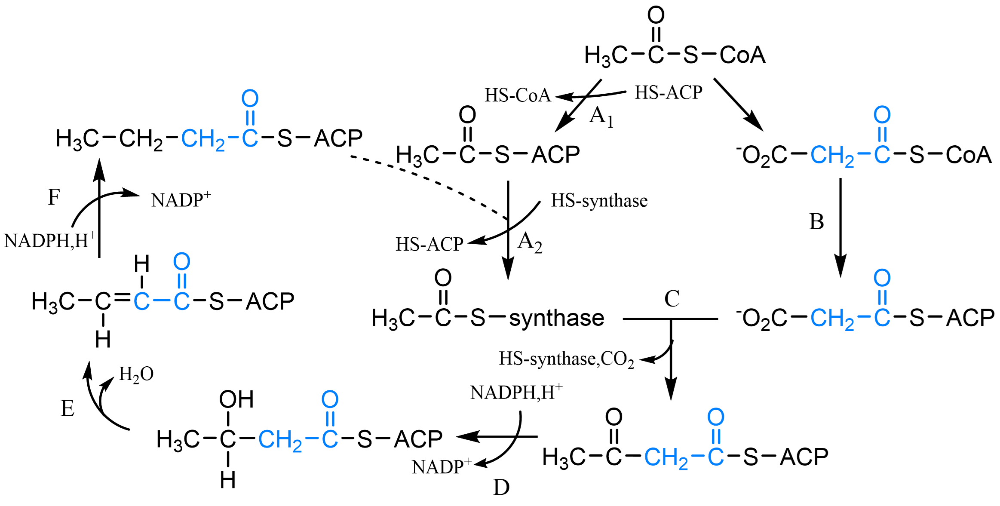

######################################
脂类及其代谢、生物膜
######################################

概述
======================================

脂质，一类低溶于水而高溶于非极性溶剂的生物大分子；本质多为脂肪酸和醇形成的酯类及衍生物。

分类
--------------------------------------

- 单纯脂质：由脂肪酸及甘油形成的酯；三酰甘油（3分子脂肪酸及1分子甘油组成）、蜡（由长链脂肪酸和长链醇/固醇组成）。
- 复合脂质：除含脂肪酸及醇外，还有其它非脂分子成分；磷脂（非脂成分：磷酸、含氮碱；醇成分：甘油磷脂、鞘氨醇磷脂）、糖脂（醇成分：鞘糖脂、甘油糖脂）。
- 衍生脂质：由单纯脂质和复合脂质衍生；取代烃、固醇/甾类、萜、其它（VA、D、E、K；脂酰CoA；脂多糖；脂蛋白）。
- 成皂性：可皂化脂质（能被碱水解产生皂）、不可皂化脂质（类固醇、萜）。

极性脂质可见 :numref:`生化-表-极性、非极性脂质`

.. list-table:: 极性、非极性脂质
   :align: center
   :header-rows: 1
   :name: 生化-表-极性、非极性脂质

   * - 类别
     - 界面性质
     - 容积性质
     -
   * - 非极性脂质
     - 无分散
     - 不溶
     - 长链脂肪烃
   * - 极性Ⅰ
     - 稳定单分子层
     - 不溶/低溶解度
     - 三酰甘油、VA、K、E、神经酰胺
   * - 极性Ⅱ
     - 稳定单分子层
     - 不溶，水中成液晶
     - 成膜，磷脂酰胆碱等
   * - 极性ⅢA
     - 不稳定单分子层
     - 可溶，高浓度成微团，低成液晶
     - 常见去污剂
   * - 极性ⅢB
     - 不稳定单分子层
     - 可溶，成微团
     -

生物学作用
--------------------------------------

- 贮存脂质：三酰甘油、蜡

    - 油脂是能量主要贮存形式，1g油脂完全氧化产生37KJ。
    - 可作为抗低温层、防震。
    - 浮游生物中蜡是主要贮存形式。

- 结构脂质：生物膜骨架由磷脂类构成脂双层。
- 活性脂质：具专一重要生物活性；部分激素、脂溶性激素、泛醌、质体醌等。

脂肪酸
======================================

脂肪酸（fatty acid，FA）：

- 大多以结合形式存在，少量游离于组织及细胞中
- 为一条长烃链及一个末端羧基构成的羧酸
- 烃链不含双/三键的为饱和脂肪酸，含不饱和键的为不饱和脂肪酸（单/多）
- 简写为碳原子数：双键数Δ\ :sup:`双键位置c/t`\

部分脂肪酸例举可见 :numref:`生化-表-部分脂肪酸`

.. list-table:: 部分脂肪酸
   :align: center
   :header-rows: 1
   :name: 生化-表-部分脂肪酸

   * - 通俗名
     - 简写
     - 存在
   * -
     - 饱和脂肪酸
     -
   * - 软脂酸
     - 16:0
     - 动植物油脂
   * - 硬脂酸
     - 18:0
     - 动植物油脂
   * -
     - 单不饱和脂肪酸
     -
   * - 油酸
     - 18:1Δ\ :sup:`9c`\
     - 橄榄油
   * -
     - 多不饱和脂肪酸（PUFA）
     -
   * - 亚油酸
     - 18:2Δ\ :sup:`9c,12c`\
     - 大豆油、亚麻籽油
   * - α-亚麻酸
     - 18:3Δ\ :sup:`9c,12c,15c`\
     - * 亚麻籽油
       * 含羟基、酮基脂肪酸
       * 含分支、环结构脂肪酸

结构特点
--------------------------------------

- 动物源脂肪酸结构简单，碳骨架呈线性、双键1-4个（少数达6个）。
- 细菌源脂肪酸绝多数饱和，少数单烯酸，部分含分支。
- 植物源尤其高等植物不饱和比饱和脂肪酸丰富，且分支类型多样。
- 天然脂肪酸骨架基本为偶数（与合成相关），奇数型存在于某些海洋生物；骨架长常为16或18。
- 多数单不饱和脂肪酸双键位于C\ :sub:`9`\与C\ :sub:`10`\间（Δ\ :sup:`9`\），多不饱和脂肪酸首个双键位于Δ\ :sup:`9`\，其余多位于Δ\ :sup:`9`\与末端甲基间；双键分布多为非共轭系统，少数为共轭系统（具重要作用，视黄醇、胡萝卜素）。
- 饱和脂肪酸烃链具大柔性；
- 不饱和脂肪酸出现结节，顺式构型双键产生30°刚性弯曲，反式则与饱和链相似。

物化性质
--------------------------------------

- 受烃链长度、不饱和度影响；
- 非极性烃链使脂肪酸水中溶解度降低，烃链长则溶解度低、熔点高；
- 双键多则熔点低，顺式低于反式。

乳化作用
--------------------------------------

- 脂肪酸盐为Ⅲ类极性脂质，具亲水基、疏水基，为离子型去污剂、两亲分子。
- 油水混合物中，疏水部与油、亲水部与水相接成单分子层，大于临界微团浓度时形成微团；
- 油滴悬于水中成乳胶，即为乳化。

必需多不饱和脂肪酸
--------------------------------------

- 人、哺乳类不能向脂肪酸中引入超过Δ\ :sup:`9`\的双键，因此不能合成亚油酸（ω-6）、亚麻酸（ω-3）；ω-3/6系列指离甲基末端第一个双键的碳。
- 对人体功能必不可少但必须由膳食提供的脂肪酸为 **必需脂肪酸** 。
- 亚油酸，人、哺乳类体内转为γ-亚麻酸，后延长为花生四烯酸（维持胞膜结构、功能）。
- α-亚麻酸，合成EPA、DHA。

类二十碳烷
--------------------------------------

- 由20碳PUFA（至少含三双键）衍生；体内局部激素。
- 前列腺素（PG）：升高体温、促进炎症、调节血流、控制跨膜运输、突触传递、诱导睡眠、刺激分娩、经期子宫收缩；由专一性细胞受体调节胞内信使分子合成作用。
- 前列环素（PGI\ :sub:`2`\）：血管扩张剂，可防止血小板聚集及黏着。
- 凝血噁烷（TX）：引起动脉收缩、诱发血小板聚集、促血栓形成。
- 白三烯（LT）：促趋化性、过敏反应。
- 阿司匹林（乙酰水杨酸）：抑制PGH合酶停止前列腺素合成，强抗炎药；抑制TXA\ :sub:`2`\形成，为抗凝剂。

三酰甘油与蜡
======================================

- 动植物油脂本质为酰基甘油，常温程液态称油、固态为脂；植物性多为油，动物性多为脂。
- Sn-系统，S-原羟甲基为1-位、手性中心β为2-位、R-原羟甲基为3-位。
- 如 :numref:`生化-图-甘油构型`，若R1=R2=R3时称简单三酰甘油；当R1、R2、R3不全相同称混合三酰甘油。

    - 多数天然油脂为二者的复杂混合物。

- 二酰甘油、单酰甘油是生物合成中的重要中间物。

    - 烷醚酰基甘油，其中一个α羟基与烷基、烯基成醚键，余下为脂肪酸酯化，难以与三酰甘油分离。

   甘油构型

   A：甘油通式，骨架两端碳为α，中间为β。
   B：sn-系统，R/S原指羟甲基增加优先性后成为R/S构型手性中心基团。

物化性质
--------------------------------------

- 纯三酰甘油为无色、无嗅、无味稠性液体/蜡状固体；

    - 密度均小于水；
    - 不溶于水，略溶于低级醇，易溶于乙醚、氯仿、苯、石油醚等非极性有机溶剂（脂溶剂）；
    - 熔点与脂肪酸组成有关，随不饱和键及低分子量脂肪酸比例增高而降低。

- 三酰甘油在酸、碱、酯酶作用下水解为脂肪酸及甘油（皂化作用即油脂碱水解，皂化值：KOHmg数/g油脂）
- 甘油特征反应：在脱水剂下加热成具刺激性臭味丙烯醛；对不饱和油脂分子可加成反应
    - 碘值：吸收碘克数/百克油脂；含羟脂肪酸油脂可与乙酸酐或其它酰化剂形成乙酰化油脂或其它酰化油脂，
    - 乙酰值：中和1g乙酰化产物释放的乙酸所需KOHmg数
    - 酸值：中和1g油脂中游离脂肪酸的KOHmg数
    - 酸败：天然油脂长时间暴露于空气中产生难闻气味，其不饱和成分自动氧化，结果是形成粘稠、胶状或固化聚合物，

蜡
--------------------------------------

- 长链脂肪酸和长链一元醇或固醇形成的酯，RCOOR’，其脂肪酸一般为饱和脂肪酸；
- 含弱极性头及非极性尾而完全不溶于水硬度由烃链长度饱和度决定。
- 蜂蜡、白蜡、鲸蜡、羊毛脂（可使水溶性、脂溶性物质“混溶”）等

脂质过氧化作用
======================================

- 脂质过氧化作用即脂质自动氧化，一般为多不饱和脂肪酸或脂质的氧化变质；
- 脂质过氧化将直接干扰、破坏膜功能，也与肿瘤、血管硬化、衰老等相关。

机制
--------------------------------------

- 过氧化作用典型是活性氧参与的自由基链反应

    - 自由基是含奇数价电子而轨道上具一不成对电子的原子或原子团，具顺磁性、反应性强、寿命短，可由辐射诱导、热诱导、单电子氧化还原产生。
    - 活性氧：即氧或含氧高反应活性分子，具超氧阴离子自由基、羟基自由基、过氧化氢、单线态氧。

    .. note:: 高浓度氧可引起氧中毒，即氧在体内大量转为活性氧自由基，攻击胞膜、Pr、酶、DNA等引起组织病变、器官功能失常。

- 自由基可发生抽氢、歧化、化合、取代、加成等反应，但倾向链式反应：引发（抽氢）、增长（加成、抽氢、断裂等）、终止。
- 生物膜为最易发生脂质过氧化场所，具备必要条件：氧气、多不饱和脂肪酸（PUFA）。

机体损伤
--------------------------------------

- 中间产物自由基导致蛋白分子聚合；
- 终产物二醛基化合物导致蛋白分子交联（醛类也可与巯基反应）；
- 对膜的损害（膜不饱和脂肪酸减少，流动性降低）；
- 动脉粥样硬化（LDL过氧化）；
- 衰老（脂褐素、黑色素的形成）。

抗氧化剂保护作用
--------------------------------------

- 抗氧化剂：具还原性可抑制靶分子自动氧化的物质。
- 自由基清除剂：可与自由基反应还原其为非自由基的抗氧化剂。
- 预防型抗氧化剂：消除链反应引发阶段的自由基及其它引发剂SOD、过氧化氢酶、谷胱甘肽过氧化物酶、金属螯合剂。
- 阻断型抗氧化剂：捕捉消除链反应产生的自由基，中断、延缓链反应进行，VE、VC、还原型谷胱甘肽、β胡萝卜素。

其它脂类
======================================

磷脂
--------------------------------------

- 磷脂含甘油磷脂、鞘磷脂。甘油磷脂与鞘脂类（鞘磷脂、鞘糖脂）为两大类膜脂。

   甘油磷脂结构及磷脂酶位点

   骨架左侧为非极性尾，右侧为极性头基。

- 对于不同的甘油磷脂衍生物（:numref:`生化-图-甘油磷脂结构及磷脂酶位点`），X基团不同产生不同的甘油磷脂，如：胆碱、乙醇胺、丝氨酸、等。

    - 弱碱水解可产生脂肪酸盐和甘油-3-磷酰醇，强碱水解生成脂肪酸盐、醇和甘油-3-磷酸。
    - 被磷脂酶A1或A2水解后生成仅含一个脂肪酸的溶血甘油磷脂，为强表面活性剂，溶解胞膜。

- 常见甘油磷脂：

    - 磷脂酰胆碱（卵磷脂；胆碱为甲基供体；两者可防止脂肪肝形成）
    - 磷脂酰乙醇胺（脑磷脂）
    - 磷脂酰丝氨酸（血小板第三因子）
    - 磷脂酰肌醇、磷脂酰甘油、双磷脂酰甘油

- 醚甘油磷脂：缩醛磷脂、血小板活化因子（PAF，嗜碱性粒细胞释放，炎症、过敏反应的有效介体）。
- 鞘磷脂，鞘氨醇磷脂，由鞘氨醇、脂肪酸及磷酰胆碱（少数磷酰乙醇胺）组成。神经酰胺，脂肪酸与鞘氨醇氨基相连。

糖脂
--------------------------------------

- 糖脂指糖经半缩醛羟基以糖苷键与脂质连接的化合物；分为：鞘糖脂、甘油糖脂、类固醇衍生糖脂。
- 鞘糖脂，以神经酰胺为母体，可与鞘磷脂归为鞘脂类。

    - 分中性鞘糖脂（糖基不含唾液酸）、酸性鞘糖脂（硫酸鞘糖脂，称硫苷脂，可能与血液凝固、细胞黏着相关。
    - 唾液酸鞘糖脂，称神经节苷脂，基本含N-乙酰神经氨酸，可能于神经冲动传递起重要作用）。

- 甘油糖脂，主要存于植物（叶绿体）、微生物（质膜）中；哺乳类主要存于睾丸、精子质膜和中枢神经系统髓磷脂内。

萜及类固醇
--------------------------------------

- 萜，由两个或多个异戊二烯单位构成。分单萜、双萜、三萜及多萜。
- 类固醇，称甾类，以环戊烷多氢菲为基础。

    - 胆固醇：脑、肝、肾、蛋黄中含量高；主要存于动物细胞，参与膜组成（质膜较高）；动脉粥样硬化成分之一；
    - 衍生的类固醇：雄激素、雌激素、孕酮、糖皮质激素、盐皮质激素、VD、胆汁酸等。
    - 植物固醇少被人肠粘膜细胞吸收，可抑制胆固醇吸收。

脂蛋白
--------------------------------------

脂蛋白：由脂质及蛋白质以非共价键结合成；蛋白质部分为脱辅基脂蛋白或载脂蛋白；广泛存于血浆称血浆载脂蛋白。

    - 多数脂质在血液中转运以脂蛋白复合体形式进行；
    - 分乳糜微粒、极低密度脂蛋白（VLDL）、中间密度脂蛋白（IDL）、低密度脂蛋白（LDL）、高密度脂蛋白（HDL）；
    - 可经密度梯度超速离心分离。

- 血浆脂蛋白皆为球状颗粒，由疏水脂核心及极性脂与载脂蛋白参与的外壳层构成。
- 载脂蛋白富含疏水氨基酸残基，作为疏水脂质增溶剂、脂蛋白受体识别部位。

脂蛋白类型：

- 乳糜微粒，由小肠上皮细胞合成，核心为三酰甘油；

    - 从小肠转运三酰甘油、胆固醇及其它脂质到血浆及其它组织；
    - 当中的三酰甘油被肌肉、脂肪组织毛细血管壁的脂蛋白脂酶水解用于燃料及脂肪合成，余下富含胆固醇残留物称残留乳糜微粒被肝吸收。

- 极低密度脂蛋白（VLDL）：

    - 于肝细胞内质网合成，从肝转运内源性三酰甘油、胆固醇至靶组织；
    - 当中的三酰甘油与乳糜微粒一样被同处脂蛋白脂酶水解，余下为IDL。

- 中间密度脂蛋白（IDL）：部分被肝直接吸收，余下转为LDL。
- 低密度脂蛋白（LDL）：血液中胆固醇主要载体；转运胆固醇至外围组织，调节这些部位的胆固醇从头合成。
- 高密度脂蛋白（HDL）：

    - 以新生HDL前体形式于肝、小肠中合成，分泌后由扁圆形转为球形，
    - 同时收集死细胞、更新的膜、降解的乳糜微粒及VLDL释放到血浆的胆固醇、磷脂、三酰甘油及载脂蛋白，
    - 经HDL中酰基转移酶使胆固醇酯化，运送至VLDL或LDL。

提取、分离及分析
======================================

- 有机溶剂提取（非极性脂质用乙醚、氯仿、苯等提取；膜脂用极性有机溶剂提取）
- 色谱分离
- 气液色谱分析
- 结构测定（特异条件降解、专一性酶等）。

分解代谢
======================================

- 脂肪酸的四种重要功能：

    - 脂肪酸是磷脂、糖脂元件，参与膜构成；
    - 修饰蛋白引导向膜位置；
    - 燃料分子；
    - 衍生物作激素、胞内信使。

- 氧化过程中，电子转移经线粒体呼吸链、推动ATP合成、产生乙酰CoA。高等植物产生的乙酰CoA先供给合成前体。
- 脂肪消化发生于脂质-水界面，胆汁盐促进脂类在小肠的吸收。

脂肪酸氧化
--------------------------------------

- 脂肪酸分解代谢于原核胞质、真核线粒体基质。
- 首先活化，由脂酰辅酶A合酶（线粒体外膜）催化，消耗1ATP。
- 脂肪酸转入线粒体：中短链（10C）脂酰CoA容易渗透过线粒体内膜，长链则需脂酰-肉碱转移系统跨膜。:numref:`生化-图-脂酰肉碱转移系统`

   脂酰肉碱转移系统

   E1：脂酰肉碱移位酶Ⅰ；E2：脂酰肉碱移位酶Ⅱ；E3：载体蛋白。

- 线粒体中脂肪酸氧化：脂肪酸β-氧化；β-氧化产物乙酰CoA进入TCA；产生的NADH、FADH\ :sub:`2`\驱动ATP生成。
- β-氧化：降解始于羧基端β-位碳原子；

    - 经过：活化（硫激酶）、氧化（脂酰CoA脱氢酶）、水合（烯酰CoA水合酶）、氧化（L-3-羟脂酰CoA脱氢酶）、断裂（硫解酶）阶段。:numref:`生化-图-脂肪酸β-氧化流程`
    - 每轮β-氧化产生1NADH、1FADH\ :sub:`2`\、1乙酰CoA；
    - 彻底氧化：每轮产生14ATP；
    - 饱和偶数碳脂肪酸β-氧化末轮余1乙酰CoA，:math:`净总ATP数=((\frac{C_数}{2}-1)*14+10)-2`。

.. figure:: images/β-oxidation.png
   :name: 生化-图-脂肪酸β-氧化流程
   :align: center
   :figwidth: 75%

   脂肪酸β-氧化流程

   A：活化（硫激酶）；B：氧化（脂酰CoA脱氢酶）；
   C：水合（烯酰CoA水合酶）；D：氧化（L-3-羟脂酰CoA脱氢酶）；
   E：断裂（硫解酶）；

调节
--------------------------------------

- 脂肪酸进入线粒体的调控：丙二酰CoA强烈抑制肉碱酰基转移酶Ⅰ，高丙二酰CoA时阻碍脂肪酸分解、促进合成。
- 心脏的调节：心中脂肪酸合成少，氧化为主要能源。

    - 需能降低时，TCA、氧化磷酸化减弱，乙酰CoA、NADH积累，抑制硫解酶活性 :numref:`生化-图-脂肪酸β-氧化流程` A；
    - NADH增加、NAD\ :sup:`+`\减少阻碍第二次氧化 :numref:`生化-图-脂肪酸β-氧化流程` D。

- 激素调节：胰高血糖素、肾上腺素；

    - 激素 → cAMP↑ → 激活cAMP依赖蛋白激酶 → 三脂酰甘油脂肪酶磷酸化↑
    - 抑制乙酰CoA羧化酶 → 脂解 → 血液脂肪酸↑ → 活化β-氧化。

- 机体代谢调节：

    - 软脂酰CoA过量则抑制合成、减少NADH产生；
    - 柠檬酸充足则促进合成。
    - 柠檬酸为乙酰CoA羧化酶专一性活化剂。

- 膳食改变导致的酶水平调整：酶水平的调整由酶合成速度的改变而成非降解。

    - 禁食：脂肪酸合酶、乙酰CoA羧化酶浓度降低；
    - 无脂肪喂食：则脂肪酸合酶含量升高。

酮体
--------------------------------------

- 乙酰CoA去向：TCA代谢；类固醇前体合成胆固醇；脂肪酸合成前体；转化为乙酰乙酸、β-羟丁酸、丙酮，统称酮体。
- 酮体主要由肝脏合成，乙酰乙酸、β-羟丁酸进入血液流向肝外组织。

    - 脑组织正常下由葡萄糖供能，饥饿下接受乙酰乙酸、β-羟丁酸。

- 严重饥饿、未治疗糖尿病人体内产生大良乙酰乙酸，因饥饿、低胰岛素水平皆耗尽贮存糖，肝外组织缺乏充足葡萄糖供应，肝中糖异生、脂肪酸氧化、蛋白质分解加速。

    - 脂肪酸氧化产生大量乙酰CoA，因糖异生作用使得草酰乙酸耗尽（乙酰CoA进入TCA必须），使乙酰CoA转化为酮体。
    - 结果：血液具大量丙酮；血液中乙酰乙酸、β-羟丁酸降低pH，引起“酸中毒”，尿中酮体显著升高。称“酮症”。

不饱和脂肪酸氧化
--------------------------------------

- 经β-氧化降解，但需异构酶、还原酶。

    - 对于单不饱和脂肪酸，不饱和键处经异构酶作用不经过β-氧化的第一次氧化 :numref:`生化-图-脂肪酸β-氧化流程` B；使得能量产出少1FADH\ :sub:`2`\即1.5ATP。
    - 对于多不饱和脂肪酸，还需还原酶作用消耗1NADPH。
    - 奇数碳脂肪酸经β-氧化，最后骨架剩余物为丙酰CoA，经3步酶促转为琥珀酰CoA。

- 脂肪酸还可经α-、ω-氧化，

    - α-氧化：先经脂肪酸α-羟化酶脱羧后再正常β-氧化。
    - ω-氧化：中长链、长链脂肪酸经末端甲基转为二羧基酸；

        - 由单加氧酶催化，需NADPH、O\ :sub:`2`\；
        - 二羧基酸两端皆可结合CoA进行β-氧化；
        - 加快脂肪酸降解速度。

其它脂类代谢
--------------------------------------

- 磷脂代谢：

    - 磷脂酶水解 :numref:`生化-图-甘油磷脂结构及磷脂酶位点` A1、A2、D、C，磷脂酶B认为为磷脂酶A1、A2混合物；
    - 水解产物脂肪酸经β-氧化代谢，甘油、磷酸经糖代谢。

- 鞘糖脂代谢：

    - 于溶酶体，先脱去糖基余神经酰胺，再脱去长链碱成脂肪酸。
    - 代谢异常时，中间体积累引起疾病：缺α-GalaseA时得Fabry病，肾中积累Gal-Gal-Glc-神经酰胺。
    - 缺氨基己糖苷酶时得Tay-Sachs病，积累神经糖苷脂（GM\ :sub:`2`\），尤其是脑中。

- 甾醇代谢：胆固醇，经氧化转化为各类生物活性物；肝中主要转为胆汁酸用以消化，未作用部分经细菌分解排出。

生物合成
======================================

- 贮存的脂肪称贮存脂肪、脂肪组织；
- 动员：脂肪组织中贮存的脂肪释放出游离脂肪酸，转移至肝脏，需脂酶、磷脂酶水解作用。
- 脂肪肝：过度脂肪动员发展形成，肝脏被脂肪细胞浸渗为非功能脂肪组织；

    - 可因糖尿产生，胰岛素缺乏引起葡萄糖动员不足，需由其它营养物供能，使得脂类分解代谢加剧，过度脂肪动员、肝中过度脂肪酸降解。
    - 缺乏抗脂肪肝剂（胆碱、Met）膳食可导致脂肪肝，磷脂酰胆碱合成缺乏导致脂蛋白减少。

脂肪酸合成
--------------------------------------

乙酰CoA产生于线粒体，需转运至胞质才能参与脂肪酸合成，需三羧酸转运体系跨膜转运。 :numref:`生化-图-三羧酸转运体系`

   三羧酸转运体系

- 脂肪酸合成阶段： :numref:`生化-图-脂肪酸合成`

    - 启动（乙酰CoA：ACP转移酶）
    - 装载（丙二酸单酰CoA-ACP转酰酶）
    - 缩合（β-酮酰ACP合酶）
    - 还原（β-酮酰ACP还原酶）
    - 脱水（β-羟酰ACP脱水酶）
    - 还原（烯酰ACP还原酶）
    - 释放（脂酰ACP硫酯酶）

- 这些酶与酰基载体蛋白构成脂肪酸合酶复合体。
- 乙酰CoA在乙酰CoA转羧酶（辅酶生物素）催化下转为丙二酸单酰CoA。

   脂肪酸合成

   A：启动（乙酰CoA：ACP转移酶），B：装载（丙二酸单酰CoA-ACP转酰酶），C：缩合（β-酮酰ACP合酶），D：还原（β-酮酰ACP还原酶），E：脱水（β-羟酰ACP脱水酶），F：还原（烯酰ACP还原酶），释放（脂酰ACP硫酯酶）

- 碳链延长：线粒体中的延长独立于脂肪酸合成，是乙酰单元的加成、还原，是脂肪酸降解的逆反应。光面内质网中的延长更活跃，由CoA代替ACP及酶不同。
- 碳链去饱和：由脂肪酰CoA去饱和酶催化；哺乳动物不能引入Δ9以外的双键，故不能合成亚油酸、亚麻酸
- 合成与β-氧化的比较：

    - 合成发生于细胞溶胶，降解发生于线粒体；
    - 都有中间体与载体连接，合成为ACP，降解为CoA；
    - 合成中的缩合、还原、脱水、还原与降解中的氧化、水合、氧化、裂解在化学上是逆反应，但酶及辅因子不同；
    - 均具转运机制将线粒体及胞质相连，合成为三羧酸转运系统 :numref:`生化-图-三羧酸转运体系`，运送乙酰CoA，降解为肉碱载体系统 :numref:`生化-图-脂酰肉碱转移系统`，运送脂酰CoA；
    - 都以逐次变化为特点，合成以2碳单位延伸或脱离；
    - 合成时从甲基端始到羧基端止，降解则相反；
    - 羟酯基中间体在合成中有D-构型，降解为L-构型；
    - 合成由还原途径构成需NADPH，降解由氧化途径构成需FAD及NAD\ :sup:`+`\；
    - 动物体中脂肪酸合成酶全位于单一多肽链上，为脂肪酸合酶的一部分。

调节
--------------------------------------

- 乙酰CoA羧化酶是合成过程的限速酶，

    - 抑制：胰高血糖素、肾上腺素磷酸化、高软脂酰CoA水平
    - 促进合成：高柠檬酸水平、高乙酰CoA水平，胰岛素活化柠檬酸裂解酶及丙酮酸脱氢酶复合体促进乙酰CoA生成。

- 丙二酸单酰CoA可抑制肉碱脂酰转移酶Ⅰ（ :numref:`生化-图-脂酰肉碱转移系统` E1），使得脂肪酸合成时可阻断β-氧化，防能量浪费。

其它脂类合成
--------------------------------------

- 脂酰甘油：由脂酰CoA、甘油-3-磷酸合成。
- 磷脂类：甘油磷脂，由甘油-3-磷酸形成磷脂酸过程真核生物与大肠杆菌类似，但具附加途径差异。

    - 二脂酰甘油是磷脂酰胆碱、磷脂酰乙醇胺合成的关键化合物。
    - 脂肪酸的取代可发生于sn1、sn2位。
    - 肝对结构脂质的调控优于贮能脂质。
    - 磷脂类生物合成最后一步发生于内质网胞质面。

- 鞘磷脂直接由神经酰胺生成；鞘糖脂合成始于神经酰胺，部分合成于O-连接蛋白质类似。
- 胆固醇：

    - 经乙酸 → 甲羟戊酸 → 异戊二烯衍生物 → 鲨烯 → 羊毛固醇 → 胆固醇过程。
    - HMG-CoA还原酶的调节：mRNA生成调节、酶降解速度、磷酸化/去磷酸化。可降解为胆酸，并大部分转化为胆盐。

膜组成及结构
======================================

生物膜：细胞外周末和内膜系统；是细胞结构基本形式，对细胞内生物大分子有序反应及区域化提供必要结构基础。

组成及性质
--------------------------------------

- 主要由蛋白质、脂质、糖类组成，含水、金属离子。
- 膜脂，生物膜内脂质有：磷脂（主要；甘油磷脂、鞘磷脂）、胆固醇（维持膜流动性）、糖脂（动物多为鞘氨醇衍生物，神经节苷脂；植物细菌基本为甘油衍生物）等。
- 膜脂多态性；生物膜在一般条件下呈脂双层结构，但在特定生理条件下（胞吞胞吐、融合、脂分子翻转、蛋白质跨膜运输等）可能出现非脂双层结构；不饱和脂酰链的磷脂酰乙醇胺等称非双层脂，而PC、PS、PG在中性低温时以脂双层结构存在称双层脂。
- 膜外周蛋白，经静电力、非共价键与其它膜蛋白连接于膜上。膜内在蛋白，靠疏水力与膜脂结合，部分嵌于脂双层或全跨膜；与膜结合形式：单α螺旋跨膜、多α螺旋跨膜、分子末端片段插膜、共价键结合的脂插膜（经糖基磷脂酰肌醇、豆蔻酸、法尼基锚定）。
- 糖类，与信息传递、识别有关；大多与膜蛋白结合，少量与膜脂结合。

结构
--------------------------------------

- 生物膜分子间作用力：静电力、疏水作用、范德华力。
- 主要特征：膜组分的不对称分布、膜的流动性（膜脂流动性：磷脂分子在膜上的侧向扩散、移动，脂双层中翻转运动，烃链旋转的异构化运动，垂直膜平面的摆动、旋转；膜蛋白流动性：侧向扩散、旋转扩散）。
- 结构模型：流动镶嵌模型等。

物质运输
======================================

生物膜的主要功能：能量转换、物质运输、信息识别与传递。膜的通透性具高度选择性，保持细胞动态稳定、维持细胞生命活动。

被动运输与主动运输
--------------------------------------

- 被动运输，物质顺浓度梯度方向跨膜运输，速率依赖膜两侧浓度差、运输物大小电荷及脂双层溶解性。
- 主动运输，物质逆浓度运输，耗能。特点：专一性、运输速度可达饱和态、具方向性、可选择抑制、耗能。依靠运输传递体与酶系能量传递系统的偶联。

胞吞胞吐作用
--------------------------------------

- 胞吐作用，胞内物质以囊泡形式形成分泌泡，再与胞膜接触融合向外释放内容物。
- 胞吞作用，细胞从外摄入大分子或颗粒先被质膜小部分包围内陷，后脱落形成含摄入物的胞内囊泡。可分为：吞噬作用、胞饮作用、受体介导的胞吞作用。
- 吞噬作用，大的囊泡形式内吞较大固体颗粒、细胞碎片等；可分吸附、吞进过程；需能主动运输，不具明显专一性。
- 胞饮作用，以小囊泡形式内吞细胞周围的微滴状液体；不具明显专一性。
- 受体介导的胞吞作用，内吞物与细胞表面的专一性受体结合引发胞膜内陷，形成囊泡；强专一性。

小分子物质运输
--------------------------------------

- 单向运输，运输一种分子由膜的一侧到另外一侧。协同运输：同向运输（一种物质运输与另外一种物质运输相关且同向）、反向运输。
- Na\ :sup:`+`\、K\ :sup:`+`\运输：Na\ :sup:`+`\,K\ :sup:`+`\-泵（Na\ :sup:`+`\,K\ :sup:`+`\-ATP酶）；

    - 胞内高K\ :sup:`+`\低Na\ :sup:`+`\，胞外则高Na\ :sup:`+`\低K\ :sup:`+`\；
    - 每分解1ATP，泵出3 Na\ :sup:`+`\、泵入2 K\ :sup:`2+`\

- Ca\ :sup:`2+`\运输：肌质网是肌肉细胞特化的内质网膜系统，是胞内重要Ca\ :sup:`2+`\库；Ca\ :sup:`2+`\-ATP酶每消耗1ATP将肌质膜外2 Ca\ :sup:`2+`\运至肌质膜内。
- ATP酶：

    - P型：通过水解ATP转运Ca\ :sup:`2+`\或Na\ :sup:`+`\、K\ :sup:`+`\，作用机制符合构象变化假说；
    - F型：存于真核线粒体内膜上，由质子推动合成ATP，结合变构假说，每3个H\ :sup:`+`\通过F0-F1接头合成1ATP；
    - V型：存于真菌、酵母微囊，通过水解ATP转运质子，为致电质子泵。

- 阴离子运输：带3蛋白，乒-乓机制假说：运进一个阴离子后再运出一个阴离子。
- 协同运输：一些糖、氨基酸主动运输不直接依赖ATP供能而依赖形成的离子梯度。小肠中Glc伴随Na\ :sup:`+`\运入细胞，间接利用Na\ :sup:`+`\,K\ :sup:`+`\-泵供能。真菌中多以质子梯度推动。
- 基团运输：有些糖经过细菌膜时磷酸化，以糖-磷酸形式过膜。
- ATP/ADP交换体：经线粒体膜电位使易于外运ATP、内运ADP。

离子载体
--------------------------------------

一类溶于脂双层的疏水性小分子，分：

    - 移动性离子载体：

        - 缬氨霉素：K\ :sup:`+`\
        - A23187载体：Ca\ :sup:`2+`\、Mg\ :sup:`2+`\等2价阳离子运入细胞，同时运出2H\ :sup:`+`\
        - 尼日利亚菌素：H\ :sup:`+`\-K\ :sup:`+`\交换

    - 通道形成体：短杆菌肽A：选择性1价阳离子顺电化学梯度通过

膜运输机制
--------------------------------------

- 移动性载体模型，运输体运输过程中由于过膜来回穿梭、或膜平面旋转运动改变膜内定向，使物质跨膜。
- 孔道、通道模型，运输蛋白在膜内有较确定方向，且形成对被运输物具立体构型亲水性孔道；配体门控、电压门控等。
- 构象变化假设物质跨膜具高度选择性、方向性，与运输蛋白构象变化相关。

.. note::

    https://mp.weixin.qq.com/s?__biz=MzI4NTU5NjI2OA==&mid=2247515273&idx=1&sn=bea14a9a100fa565597ac84f9a8423cf&chksm=ebeb338adc9cba9cb3b7f2d9de95632a9b88bf5567c50f67e0ce89c5e85f3bd83d17e16466bf&scene=21#wechat_redirect

    https://www.nature.com/articles/s41574-021-00471-8

    https://zhuanlan.zhihu.com/p/586624301

    https://blog.sciencenet.cn/blog-3483272-1309229.html

    https://blog.sciencenet.cn/blog-3483272-1309230.html