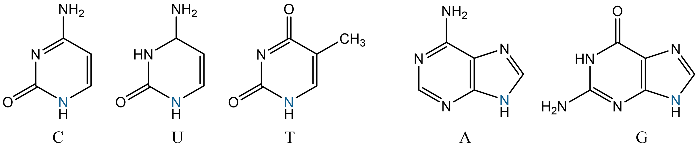
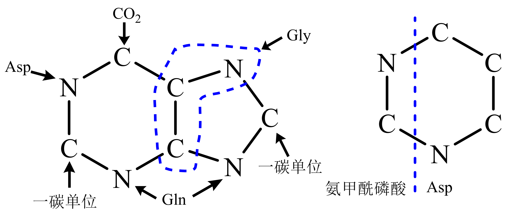

######################################
核酸及其代谢
######################################

核酸是重要的生物大分子，分脱氧核糖核酸、核糖核酸。

脱氧核糖核酸（DNA）：

    * 原核染色体DNA、质粒DNA（染色体外基因，可自主复制及表达）、
    * 真核细胞器DNA均为环状双链DNA；
    * 真核染色体DNA为线性双链DNA，末端具高度重复序列形成的端粒。

核糖核酸（RNA）：

    * tRNA、
    * rRNA（原核16S/5S,23S；高等真核18S/5S,5.8S,28S；低等真核17S/5S,5.8S,26S）、
    * mRNA（原核结构简单、多顺反子；真核5’帽子、3’polyA尾、非翻译区调控序列）。

核酸功能：

    * DNA是主要遗传物质（基因为染色体上占一定位置的遗传单位，可复制传递遗传信息、转录影响表型、突变为各等位基因）；
    * RNA参与蛋白合成，控制蛋白质合成、作用于RNA转录后加工修饰、基因表达与细胞功能调节、生物催化及其它细胞持家功能、遗传信息加工进化。

结构
======================================

核酸为多聚核苷酸，结构单位为核苷酸；核苷酸由核苷、磷酸构成；核苷由碱基、戊糖（D-核糖、D-2-脱氧核糖）构成；碱基分嘌呤碱、嘧啶碱。

.. list-table:: 核酸基本组成
   :align: center
   :header-rows: 1
   :name: 生化-表-核酸基本组成

   * -
     - DNA
     - RNA
   * - 嘌呤碱
     - 腺嘌呤（A）
     - 腺嘌呤（A）
   * -
     - 鸟嘌呤（G）
     - 鸟嘌呤（G）
   * - 嘧啶碱
     - 胞嘧啶（C）
     - 胞嘧啶（C）
   * -
     - 胸腺嘧啶（T）
     - 尿嘧啶（U）
   * - 戊糖
     - D-2-脱氧核糖
     - D-核糖
   * - 酸
     - 磷酸
     - 磷酸

碱基：嘧啶碱（C、U、T）；嘌呤碱（A、G）；稀有碱基：含量少，多为甲基化碱基（m\ :sup:`5`\C、hm\ :sup:`5`\C、I）。

   碱基类别

核苷：一类糖苷，戊糖与碱基缩合成，N-糖苷键；戊糖均为呋喃型、β-糖苷键；tRNA、rRNA中含少量假尿嘧啶核苷（φ）；某些tRNA中含W、Q核苷，可视为鸟嘌呤核苷衍生物。

核苷酸：核苷酸（2’-、3’-、5’-），脱氧核苷酸（3’-、5’-）；碱水解RNA时可得2’-、3’-核苷酸混合物；**图 8 1**。

共价结构
--------------------------------------

核酸由核苷酸聚合而成，共价结构即为核酸一级结构（核苷酸序列）。核苷酸以3’,5’-磷酸二酯键相连，字母表示中5’端在左、3’端在右。

原核生物以操纵子为转录单位产生多顺反子mRNA，mRNA链上具多编码区、两端具非翻译区。

真核生物mRNA均为单顺反子，5’端具帽子结构、3’端具poly（A）尾（与出核运输、半衰期相关）。

字母表示：N为任意核苷，m指甲基化（左于碱基、右于核糖；右上角数字为位点、右下角为数目）。

DNA高级结构
--------------------------------------

双螺旋结构：

    * 反向平行双链绕轴心缠绕均为右手螺旋；
    * 碱基位于螺旋内侧，磷酸、核糖以3’,5’-磷酸二酯键相连形成骨架，形成大沟、小沟；
    * 螺径2nm、碱基堆积距离0.34nm、两核苷间夹角36°、10nt/周、螺距3.4nm；
    * 两链间碱基互补配对，A-T（2氢键）、G-C（3氢键，较稳定）；
    * 碱基在单一链上排序不受限。

DNA结构可受环境条件影响改变，B型、A、C、D、E型及Z型（左手螺旋）。铰链DNA：分子内折叠成的三股螺旋。

三级结构：DNA分子经扭曲、折叠形成的特定构象，含不同二级机构单元间的相互作用、单链与二级结构单元间相互作用、拓扑特征；超螺旋为其中一种形式。

* 连环数（L）：双螺旋DNA中某一链以右手螺旋绕另一链的次数；
* 扭转数（T）：双螺旋数；
* 超螺旋数（缠绕数，W）；
* L=T+W；
* 比连环差 :math:`λ=\frac{L-L_0}{L_0}` 。
* 拓扑异构酶Ⅰ每次可使L+1；拓扑异构酶Ⅱ每次可使L-2。

染色质基本结构单位：

    * 核小体，八聚体，由组蛋白H2A、H2B、H3、H4各2分子组成；
    * DNA以左手螺旋绕1.8圈共146bp、平均每核小体重复单位DNA200bp；
    * 核小体间连接DNA上结合组蛋白H1（维系高级结构重要组分）。

剂量补偿效应：哺乳动物其中一条X染色体在发育早期异染色质化为无活性巴氏小体，使得雄性细胞、雌性细胞X染色体基因活性水平一致。

RNA高级结构
--------------------------------------

tRNA：蛋白质合成中具转运氨基酸、识别密码子作用，在DNA反转录、其它代谢及基因表达调节具作用；每种氨基酸对应一种/多种tRNA；二级结构呈三叶草形，由氨基酸臂（末端CCA，接受活化氨基酸）、二氢尿嘧啶环、反密码子环、额外环、TφC环组成。

rRNA：核糖体中催化肽键合成。

RNA常与蛋白质形成复合物，以RNA-蛋白质复合物形式行使功能。

物化性质
======================================

核酸的糖苷键、磷酸二酯键可水解；具磷酸基、碱基而表现酸碱性；碱基引起紫外吸收特性；双螺旋结构而可变性、复性。

水解
--------------------------------------

酸水解：糖苷键比磷酸酯键更易被水解，嘌呤碱糖苷键对酸更不稳定。

碱水解：RNA磷酸酯键易被碱水解。

酶水解：

    * 磷酸二酯酶（非特异）、核酸酶（专一水解核酸的磷酸二酯酶）；
    * 内切酶（作用于核酸链内部）、外切酶（从链末端始逐个切下）；
    * 限制性内切酶（细菌中一类识别水解外源双链DNA的核酸内切酶）。

理化性质
--------------------------------------

核酸的碱基、核苷、硫酸基均可解离。

因嘌呤、嘧啶具共轭双键，使核酸在260nm处具最大吸收值。

对核酸样品纯度鉴定：纯DNA的A260/A280>1.8，纯RNA应达到2.0。

变性、复性及杂交
--------------------------------------

变性：核酸双螺旋区氢键断裂变为单链，不涉及共价键断裂。

    * Tm：使DNA双螺旋结构失去一半时的温度；受 DNA均一性（Tm幅度）、GC含量（Tm大小）、介质离子强度影响。

复性：变性DNA在适当条件下，俩分开链重新缔合为双螺旋结构。

退火：变性DNA缓慢冷却时复性。DNA片段越长，复性越慢；浓度越高，复性越快。

核酸杂交：Southern blotting（DNA-DNA），Northern blotting（DNA-RNA）；变性DNA在复性时可与具同序列的核酸结合成杂交DNA分子。

研究方法
======================================

DNA分离：经1MNaCl溶解后稀释至0.14MNaCl，再经苯酚抽提后经冷乙醇沉淀；SDS缓冲，蛋白酶K完全作用后苯酚抽提；RNA经RNase分解去除。

RNA分离：器皿需高压灭菌或DEPC破坏RNase，破碎细胞时需加强变性剂，反应体系内需加RNase抑制剂。

含量测定：（比色法）

    * RNA与盐酸共热核糖转为糠醛，与地衣酚反应呈鲜绿色，于670nm处最大吸收；
    * DNA酸性溶液中与二苯胺共热，脱氧核糖反应成蓝色化合物，于595nm处最大吸收。

降解及代谢
======================================

核苷酸作用：核酸生物合成前体；衍生物为众多合成活性中间物；ATP为代谢通用高能化合物；腺苷酸为NAD、FAD、CoA组分；部分起代谢调节作用。

分解代谢
--------------------------------------

核酸解聚：核酸酶水解核苷酸间的磷酸二酯键。核苷酸酶/磷酸单酯酶催化核苷酸水解脱去磷酸为核苷。核苷经核苷酶（核苷磷酸化酶；核苷水解酶，仅对核糖核苷作用，反应不可逆）催化分解为碱基、戊糖。

嘌呤分解：先经脱氨酶作用生成次黄嘌呤、黄嘌呤。动物组织中腺嘌呤核苷脱氨酶 :numref:`生化-图-腺嘌呤脱氨分解` E2、腺嘌呤核苷酸脱氨酶 :numref:`生化-图-腺嘌呤脱氨分解` E1活性高，而腺嘌呤脱氨酶 :numref:`生化-图-腺嘌呤脱氨分解` E3量极少。

   腺嘌呤脱氨分解

鸟嘌呤由鸟嘌呤脱氨酶催化为黄嘌呤。次黄嘌呤、黄嘌呤在黄嘌呤氧化酶催化下氧化为尿酸（人、猿类）。

    * 多数物种可继续分解尿酸，由尿酸氧化酶催化为尿囊素（人、猿外其它哺乳类嘌呤代谢排泄物）；
    * 尿囊素由尿囊素酶水解为尿囊酸（某些硬骨鱼嘌呤代谢排泄物）；
    * 尿囊酸经尿囊酸酶水解为乙醛酸及尿素（多数鱼类、两栖类嘌呤代谢排泄物）；
    * 部分低等动物将尿素分解为氨、CO2排出。

痛风：体内尿酸过量积累引起。因人、猿类缺乏尿酸分解能力；别嘌呤醇对黄嘌呤氧化酶 :numref:`生化-图-嘌呤分解代谢` E1具强抑制作用，患者嘌呤代谢物以黄嘌呤、次黄嘌呤代替尿酸。

   嘌呤分解代谢

嘧啶分解：具氨基的嘧啶需先水解脱去氨基，后经水解开环为有机酸。

   嘧啶分解代谢

合成代谢
--------------------------------------

无论何物种，常均可合成嘌呤、嘧啶核苷酸。核苷酸合成可经“从头合成”及“补救”途径（已形成的碱基、核苷合成核苷酸）。

   嘌呤及嘧啶环骨架来源

   嘌呤核苷酸合成

* 嘌呤核苷酸“从头合成”，先合成IMP后再氨基化为腺嘌呤核苷酸或先氧化为黄嘌呤核苷酸后氨基化为鸟嘌呤核苷酸。
* “补救”途径：碱基与1-磷酸核糖反应（由特异核苷磷酸化酶催化，再经核苷磷酸激酶催化；皆可逆；除腺苷激酶外缺乏其它嘌呤核苷激酶）、嘌呤碱与5-磷酸核糖焦磷酸由磷酸核糖转移酶催化为嘌呤核苷酸（ :numref:`生化-图-嘌呤核苷酸合成` 虚线）。
* Lesch-Nyhan综合症：缺乏次黄嘌呤-鸟嘌呤磷酸核糖转移酶，GMP、IMP补救合成障碍导致尿酸过量产生。IMP、AMP、GMP可抑制PRPP形成5-磷酸核糖胺；AMP、GMP分别抑制IMP始的分支。

   嘧啶核苷酸合成

* 嘧啶核苷酸合成由氨甲酰磷酸、天冬氨酸始，先合成尿嘧啶核苷酸；仅尿嘧啶核苷三磷酸可氨基化为胞嘧啶。
* “补救”途径：尿嘧啶与5-磷酸核糖焦磷酸反应生成UMP、尿嘧啶与1-磷酸核糖反应后由尿苷激酶磷酸化生成UMP（重要作用）；胞嘧啶核苷由尿苷激酶催化生成CMP。dTMP的生成由dUMP经甲基化生成，或经dCTP脱氨为dUTP后转变；胞内dUTP生成即由酶转为dUMP以防掺入DNA。

辅酶核苷酸合成
--------------------------------------

* NAD、NADP：烟酸与5-磷酸核糖焦磷酸反应后，再与ATP（供AMP），Gln、ATP（供能）反应生成NAD；NAD经激酶催化与ATP（供Pi）反应为NADP。
* FAD：核黄素经激酶与ATP（供Pi）反应后由FAD焦磷酸化酶催化与ATP（供AMP）反应生成。
* CoA：泛酸经过激酶等催化，由ATP、Cys等参与反应。
