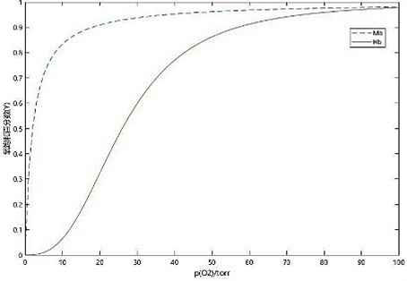
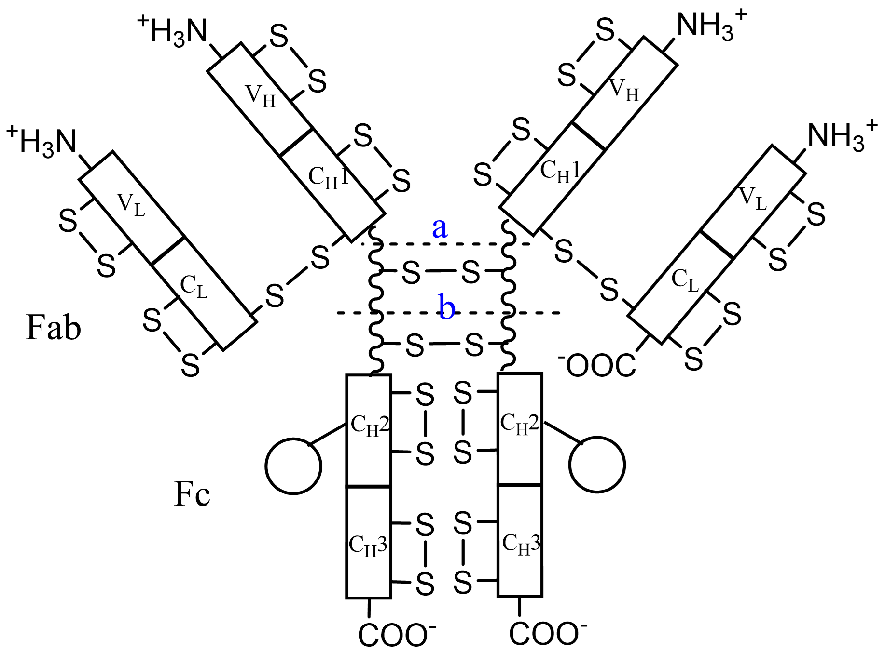
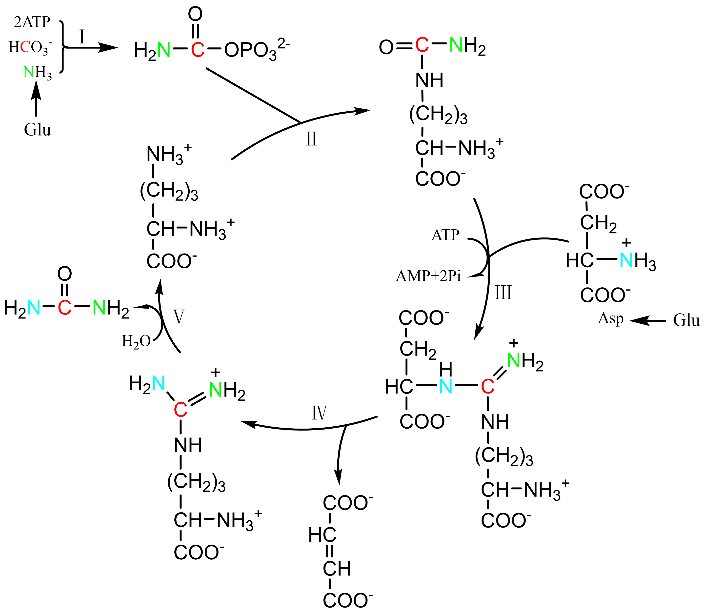

######################################
蛋白质及其代谢
######################################

- 蛋白质是生物功能的主要载体，一类重要的生物大分子，在结构、功能上具多样性；与核酸构成胞内原生质的主要成分。
- 蛋白质主要含C、H、O、N、S及其它如Fe、P、Cu、I、Zn、Mo；平均含N量16%，凯氏定氮法（蛋白质量=蛋白氮*6.25）。
- 蛋白质依形状、大小可分：纤维状蛋白质（结构）、球状蛋白质（水溶性好）、膜蛋白（亲水氨基酸残基少于胞质蛋白）。

    - 单纯蛋白质：仅由氨基酸组成无其它成分，可用110除Mr大致得到氨基酸残基数。
    - 缀合蛋白质：除含氨基酸外还有其它成分；非蛋白部分称辅基，需水解或变性释放。
    - 单体蛋白质：仅由一条多肽链构成。
    - 寡聚/多聚蛋白质：由两条/多条多肽链构成；每条肽链称亚基，亚基间以非共价键连接。

- 蛋白质的构象：特定蛋白所有的特有空间结构（三维结构）。

    - 一级结构：肽链氨基酸序列。
    - 二级结构：肽链经氢键排列成特有α螺旋、β折叠片段。
    - 三级结构：肽链经非共价键弯曲、折叠成具特定走向的紧密球状构象。
    - 四级结构：寡聚蛋白质各亚基间在空间上的相互关系、结合方式。
    - 但一个蛋白质其复杂结构所需信息均于一级结构中。

- 蛋白质功能：

    #. 催化：酶，催化效率远大于合成催化剂。
    #. 调节：调节其它蛋白质执行生理功能，胰岛素；参与基因表达调控。
    #. 转运：经血液转运物质的血清清蛋白，膜转运蛋白。
    #. 贮存：N的贮存及其它元素的贮存。
    #. 运动：肌动蛋白、肌球蛋白，用以细胞运动；胞内物的驱动，动力蛋白、驱动蛋白。
    #. 结构成分：建造、维持生物体结构，胶原蛋白、α-角蛋白。
    #. 支架作用：在细胞应答激素、生长因子途径中起作用，协调及通讯；锚定/导向蛋白。
    #. 防御、进攻：免疫球蛋白（抗体，外源蛋白质或其它物质即抗原作用下，由淋巴细胞产生与相应抗原结合而排除外来物），血液凝固蛋白：凝血酶原、血纤蛋白原，抗冻蛋白，蛇毒、细菌毒素。
    #. 其它功能：甜蛋白具极高甜度，昆虫的节肢弹性蛋白，贝类的胶质蛋白用于贝壳固定。

氨基酸
======================================

- 氨基酸的内在性质使得蛋白质在结构、功能上具多样性：聚合能力、特有的酸碱性质、侧链结构及其化学功能多样性、手性。
- 蛋白质水解：水解过程中逐渐降解为小肽段最后为氨基酸混合物。

    - 完全水解（氨基酸混合物）、部分水解（肽、氨基酸）。
    - 酸水解：4MH\ :sub:`2`\SO\ :sub:`4`\或6MHCL共热20h；不引起消旋、Trp完全破坏、Ser\Thr部分水解、Asn\Gln酰胺基被水解。
    - 碱水解：5MNaOH共热10-20h；多数氨基酸被破坏并消旋，D-、L-氨基酸混合物（消旋物）；Arg脱氨，Trp稳定。
    - 酶水解：无消旋、不破坏氨基酸；需多种酶协同作用，时间长。

- 常见氨基酸，除脯氨酸及其衍生物，与羧基相邻的α-碳上都具氨基，称α-氨基酸。 :numref:`生化-图-α-氨基酸结构通式`

    - 因同时含氨基、羧基，可通过首尾相连聚合，脱去1H2O形成共价酰胺键（肽键）。
    - 氨基酸在中性pH时，羧基为-COO\ :sup:`-`\、氨基为-NH\ :sup:`3+`\形式存在，含正、负电荷各一，称兼性离子。
    - 均为L型，具旋光性；白色晶体、高熔点；Pro（羟脯氨酸）能溶于乙醇、乙醚，除Tyr（胱氨酸）外其余可溶于水。

   α-氨基酸结构通式

分类
--------------------------------------

- 氨基酸是否参与蛋白质组成分：蛋白质氨基酸、非蛋白质氨基酸。
- 按R基结构分脂肪族（中性、酸性及其酰胺、碱性、含羟基或硫）、芳香族、杂环族。 :numref:`生化-表-氨基酸及其分类`

    - 胱氨酸由两Cys经巯基氧化成共价二硫桥连接成。
    - Asn、Gln在生理pH范围内酰胺基不被质子化，侧链不带电荷。
    - Arg为动物尿素形成中间体。
    - Trp在植物、部分动物体内可转为VPP。
    - His既是杂环族氨基酸，也是碱性氨基酸。
    - Pro无自由α-氨基，是一种α-亚氨基酸。

- 按R基性质（pH7），可分为： :numref:`生化-表-氨基酸及其分类`

    #. 非极性R基氨基酸（水中溶解度低于极性R基氨基酸；Ala的R基疏水性最小，介于①和②间）
    #. 不带电荷极性R基氨基酸（侧链极性：Ser、Thr、Tyr羟基，Asn、Gln酰胺基，Cys巯基；Gly侧链介于极性及非极性间；Cys、Tyr的R基极性最强）
    #. 带正电荷R基氨基酸（His为唯一R基pKa于7附近氨基酸）
    #. 带负电荷R基氨基酸。

.. list-table:: 氨基酸及其分类
   :align: center
   :header-rows: 1
   :name: 生化-表-氨基酸及其分类

   * - 类别
     - 名称
     - 缩写
     - 简写
     - R基性质（pH7）
   * - 中性脂肪族
     - 丙氨酸
     - Ala
     - A
     - 非极性
   * - 中性脂肪族
     - 异亮氨酸
     - Ile
     - I
     - 非极性
   * - 中性脂肪族
     - 亮氨酸
     - Leu
     - L
     - 非极性
   * - 中性脂肪族
     - 缬氨酸
     - Val
     - V
     - 非极性
   * - 中性脂肪族
     - 甘氨酸
     - Gly
     - G
     - 不带电极性
   * - 酸性
     - 天冬酰胺
     - Asn
     - N
     - 不带电极性
   * - 酸性
     - 谷氨酰胺
     - Gln
     - Q
     - 不带电极性
   * - 酸性
     - 天冬氨酸
     - Asp
     - D
     - 带负电
   * - 酸性
     - 谷氨酸
     - Glu
     - E
     - 带负电
   * - 碱性/杂环
     - 组氨酸
     - His
     - H
     - 带正电
   * - 碱性/杂环
     - 赖氨酸
     - Lys
     - K
     - 带正电
   * - 碱性/杂环
     - 精氨酸
     - Arg
     - R
     - 带正电
   * - 碱性/杂环
     - 脯氨酸
     - Pro
     - P
     - 非极性
   * - 含羟基/硫
     - 甲硫氨酸
     - Met
     - M
     - 非极性
   * - 含羟基/硫
     - 半胱氨酸
     - Cys
     - C
     - 不带电极性
   * - 含羟基/硫
     - 丝氨酸
     - Ser
     - S
     - 不带电极性
   * - 含羟基/硫
     - 苏氨酸
     - Thr
     - T
     - 不带电极性
   * - 芳香族
     - 络氨酸
     - Tyr
     - Y
     - 不带电极性
   * - 芳香族
     - 苯丙氨酸
     - Phe
     - F
     - 非极性
   * - 芳香族
     - 色氨酸
     - Trp
     - W
     - 非极性

- 非常见蛋白质氨基酸：由常见氨基酸修饰形成；参与结缔组织、凝血酶原、光驱动质子泵等。
- 非蛋白氨基酸：多为L-型α-氨基酸衍生物，部分为β-、γ-、δ-氨基酸及D型氨基酸。

各常见蛋白质氨基酸：

   中性脂肪族氨基酸

   含羟基/硫氨基酸

   酸性氨基酸及其酰胺

   碱性及杂环氨基酸

   芳香族氨基酸

酸碱化学性质
--------------------------------------

- 氨基酸可使水的介电常数增高、且氨基酸晶体熔点高，以兼性离子形式存在；晶体由离子晶格组成。
- 氨基酸在水中既可作酸、也可作碱，是一类两性电解质。

   甘氨酸解离

- 解离常数K\ :sub:`a1`\、K\ :sub:`a2`\分别代表α-C的羧基、氨基解离常数。

    - :math:`K_{a1}=\frac{[A^0][H^+]}{[A^+]}` ；:math:`K_{a2}=\frac{[A^-][H^+]}{[A^0]}`。
    - R基不解离氨基酸均具甘氨酸类似滴定曲线。
    - 生理条件下，除His外均无明显缓冲容量；His具有的缓冲作用，使得富含其的血红蛋白对运输O2、CO2具重要作用。

- 等电点（pI）：使得氨基酸处于净电荷为零的兼性离子状态时的pH

    - :math:`pI=\frac{1}{2}(pK_{a1} +pK_{a2})`
    - pI与离子浓度基本无关，只决定于等电兼性离子（A\ :sup:`0`\）两侧的pKa值
    - 处于pI上的任一pH，氨基酸均带负电荷并向正极移动；低于则带正电荷并向负极移动

- 氨基酸因酸、碱滴定的等电点pH过高或过低而无合适指示剂，可加过量甲醛将氨基转为羟甲基衍生物降低氨基酸的碱性；使得滴定曲线的碱滴定段显著向低pH方向移动。

化学反应
--------------------------------------

- α-氨基参与：

    - 室温下与亚硝酸作用生成N\ :sub:`2`\（氨基酸定量及蛋白质水解程度，仅半数N\ :sub:`2`\源自氨基酸；Lysε-NH\ :sub:`2`\也可参与但较慢）
    - 弱碱下与酰氯/酸酐反应酰基化（可作合成时氨基保护剂），丹磺酰氯用于N末端氨基酸标记及微量氨基酸定量
    - 弱碱下与DNFB生成DNP-aa（Sanger）或与PITC生成PTC-aa再环化为PTH-aa（Edman）
    - 与醛类生成弱碱（西佛碱）
    - 经氨基酸氧化酶脱氨基为酮酸

- α-羧基参与：

    - 与碱作用成盐或与醇作用成酯（羧基被保护使氨基活化）
    - 氨基适当保护后与PCl\ :sub:`5`\作用使羧基活化易于与另一氨基结合（人工合成）
    - 经氨基酸脱羧酶作用释放CO\ :sub:`2`\生成相应一级胺
    - 经甲酯化后与肼及亚硝酸作用为叠氮化合物活化羧基（人工合成）

- α-氨基及α-羧基共同参与：

    - 弱酸下与茚三酮共热成紫色物（可定性及570nm定量，释放的CO\ :sub:`2`\可定量反应氨基酸量），Pro、羟脯氨酸直接生成亮黄色物（无NH\ :sub:`3`\产生，440nm）；
    - 成肽，一个氨基酸的氨基与另一氨基酸羧基缩合成肽键

- 侧链R基参与：

    - Tyr的3-,5-可被取代，酚基可与重氮化合物成橘黄色物；
    - His咪唑基与重氮苯磺酸成棕红色物；
    - Arg胍基与1,2环己二酮硼酸钠下缩合，羟胺缓冲液可逆转（序列分析、结构功能研究）；
    - Trp吲哚基被N-溴代琥珀酰亚胺氧化可分光光度法测含量及于Trp、Tyr处选择性断键；
    - Met甲硫基与烃化剂成锍盐可被巯基试剂逆转；
    - Cys巯基反应性强，微碱性下解离为巯醇与卤化烷迅速成稳定烷基衍生物，可与DTNB反应释放硫硝基苯甲酸（412nm,pH8.0）；巯基能与各金属离子成稳定度不等络合物、易受空气及其它氧化剂氧化。

光学性质
--------------------------------------

- 蛋白质经碱水解或一般有机合成得到的氨基酸皆为无旋光性DL-消旋物（外消旋）；胱氨酸为特殊的内消旋物。
- 比旋是α-氨基酸的物理常数，可供鉴别。
- 氨基酸再红外/远紫外区均有光吸收，芳香族氨基酸在近紫外区具光吸收。一般，蛋白质的最大光吸收在280nm。芳香族氨基酸在紫外区呈较弱荧光，Trp显磷光。

共价结构
======================================

肽
--------------------------------------

- 肽链，氨基酸的线性聚合物，脱去1H\ :sub:`2`\O形成肽键相连；

    - 可分n肽、寡肽、多肽；
    - 参与形成肽链的氨基酸称氨基酸残基，命名：氨基末端（左侧） → 羧基末端（右侧）；某酰···某氨基酸。
    - 肽链除肽键外在两Cys间可形成二硫键（二硫桥），使两独立肽链相连（链间二硫键）或链内成环（链内二硫键）。

- 肽键共振：具双键性质；限制肽键的自由旋转；形成酰胺平面；绕键能障高维持酰胺平面；具永久偶极。反式构型较顺式构型稳定，除Pro。
- 物化性质：晶体为离子晶格具高熔点；

    - 酸碱性主要决定于末端游离α-羧基、α-氨基及侧链R基；
    - 末端α-羧基pKa大于游离氨基酸、末端α-氨基pKa小于游离氨基酸。
    - 双缩脲反应：碱性CuSO4溶液，生成紫红色/蓝紫色复合物；肽/蛋白质特有。

- 活性肽：具特殊生物学功能（肽类激素、部分抗生素等）。α-鹅膏蕈碱：抑制真核RNA polⅡ。谷胱甘肽：GSH，巯基缓冲剂。

一级结构测定
--------------------------------------

- 简要步骤：

    - 测定蛋白质分子多肽链数目
    - 拆分蛋白质分子多肽链
    - 断开多肽链内二硫键
    - 分析多肽链氨基酸组成
    - 测定末端残基
    - 裂解多肽链成小片段
    - 测定各片段氨基酸序列
    - 重建完整肽链一级结构
    - 确定二硫桥位置

- N-末端分析：

    - DNFB/FDNB法
    - DNS法
    - PITC法
    - 氨肽酶法

- C-末端分析：

    - 肼解法（Gln、Asn、Cys被破坏，Arg转为鸟氨酸）
    - 还原法
    - 羧肽酶法
    - 二硫桥断裂：过甲酸氧化法、巯基化合物还原法

- 多肽裂解：

    - 酶裂解：胰蛋白酶（得Arg、Lys羧基端残基肽）、糜蛋白酶（断裂Phe、Trp、Tyr羧基端肽键）、胃蛋白酶（两侧疏水性氨基酸）、木瓜蛋白酶（Arg、Lys羧基端）等。
    - 化学裂解：溴化氰断裂（只断裂Met羧基端）、羟胺断裂（Asn-Gly间）。

- 肽段序列测定：

    - Edman降解法（N-末端分析的PITC法）
    - 酶降解法（肽链外切酶）
    - 质谱法
    - 核酸序列推断

- 多肽段次序确定：多种断裂法形成不同断裂形式的多套肽段，具有跨切口的重叠肽段，以确定原序列。
- 二硫桥确定：经胃蛋白酶水解（专一性差、pH低防二硫键反应）后，行对角线电泳，第二向电泳前过甲酸断裂二硫键。

氨基酸序列与生物功能
--------------------------------------

- 同源蛋白质：

    - 不同生物体中具相同或相似功能的蛋白质
    - 氨基酸序列具明显相似性（序列同源性）
    - 不同物种间相同的序列称不变残基，变化大者称可变残基

- 对任意两物种的同源蛋白质，序列的差异数与物种间系统发生差异成正比。

人工合成
--------------------------------------

- 控制合成：不同氨基酸按一定序列合成。共聚合：一种或两种氨基酸聚合成。
- 控制合成时需对游离氨基（苄氧甲酰基）、羧基（盐/酯）、侧链活泼基团等进行保护。肽键在正常条件下非自发形成，需活化；常活化羧基（叠氮法、活化酯、混合酸酐）。

三维结构
======================================

特定蛋白质行使功能常由其三维结构或构象决定。

折叠结构受影响于：与溶剂分子的相互作用；溶剂pH和离子组成；氨基酸序列。

构象研究方法
--------------------------------------

- X射线衍射法（晶体结构测定）
- 紫外差光谱（芳香族、杂环族共轭环系统，即发色团；受微环境影响；环境极性大、吸收峰向短波长移动，蓝移/向紫效应；反之为红移/向红效应）
- 荧光偏振
- 圆二色性（估算α螺旋、β折叠、无规则卷曲含量）
- 核磁共振

作用力及空间限制
--------------------------------------

- 主要为弱相互作用/非共价键/次级键：

    - 氢键、范德华力、疏水作用力、盐键；
    - 稳定核酸构象、生物膜结构。
    - 共价二硫键在稳定蛋白质构象中也起作用。

- 氢键，肽链中为羰基氧与酰胺氢间形成，稳定蛋白质二级结构的主要作用力；也在侧链间、侧链与水、主链与侧链活水间形成。

    - 具方向性、饱和性。
    - 多数蛋白质采取主链肽基间形成分子内氢键，同时保持大多数侧链位于蛋白质表面与水作用。

- 范德华力：

    - 定向效应（极性分子/基团间）
    - 诱导效应（极性物质与非极性物间）
    - 分散效应（非极性分子/基团间仅有的范德华力）
    - 两非键合原子处于接触距离时范德华力达最大；
    - 相互作用具加和效益、位相效应。

- 疏水作用：

    - 球状蛋白在水中折叠倾向将疏水残基分布于分子内的现象；
    - 熵增加是主要动力；
    - 非极性溶剂、去污剂可破坏（变性剂）；
    - 尿素、盐酸胍即破坏氢键、也破坏疏水作用（强变性剂）。
    - 疏水物/基团加入水中，周围水分子排列成刚性有序结构（笼型结构）。

- 盐键（盐桥、离子键）：正负电荷间静电相互作用。
- 二硫键：对构象起稳定作用，多位于β转角附近。

二级结构
--------------------------------------

- 二级结构：蛋白质主链折叠产生由氢键维持的有规则构象；使得因疏水作用形成的分子内主链极性基团可被氢中和。

- α螺旋：3.6残基/圈、螺距0.54nm、每残基旋转100°上升0.15nm、螺径0.5nm、氢键封闭环为13元环；3.6\ :sub:`13`\-螺旋。

    - 末端酰胺氢与羧基氧不参与螺旋、非极性残基暴露，经螺旋帽化补偿。
    - 具旋光性，右手螺旋；折叠形成螺旋时具协同性。
    - 肽链能否形成α螺旋及是否稳定与氨基酸组成及序列具极大关系（R基电荷性及大小）；Pro中断α螺旋产生结节。

- β折叠：局部协同性氢键形成，呈锯齿状；侧链垂直于折叠片平面且交替伸出；呈平行式（更规则）或反平行式（疏水侧链发布同侧）纤维状蛋白以反平行为主，球状蛋白广泛存在。
- β转角：非重复性结构，首个残基的C=O键与第四残基的N-H氢键键合成紧密环；允许蛋白质倒转肽链方向。
- β凸起：小片非重复结构，常为反平行β折叠中的不规则存在。
- 无规则卷曲：泛指未明确的二级结构多肽段；有序非重复结构常构成酶活性部位及蛋白质特异功能部位。

纤维状蛋白：

    - 基本支架及外保护组分，呈纤维状/细棒状具线性结构。
    - 分不溶性：角蛋白、胶原蛋白及弹性蛋白等，
    - 可溶性：肌球蛋白、血纤蛋白等。
    - 角蛋白源于外胚层，分α、β：

        - α-角蛋白：为毛发主要蛋白，典型α螺旋；毛发中3股右手α螺旋向左缠绕为初原纤维，再以9+2结构成微原纤维，最后结合成不规则的大原纤维。
        - β-角蛋白：如丝心蛋白，具高抗张强度、柔软但不可拉伸，反平行β折叠，链间氢键相连、层间范德华力维持。

    - 胶原蛋白（胶原）：

        - 为结构蛋白质，使结缔组织具机械强度，含多种类型 :numref:`生化-表-胶原类型`
        - 糖的加入在多肽合成后、折叠成超螺旋前；以胶原纤维形式存在，结构单元为原胶原；
        - 以3股α肽链（左手螺旋）缠绕成右手超螺旋，每残基上升0.29nm、螺距8.6nm、30残基/股圈、左手螺旋螺距0.95nm、3.3残基/圈；
        - 胶原纤维可分子内（N-末端与非螺旋区Lys）、分子间（N-末端与相邻原胶原C-末端）交联，年龄增加共价交联越多而使得结缔组织变脆。
    - 弹性蛋白：

        - 为结缔组织另一种蛋白，只有一个基因，由可溶性单体原弹性蛋白合成；
        - 交联形式与胶原蛋白类似，也可经Lys修饰的与异锁链素交联（特征标志）；
        - 缺乏规则二级结构，但具多样无规则卷曲。

.. list-table:: 胶原类型
   :align: center
   :header-rows: 1
   :name: 生化-表-胶原类型

   * - 类型
     - 分布
     - 组成
   * - Ⅰ
     - 骨、皮、腱、角膜
     - [α1(Ⅰ)]\ :sub:`2`\α2(Ⅰ)
   * - Ⅱ
     - 软骨、椎间盘、玻璃体
     - [α1(Ⅱ)]\ :sub:`3`\
   * - Ⅲ
     - 血管、新生皮、瘢痕
     - [α1(Ⅲ)]\ :sub:`3`\
   * - Ⅳ
     - 基底膜
     - [α1(Ⅳ)]\ :sub:`2`\α2(Ⅳ)、[α1(Ⅳ)]\ :sub:`3`\、[α2(Ⅳ)]\ :sub:`3`\
   * - Ⅴ
     - 细胞表面、胞外骨架
     - α1(Ⅴ)α1(Ⅴ)α1(Ⅴ)

超二级结构与结构域
--------------------------------------

- 超二级结构：

    - 由若干相邻二级结构元件组合、相互作用成多种类、有规则的二级结构组合（串），并在多种蛋白质中充当三级结构的构件；
    - 形式：αα（两股平行/反平行右手螺旋互相缠绕成左手超螺旋）、βαβ、ββ（β-发夹；β曲折为常见超二级结构）。

- 结构域：

    - 多肽链在二级结构、超二级结构基础上形成三级结构局部折叠区，为相对独立紧密球状实体；
    - 对于较大球状蛋白质/亚基，其三级结构多为两个/多个结构域缔合而成，即多结构域；
    - 常由外显子编码，结构域间可相对运动；
    - 具全α结构、αβ结构、全β结构、不规则小蛋白结构；
    - 亦称功能域，指蛋白质分子中独立存在的功能单位。

三级结构
--------------------------------------

- 三维结构：由二级结构元件构成的总三维结构，包括一级结构中较远肽段间的几何关系、侧链三维空间的相互关系。
- 球状蛋白含多种二级结构元件，具明显折叠层次，为紧密球体，疏水侧链于分子内部，表面具空穴为活性部位、多为疏水环境。

四级结构
--------------------------------------

四级结构：

- 亚基经非共价键缔合聚集成蛋白质；
- 寡聚蛋白质、多聚蛋白质/多亚基蛋白质；
- 同多聚蛋白质、杂多聚蛋白质；
- 亚基间紧密接触依靠极性相互作用、疏水作用（同种缔合、异种缔合）；
- 具对称性；
- 增强结构稳定性、提高遗传经济性及效率、汇集催化基团、具协同性及别构效应（结合于蛋白质特定位点的配体对其它部位产生的影响；
- 同促效应：发生作用部位相同，正协同、负协同；
- 异促效应：活性部位受别构部位、效应物结合影响）。

折叠与结构预测
--------------------------------------

- 蛋白质变性：

    - 天然蛋白质受物化因素（热、UV、高压、表面张力、有机溶剂等）影响，生物活性丧失、溶解度降低、不对称性增高及其它物化常数改变的过程；
    - 实质为次级键破坏、天然构象解体；
    - 不涉及共价键、一级结构完好；
    - 生物活性丧失是主要特征、侧链基团暴露、物化性质改变（疏水基外露、溶解度降低）、生物化学性质改变（易被水解酶分解）。

- 变性剂：

    - 尿素、盐酸胍，与主链竞争氢键破坏二级结构；
    - 增加非极性侧链溶解度，降低维持三级结构的疏水作用。

- 去污剂：SDS等，变性剂一类，破坏分子内疏水作用暴露非极性基团。
- 复性：变性因素去除后，变性蛋白可重新回复天然构象。
- 球状蛋白折叠：

    - 完全伸展态快速、可逆形成局部二级结构（成核）；
    - 折叠核协同聚集成初始结构域；
    - 结构域装配成熔球态；
    - 结构域构象调整；
    - 形成完整三级结构蛋白。

- 分子伴侣：

    - 抑制新生肽链不恰当聚集并排除与其它蛋白质不合理集合，协助多肽链正确折叠；
    - 热休克蛋白。

- 二级结构预测：

    - Glu、Met、Ala、Leu在α螺旋中频率高于其它二级结构元件；
    - Gly、Pro在α螺旋中频率低，β转角中高；
    - Val、Ile、芳香族氨基酸在β折叠片中频率高；
    - Asp、Glu、Pro在β折叠片中频率低

结构与功能关系
======================================

蛋白质功能跟蛋白质与其它分子相互作用相联系；构象的改变等。

肌红蛋白
--------------------------------------

肌红蛋白（Mb）：

- 哺乳动物肌细胞贮存、分配氧的蛋白质；
- 由一条多肽链（珠蛋白，与血红蛋白具系列同源性）、一个辅基血红素（原卟啉Ⅸ、Fe）构成；
- CO亲和力较O\ :sub:`2`\高，但远低于与铁卟啉的亲和力，可有效防止代谢产生的少量CO占据O\ :sub:`2`\结合部位。
- 形成多肽微环境：固定血红素基、保护血红素铁防氧化、为O\ :sub:`2`\提供合适结合部位。
- 给定氧压下肌红蛋白氧分数饱和度 :math:`Y=\frac{P(O_2)}{P(O_2)+K}`；
- 肌红蛋白高度氧合利于向线粒体供氧，为氧贮库。

血红蛋白
--------------------------------------

血红蛋白（Hb）：:numref:`生化-表-人体内正常功能血红蛋白`

- 血液中结合转运氧气；
- 具4个亚基，每个亚基均具1个血红素、1个氧结合部位。
- αβ接触有：装配接触（α\ :sub:`1`\β\ :sub:`1`\与α\ :sub:`2`\β\ :sub:`2`\）、滑动接触（α\ :sub:`1`\β\ :sub:`2`\与α\ :sub:`2`\β\ :sub:`1`\）；
- 存在紧张态（T）、松弛态（R），R态对氧高亲和。

.. list-table:: 人体内正常功能血红蛋白
   :align: center
   :header-rows: 1
   :name: 生化-表-人体内正常功能血红蛋白

   * - 阶段
     - 名称
     - α链
     - β链
     - 亚基
   * - 胚胎
     -
     - ζ
     - ε
     - ζ\ :sub:`2`\ε\ :sub:`2`\
   * - 胎儿
     - Hb F
     - α
     - γ
     - α\ :sub:`2`\γ\ :sub:`2`\
   * - 出生后
     - Hb A
     - α
     - β
     - α\ :sub:`2`\β\ :sub:`2`\
   * - 出生后
     - Hb A\ :sub:`2`\
     - α
     - δ
     - α\ :sub:`2`\δ\ :sub:`2`\

血红蛋白为别构蛋白，氧合具正协同性同促效应，一个O\ :sub:`2`\结合增加同一Hb分子其余空氧结合为氧亲和力。给定氧压下氧分数饱和度 :math:`Y=\frac{P(O_2)^n}{P(O_2)^n+K}  (1≤n≤4)`；

   Hb与Mb氧合曲线

血红蛋白与O\ :sub:`2`\结合受环境中其它分子调节（H\ :sup:`+`\、CO\ :sub:`2`\、BPG等）：

- H\ :sup:`+`\和CO\ :sub:`2`\促进O\ :sub:`2`\释放（去氧Hb对H\ :sup:`+`\的亲和力较氧合Hb大）、
- BPG降低Hb对O\ :sub:`2`\的亲和力（稳定T态构象；肌酐于胞内转为BPG防降低）。

Hb缺陷症：血红蛋白病（α/β链变化；镰刀状细胞贫血）、地中海贫血（缺少α/β链）。

- 镰刀状细胞贫血：大量未成熟红细胞、多长而薄新月状/镰刀状红细胞；杂合子因加速破坏感染红细胞中断疟原虫生活周期而具一定疟疾抗性；β链N端6位的Glu被Val代替。
- 其它突变部位：Hb分子表面、血红素基附近、特异结合部位、亚基界面。

免疫球蛋白
--------------------------------------

免疫：

- 脊椎动物重要防御机制，对入侵物应答涉及各类蛋白质、细胞等之间的相互作用；
- 含体液免疫、细胞免疫；
- 淋巴细胞（T：胸腺成熟，经主要组织相容性复合体MHC介导识别抗原；B：骨髓成熟，单独识别抗原）、
- 巨噬细胞（骨髓成熟为单核细胞，抗原递呈）。
- T细胞亚群：

    - Th细胞，与抗原、MHC应答中分泌细胞因子，激活其余细胞；
    - Tc细胞，激活后具细胞毒性。

抗原：

- 可引起免疫反应的分子/病原体；
- 一个单独抗体或T细胞受体仅能结合抗原内一特定分子结构，即抗原决定簇/表位。
- 某些本无抗原性与载体蛋白结合后具抗原性物称半抗原。
- MHC蛋白与胞内被消化蛋白肽段结合展示于胞外；

    - MHC-Ⅰ由Tc细胞识别，Tc细胞成熟过程中灭火可结合自身MHC-Ⅰ的Tc细胞（自身耐受性）。
    - MHC-Ⅱ存于巨噬细胞、B细胞等表面，展示被细胞摄入的外部蛋白质。

免疫球蛋白：

- 抗体，具高度特异性、多样性；
- IgG由重链（H）、轻链（L）组成，链上有可变区（V）、恒定区（C）。轻链：κ或λ；重链：γαμδε（依次）。 :numref:`生化-表-人免疫球蛋白类别`
- 特征结构域为两反向β折叠片形成的结构（免疫球蛋白折叠），当中序列保守。

   免疫球蛋白结构

   - 木瓜蛋白酶处理时于铰链区断裂 **a** 处，产生2个单价Fab及Fc；
   - 胃蛋白酶处理时断裂 **b** 处，产生1个F(ab)\ :sub:`2`\片段及其它小片段。

.. list-table:: 人免疫球蛋白类别
   :align: center
   :header-rows: 1
   :name: 生化-表-人免疫球蛋白类别

   * - 类型
     - 结构
     - 功能
   * - IgG
     - :numref:`生化-图-免疫球蛋白结构`
     - 再次应答主要抗体，唯一可过胎盘
   * - IgA
     - 单/二/三聚体
     - 初乳、乳中主要抗体
   * - IgM
     - 五聚体
     - 初次应答，抑制、凝集、溶解细菌
   * - IgD
     -
     -
   * - IgE
     -
     - 参与过敏反应

过敏反应：免疫反应一种，由过敏原引起；IgE、嗜碱性粒细胞、肥大细胞参与，由IgE介导，诱导细胞分泌组胺及其它活性胺，扩张血管促进免疫细胞向炎症部位移动。

基于免疫的分析技术：多克隆抗体、单克隆抗体、抗体-抗原沉淀反应、ELISA、免疫印迹测定。

骨骼肌收缩相关蛋白
--------------------------------------

真核生物游动系统涉及两类蛋白质：

    - 机动蛋白质（肌球蛋白、动力蛋白、驱动蛋白）、
    - 轨道蛋白质（微丝、微管）。

- 骨骼肌（横纹肌/随意肌）由平行肌纤维束（肌束）组成。
- 肌纤维（肌细胞）：

    - 多个成肌细胞融合成，内质网特化为肌质网（Ca\ :sup:`2+`\库）；
    - 呈规则周期性结构，明带、暗带交替；
    - 由肌丝组成，多个肌球蛋白经尾区离子作用装配成粗丝，肌动蛋白装配成细丝，形成肌节重复单位。 :numref:`生化-图-肌节示意图`

   肌节示意图

肌丝滑动模型：ATP水解与肌动蛋白、肌球蛋白的缔合、解离偶联；

    - 首先，ATP与肌球蛋白结合使肌球蛋白从肌动蛋白丝上释放；
    - 接着，ATP水解，肌球蛋白构象改变，与肌动蛋白丝结合；
    - 然后，释放Pi，肌球蛋白与肌动蛋白丝结合紧密；
    - 最后，肌球蛋白构象变化，粗丝向Z线移动。
    - 调节：由原肌球蛋白、肌钙蛋白C（Ca\ :sup:`2+`\结合蛋白）复合体介导，神经冲动引起Ca\ :sup:`2+`\释放，与肌钙蛋白C结合引起原肌球蛋白、肌钙蛋白复合体构象变化，暴露细丝肌球蛋白结合部位，引发收缩。

分离纯化与表征
======================================

分离纯化主要利用蛋白质间各特性的差异：分子大小、形状、酸碱性、溶解度、吸附性、配体特异亲和力等。依据具体目标、要求，选取合适分离、纯化程序。

氨基酸的分离分析
--------------------------------------

- 色谱（层析），色层分析，实际为吸附层析；

    - 系统由固定相（动相）、流动相（静相）构成，依靠混合物在两相中的分配情况不同而分离；
    - 分配系数（Kd）：一种溶质在两给定互不相溶溶液中分配时在一定温度下平衡后，溶质在两相中的浓度比；:math:`K_d=\frac{C_动}{C_静} =\frac{q}{p}`，p、q为某一物质在静、动相中的分数含量，即 :math:`p+q=1`；
    - 有效分配系数（Keff），因物质的分配不直接决定于Kd，而取决于Keff； :math:`K_eff=\frac{C_A×V_A}{C_B×V_B}=K_d*R_V`。
    - 转移n次后的第k管中的某物含量： :math:`T_{n,k}=\frac{n! * p^{(n-k+1)} * q^{(k-1)}}{(n-k+1)! * (k-1)!}`。
    - 对于Kd大的物质沿系列分溶管的移动速度，即对于混合物质经足够次分配即可使不同物质最高峰错开。

- 纸层析，滤纸吸附的水为静相、展层溶剂为动相，可用于氨基酸成分定性鉴定、定量测定。

    - 可双向层析（二维层析）；
    - 纸层析中，从原点至氨基酸停留点的距离（X）与原点至溶剂前沿距离（Y）之比称Rf值；
    - 只要各条件一致则每种氨基酸的Rf值是确定的。

- 离子交换层析为一种用离子交换树脂作支持剂的层析法。

    - 在pH3时，氨基酸与阳离子交换树脂间的静电吸引大小次序：碱性氨基酸＞中性＞酸性，洗脱顺序相反；但两者间还存在疏水作用，洗脱有所不同等。

- 气相层析，动相为气体、静相为固体颗粒表面的液体。

    - 具微量、快速，但样品需可气化、热稳定。
    - 氨基酸可生成PTH-aa后经三甲基硅烷基化而可气化。

- 高效液相层析（HPLC），静相支持颗粒很细具大表面积，溶剂系统高压洗脱速度大。

物化性质
--------------------------------------

- 蛋白质为两性电解质，可与酸、碱反应。

    - 等电点：对某一蛋白质在某一pH下所带净电荷为零时的pH值。
    - 等离子点：在无其它盐类干扰时，蛋白质质子供体解离出的质子数与质子受体结合的质子数相等时的pH值。

- 测定相对分子质量：依据微量元素含量推算最低相对分子质量；

    - 渗透压法测定（半透膜仅可通过水而不能通过蛋白质，使得浓度平衡时形成渗透压； :math:`M_r=\frac{RT}{\lim\limits_{c \to 0}\frac{\pi}{c}}`，测定需处于等电点；样品不纯时为多种蛋白质的均值）；
    - 沉降分析法（沉降速度法；沉降平衡法）；
    - 凝胶过滤法；
    - SDS-PAGE法。

- 蛋白质溶液为胶体系统；

    - 在溶液中稳定具条件性、相对性；
    - 沉淀方法：盐析法、有机溶剂沉淀法、重金属盐沉淀法、生物碱及部分酸类沉淀法、热变性沉淀法。

分离纯化
--------------------------------------

- 纯化目的：增加制品纯度（比活，增加单位蛋白质重量中所需蛋白质含量/生物活性）。
- 基本原则：前处理、粗分级分离、细分级分离。
- 依分子大小纯化：透析、超过滤；密度梯度离心；凝胶过滤。
- 依溶解度差别纯化：等电点沉淀、pH控制；盐溶、盐析；有机溶剂分级分离；温度变化。
- 依电荷不同纯化：电泳；PAGE；毛细管电泳；等电聚焦；层析聚焦；离子交换层析。
- 依吸附性纯化：羟磷灰石层析（分离蛋白质或核酸）；疏水作用层析。
- 利用配体特异生物学亲和力纯化（亲和层析）；HPLC；FPLC。

含量测定及纯度鉴定
--------------------------------------

- 凯氏定氮法、双缩脲法、Lowry法（标准测定法，Cu\ :sup:`2+`\由蛋白质易氧化成分（巯基、酚基）还原为Cu\ :sup:`+`\后可定量的与Folin-酚试剂反应）、紫外吸收法、Bradford法、胶体金测定法等。
- 酶比活（比活力）：每毫克蛋白所含活力单位数。

    - 酶活力单位数：标准条件下催化产生1微摩尔/分钟的酶量。
    - 纯化倍数：该步比活力/匀浆比活力。
    - 回收率：该步总活力/匀浆总活力。
    - 纯化后：总活力下降、比活力上升。

- 纯度鉴定的物化方法：

    - 电泳（等电聚集、PAGE、SDS-PAGE、毛细管电泳）、沉降、HPLC、溶解度分析等。
    - 纯蛋白质在不同条件下电泳均以单一速度移动，离心场中亦以单一沉降速度移动。

- 采用单一方法鉴定所得结果只为充要条件。

降解与分解代谢
======================================

蛋白质具其存活时间，总处于不断合成、降解的过程；利于排除异常蛋白质、排除过多的酶及调节蛋白维持代谢稳定。

酶活动能力实际依据合成、降解速度。

蛋白质降解
--------------------------------------

- 特性：

    - 有选择降解非正常蛋白质；
    - 绝多数快速降解酶为关键酶；
    - 对降解的敏感性与催化活性、别构性质相关；
    - 与细胞营养、激素状态相关。

- 真核细胞蛋白质降解体系：溶酶体降解（无选择性）、ATP依赖的胞质溶胶机制（泛素，具选择性）。
- 外源蛋白质：经胃、肠分泌酶水解为游离氨基酸 :numref:`生化-表-消化酶水解位点`。

.. list-table:: 消化酶水解位点
   :align: center
   :header-rows: 1
   :name: 生化-表-消化酶水解位点

   * - 酶
     - 肽键位置
   * - 胃蛋白酶
     - Phe/Tyr/Trp/Leu/Glu/Gln
   * - 胰蛋白酶
     - Lys-/Arg-
   * - 糜蛋白酶
     - Phe-/Tyr-/Trp-
   * - 弹性蛋白酶
     - Val-/Leu-/Ser-/Ala-/脂肪族-
   * - 羧肽酶A
     - 非Pro/Arg/Lys
   * - 羧肽酶B
     - Lys-/Arg-
   * - 氨肽酶
     - -氨基酸

氨基酸分解代谢
--------------------------------------

- 氨基酸分解：脱氨、氨与Asp的N结合为尿素后排出、骨架转为代谢中间体。
- 脱氨基作用：

    #. 转氨基作用，氨基酸在氨基转移酶（辅酶PLP）催化下将氨基转移至α-酮酸上，产生酮酸及新氨基酸（Glu）。
    #. 氧化脱氨基，Glu于线粒体由谷氨酸脱氢酶（辅酶NAD\ :sup:`+`\/NADP\ :sup:`+`\）催化为α-酮戊二酸及NH\ :sub:`4`:sup:`+`\。
    #. 其它脱氨基作用，L-/D-氨基酸氧化酶（非专一）以FAD为辅酶催化L-/D-氨基酸氧化。
    #. 联合脱氨基作用，一种为转氨基作用与氧化脱氨基作用偶联 :numref:`生化-图-Glu脱氢酶的联合脱氨基作用` ；另一种为嘌呤核苷酸的联合脱氨基作用，IMP与Asp形成中间物腺苷酸代琥珀酸，后分裂为AMP及延胡索酸，AMP水解产生IMP及NH\ :sub:`3`\。

- 转氨酶（氨基转移酶）：催化转氨基反应，皆可逆，多以α-酮戊二酸为受体。

    - 葡萄糖-丙氨酸循环：肌肉氨基转移酶以丙酮酸为受体转移氨基成Ala，Ala进入血液后运至肝，经转氨基作用产生丙酮酸用于糖异生，最后以Glc回至肌肉。

- 脱羧基作用：由脱羧酶（辅酶磷酸吡哆醛，高专一性）催化（His脱羧酶不需辅酶）。
- 经脱氨基作用，氨基酸的氮转为氨。

    - 血液中氨含量达到1%可引起氨中毒，即神经系统中毒。
    - 脑细胞线粒体可将氨与α-酮戊二酸作用为Glu，但消耗定量NADPH、也破坏TCA正常进行。
    - 氨的排出：排氨动物（水生、海洋动物、原生生物、线虫）、排尿酸动物（鸟类、爬虫类）、排尿素动物（大多数陆生脊椎动物）。

   Glu脱氢酶的联合脱氨基作用
   E1：转氨酶；E2：Glu脱氢酶

   经嘌呤核苷酸循环的联合脱氨基作用

代谢缺陷
--------------------------------------

缺乏某种酶引起疾病，多为先天性，常发于婴幼儿期，幼年致死。 :numref:`生化-表-氨基酸代谢缺陷症`

- 苯丙酮尿症：Phe代谢中缺乏苯丙氨酸4-单加氧酶；缺乏时，Phe与α-酮戊二酸转氨为苯丙酮酸，聚集于血液中，后由尿排出。
- 尿黑酸症：Tyr代谢中缺乏尿黑酸氧化酶；结缔组织有不正常色素沉淀。
- 白化病：黑色素细胞络氨酸酶缺失。

.. list-table:: 氨基酸代谢缺陷症
   :align: center
   :header-rows: 1
   :name: 生化-表-氨基酸代谢缺陷症

   * - 病名
     - 氨基酸
     - 缺陷
   * - Arg血/高血氨症
     - Arg/尿素循环
     - Arg酶
   * - 鸟氨酸血/高血氨症
     - 尿素循环
     - 氨甲酰磷酸合成酶/鸟氨酸脱羧酶
   * - 高Gly血症
     - Gly
     -
   * - 高His血症
     - His
     - His酶
   * - 械糖尿症
     - Ile/Leu/Val
     - 分支链酮酸脱氢酶复合体
   * - 甲基丙二酸血症
     - Ile/Met/Thr/Val
     - 甲基丙二酰CoA变位酶
   * - 异戊酸血症
     - Leu
     - 异戊酰CoA脱氢酶
   * - 高Lys血症
     - Lys
     - Lys-酮戊二酸还原酶
   * - 高胱氨酸尿症
     - Met
     - 胱硫醚β合酶
   * - 苯丙酮尿症
     - Phe
     - 苯丙氨酸4-单加氧酶
   * - 高Pro血症
     - Pro
     - Pro氧化酶/脱氢酶
   * - 尿黑酸症
     - Tyr
     - 尿黑酸氧化酶

尿素形成
--------------------------------------

- 尿素于肝中经尿素循环生成，经血液至肾后随尿排出。
- 尿素中的N分别源自氨、Asp；C源自HCO\ :sub:`3`:sup:`-`\；循环中包含5步 :numref:`生化-图-尿素循环` Ⅰ-Ⅴ，前2步于线粒体内，后3步于细胞溶胶。

   尿素循环

- 各步反应：

    #. `氨甲酰磷酸合成酶` （CPSⅠ；胞质中为CPSⅡ，参与嘧啶合成）催化NH\ :sub:`4`:sup:`+`\及HCO\ :sub:`3`:sup:`-`\活化缩合为氨甲酰磷酸，消耗2ATP。 :numref:`生化-图-尿素循环` Ⅰ
    #. `鸟氨酸转氨甲酰基酶` 将氨甲酰基转移至鸟氨酸，形成瓜氨酸。 :numref:`生化-图-尿素循环` Ⅱ
    #. `精氨琥珀酸合成酶` 催化使瓜氨酸脲基与Asp氨基缩合，消耗1ATP（2高能键）。 :numref:`生化-图-尿素循环` Ⅲ
    #. `精氨琥珀酸酶` 催化，脱去延胡索酸为Arg。 :numref:`生化-图-尿素循环` Ⅳ
    #. `精氨酸酶` 催化水解产生尿素，再生鸟氨酸。 :numref:`生化-图-尿素循环` Ⅴ

- 尿素循环与TCA的联系是通过延胡索酸及草酰乙酸转氨基后形成的Asp实现。循环共消耗4个高能键（3ATP→2ADP+1AMP）。
- 氨甲酰磷酸合酶Ⅰ受N-乙酰-谷氨酸（Glu经N-乙酰-谷氨酸合酶催化，与乙酰CoA合成）别勾激活；

    - 氨基酸降解时，转氨基作用加强，Glu含量升高，N-乙酰-谷氨酸量增加，激活氨甲酰磷酸合酶Ⅰ，加速尿素循环。
    - 循环中某些酶缺乏，使得底物浓度上升，引起上步反应底物积累，进而引起氨积累，形成高血氨症。

骨架氧化途径
--------------------------------------

20种氨基酸骨架由不同的酶系氧化分解，进入TCA，最后氧化为CO\ :sub:`2`\、H\ :sub:`2`\O。

- 形成乙酰CoA：

    - 先形成丙酮酸：Ala、Thr、Gly、Ser、Cys。
    - 先形成乙酰乙酰CoA：Phe、Tyr、Leu、Lys、Trp。

- 形成α-酮戊二酸：Arg、His、Gln、Pro、Glu。
- 形成琥珀酰CoA：Met、Ile、Val。
- 形成延胡索酸：Phe、Tyr。
- 形成草酰乙酸：Asp、Asn。

生糖、生酮及衍生物
--------------------------------------

- 生酮氨基酸：氧化时转为乙酰乙酰CoA（肝中转为乙酰乙酸、β-羟丁酸）的氨基酸。（糖尿病人肝中形成的酮体，除源自脂肪，也源自生酮氨基酸）
- 生糖氨基酸：氧化时转为丙酮酸、α-酮戊二酸、琥珀酸、草酰乙酸的氨基酸。
- 一碳单位：具一碳原子基团；如：亚氨甲基、甲酰基、羟甲基、亚甲基、次甲基、甲基等；Gly、Thr、Ser、His等可作为一碳单位来源；由四氢叶酸（THF）转移；参与嘌呤、嘧啶合成。
- 部分氨基酸亦于神经系统中发挥重要作用；部分氨基酸合成众多其它生物分子调节代谢及生命活动。

    - Tyr代谢与黑色素，肾上腺素、去甲肾上腺素、多巴、多巴胺形成相关。
    - Trp代谢与5-HT、吲哚乙酸形成。
    - Arg、Gly、Met与（磷酸）肌酸的形成。
    - His脱羧为组胺。
    - 鸟氨酸脱羧为腐胺，后形成亚精胺，最后形成精胺。
    - Glu脱羧为γ-氨基丁酸。Cys氧化脱羧为牛磺酸。

氨基酸及其衍生物合成
======================================

- 氨基酸合成中，骨架源于TCA、糖酵解、戊糖磷酸途径中的中间物；氨基多来自Glu转氨基作用。
- 生物体内将氨转为有机物的途径：

    #. 合成氨甲酰磷酸，真核生物尿素循环中由CPSⅠ催化，氮源为氨；嘧啶合成则由CPSⅡ催化，氮源为Gln；原核生物中仅具一种CPS，对Arg、嘧啶合成均具催化作用，氮源为Glu。
    #. 谷氨酸脱氢酶（辅酶NAD（P）H）催化下将α-酮戊二酸还原，氨化为Glu。
    #. 谷氨酰胺合成酶催化，将Glu转化为Gln，消耗1ATP。

脂肪族氨基酸
--------------------------------------

- Glu族氨基酸：以α-酮戊二酸为前体衍生；

    - Glu（NH\ :sub:`1`:sup:`+`\、α-酮戊二酸经谷氨酸脱氢酶催化；常为谷氨酸合酶催化α-酮戊二酸与Gln反应）
    - Gln（经Gln合成酶催化，需ATP）
    - Pro
    - Arg（始于Glu，合成至鸟氨酸时进入尿素循环）
    - Lys（蕈类、眼虫；末步反应专一以NAD\ :sup:`+`\为辅酶，为氨基转移；不同于磷酸吡哆醛为辅酶的氨基转移）。

- Asp族氨基酸：

    - Asp（谷草转氨酶催化）
    - Asn（Gln供氨）
    - Met（Asp合成至高丝氨酸；植物中经O-磷酰高丝氨酸再转为高半胱氨酸；高半胱氨酸可经酶催化酰基高苏氨酸与H2S作用直接生成）
    - Thr（O-磷酰高丝氨酸酶水解）
    - Ile（4个碳源自Asp）
    - Lys（细菌、植物）。

- 丙酮酸族氨基酸：

    - Ala（谷丙转氨酶）
    - Val及Ile（起始由丙酮酸、α-酮丁酸与活性乙醛基缩合，醛基由丙酮酸脱羧后经焦磷酸硫胺素活化）
    - Leu（Val末步底物α-酮异戊酸始）。

- Ser族氨基酸：

    - Ser（3-PG始）
    - Gly（Ser脱去羟甲基）
    - Cys（植物、微生物中Ser转乙酰基后硫氢解形成；动物中由高半胱氨酸与Ser形成胱硫醚活水解形成）。

芳香族氨基酸及组氨酸
--------------------------------------

- Phe、Tyr、Trp：只有植物、微生物合成；由PEP与E4P缩合始至分支酸后，相应形成；Phe、Tyr由Glu供氨，Trp由Gln供氨及需与Ser脱水。
- His：由PRPP始，与嘌呤核苷合成部分步骤一致。

调节
--------------------------------------

- 终产物抑制：

    - 简单终产物抑制（Ser合成Ile，反馈抑制苏氨酸脱氨(水)酶） :numref:`生化-图-产物抑制模式` Ⅰ
    - 不同终产物对共途径抑制（Gln合酶） :numref:`生化-图-产物抑制模式` Ⅱ
    - 分支产物对同工酶抑制（酶的多重抑制，芳香族氨基酸的合成） :numref:`生化-图-产物抑制模式` Ⅲ
    - 连续产物抑制（终产物只抑制分支后第一个酶） :numref:`生化-图-产物抑制模式` Ⅳ

- 酶生成量调节：调控编码基因活性。

   产物抑制模式

衍生物
--------------------------------------

- 氨基酸衍生物是重要生物分子前体及重要的生物分子。
- 氧化氮（NO，瞬时信号分子）：由Arg经氧化氮合酶催化生成氧化氮及瓜氨酸。
- 谷胱甘肽（GSH，含巯基保护红细胞不易氧化损伤）：由Glu、Cys、Gly依次缩合。
- 肌酸：由Gly基础上合成，Arg供胍基、Met供甲基。
- 卟啉：由琥珀酰CoA及Gly衍生成。
- 血红素：亚铁原子掺入原卟啉Ⅳ形成。
- 短杆菌肽S（氧化磷酸化解偶联剂），以酶为模板逐步合成，EⅠ、EⅡ分别与所需氨基酸、Phe结合后催化结合氨基酸。

生物固氮
======================================

