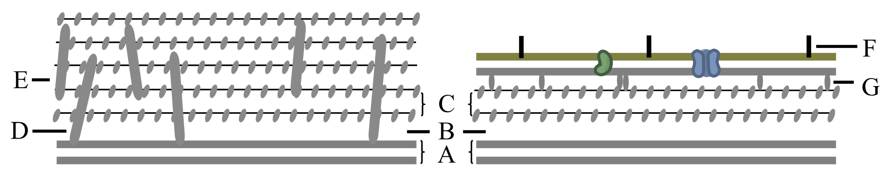

############################################################
绪论、细胞统一性与多样性及研究方法
############################################################

细胞生物学：研究、揭示细胞基本生命活动规律的科学，从显微、分化、代谢、运动、衰老、死亡，及细胞信号转导、细胞基因表达与调控，细胞起源与进化等重大生命过程。

细胞是生命体结构与功能的基本单位；多细胞生物的生长、发育依靠细胞增值、分化、凋亡实现，脑的复杂活动依靠神经细胞相互协调整合完成，疾病发病以细胞病变为基础。

根本性问题：

    * 基因组在时间、空间上的有序表达；
    * 表达产物逐级组装成行使生命活动的基本结构体系及各种胞器；
    * 表达及其产物（尤其是各种信号分子、活性因子）调节细胞增值、分化、衰老、凋亡等过程。

主要研究内容：

    #. 生物膜与细胞器：生物膜是细胞重要的结构基础，哺乳类近1/3基因用以编码膜蛋白；
    #. 细胞信号转导：胞间信号传递，受体与信号跨膜转导，胞内信号传递途径与网络调控；
    #. 细胞骨架体系；
    #. 细胞核、染色体及基因表达；
    #. 细胞增值调控：增值因子机制，细胞周期调控机制；
    #. 细胞分化及干细胞生物学：分化是发育的基础，实质是信号介导下组合调控引发的组织特异性基因表达；iPS；
    #. 细胞死亡；
    #. 细胞衰老；
    #. 细胞工程：人工方法使不同细胞重组成杂交细胞或将基因、基因组转至另一细胞中产生新性状；
    #. 细胞起源与进化。

   细胞生命活动关系

细胞学及细胞生物学发展
*****************************************

生物科学发展阶段：19世纪及更早（形态描述为主），20世纪前半（实验生物学时期），20世纪50年代后（现代生物学时期）。

细胞发现
========================================

胡克（Robert Hooke，英）于1665年用自制显微镜观察，首次描述植物细胞构造并命名。此后170年，对细胞的认识没有进行科学归纳、上升为具普遍指导意义的理论高度。

细胞学说建立及意义
========================================

1838年，施来登（M.J.Schleiden，德）发表《植物发生论》指出细胞是构成植物的基本单位。

1839年，施旺（T.Schwann，德）发表《关于动植物的结构和生长的一致性的显微研究》指出动植物是细胞的集合物。

二人共同提出：一切植物、动物均由细胞组成，细胞是一切动植物的基本单位（即细胞学说）。细胞学说提出了生物同一性的细胞学基础。

基本内容：

    * 细胞是有机体，一切动植物均由细胞发育而来，由细胞及其产物构成；
    * 每个细胞为相对独立单位，具自身生命亦对整体生命有助益；
    * 新细胞经已存在细胞繁殖产生。

细胞学经典时期
========================================

细胞学经典时期（19世纪最后25年）各种细胞器、细胞分裂活动相继发现。

.. list-table:: 细胞学经典时期理论及发现
   :align: center
   :header-rows: 1
   :name: 细胞-表-细胞学经典时期理论及发现

   * - 类别
     - 年份
     - 学者
     - 提出/发现
   * - 原生质理论提出
     - 1840 1846
     - 普金耶 冯•莫尔
     - 动植物细胞内均匀、具弹性的胶状物称原生质（protoplasm）
   * -
     - 1861
     - 舒尔策
     - 原生质理论：组成有机体的基本单位为一小团原生质
   * -
     - 1880
     - Hanstein
     - 原生质体（protoplast）：具生命活性的原生质
   * - 细胞分裂研究
     - 1841
     - R.Remak
     - 鸡胚血细胞直接分裂
   * -
     - 1841
     - W.Flemming E.Strasburger
     - 动植物细胞有丝分裂（mitosis）
   * -
     - 1883 1886
     - E.van Beneden Strasburger
     - 动植物细胞减数分裂（meiosis）
   * - 细胞器发现
     - 1883
     - E.van Beneden T.Boveri
     - 发现中心体
   * -
     - 1894
     - R.Altmann
     - 发现线粒体
   * -
     - 1898
     - C.Golgi
     - 发现高尔基体

此时期研究方法主要为：显微镜下形态学观察及描述。

实验细胞学及分支发展
========================================

O.Hertwig，1876年发现受精后细胞核合并；1892年于《细胞核组织》中提出：生物学基础在于研究细胞特性、结构、机能，以细胞为基础对所有生物学现象归纳、综合（使细胞学成为生物科学分支）；由于其采用实验方法研究海胆、蛔虫卵发育的核质关系而创立了实验细胞学。

细胞遗传学：从细胞学角度，尤其是染色体结构、功能，及染色体和其它细胞器关系研究遗传对象，阐明遗传、变异机制；核心是染色体-基因学说。

细胞生理学：研究细胞对环境的反应、细胞生长繁殖机制、从环境汲取营养的能力、兴奋性、收缩性、分泌性、膜的主动运输及能量传递与生物电等。

细胞化学：早期研究生物体化学成分、基本生化反应，脱离细胞形态结构；随着各种技术的建立使得对细胞成分，特别是核酸、蛋白质的定性、定位、定量及动态变化研究具有高精确性、专一性。

细胞生物学学科形成发展
========================================

1950s以来，随着电子显微镜超薄切片技术的发展、DNA分子双螺旋结构的发现等使得细胞结构、功能的研究水平达到新高度（形成独立的细胞生物学）；

1970s后建立的各种技术极大促进了在分子水平上对细胞基本生命活动规律的探索。

新阶段特点：

    * 以细胞，特别是活体细胞为研究对象；
    * 以细胞重大生命活动为主要研究内容；
    * 揭示细胞生命活动分子机制（信号调控网络为重点）；
    * 多领域、多学科交叉研究。

细胞基本特征
*****************************************

细胞是生命活动基本单位
========================================

细胞是多层次、非线性与多层面的复杂结构体系：细胞是物质（结构）、能量与信息过程精巧结合的综合体，是高度有序的、具自组装能力的自组织体系。

* 细胞是构成有机体的基本单位（病毒为非细胞形态，但需严格寄生于细胞才显现生命特征）；
* 细胞是代谢与功能的基本单位（单细胞生物依靠一个细胞完成系列生理活动，多细胞生物则依靠细胞间相互合作；
* 细胞的形态结构与功能相关性、一致性是细胞的共同特点）；
* 细胞是有机体生长发育的基础（生长发育依靠细胞分裂、迁移、分化、凋亡）；
* 细胞是繁殖的基本单位，是遗传的桥梁（单细胞繁殖为细胞一分为二，多细胞则靠细胞分裂形成孢子、配子）；
* 细胞是生命起源的归宿，生物进化的起点。

细胞的基本共性
========================================

* 相似的化学组成（C、H、O、N、P、S等）；
* 脂-蛋白体系的生物膜（均有主要由磷脂双分子层与镶嵌蛋白质构成的细胞质膜）；
* 相同的遗传装置（均以DNA储存、传递遗传信息，以RNA为转录物指导蛋白质合成）；
* 一分为二的分裂方式。

原核、古核细胞
*****************************************

细胞分真核细胞（eukaryotic cell）与原核细胞（prokaryotic cell），由此生物界类群分原核生物（prokaryote）与真核生物（eukaryote）。

   生物界基本类群

与真核生物相比，原核生物基因组小、主要遗传物质仅一环状DNA、胞内无以膜为基础的各种胞器、无核膜、体积常很小；原核生物含支原体、衣原体、立克次氏体、细菌、放线菌、蓝藻等多个庞大家族。

支原体
========================================

支原体（mycoplast，霉形体）：目前发现可于无生命培养基中生长繁殖的最小最简单细胞，具细胞基本形态结构、功能；无细胞壁、仅有细胞膜（含胆固醇），环状DNA均匀散布于胞内无核区，mRNA与核糖体结合成多核糖体（合成约几百种蛋白质）。

支原体不少为致病病原体（慢性病病原体多为支原体）；体积小，直径0.1~0.3μm（仅为细菌1/10），可通过细菌滤器；很多支原体可寄生于细胞内繁殖，是细胞培养中常见的难以去除的污染源。

细菌
========================================

细菌：

    * 自然界分布最广、个体数量最多、与人关系极密切的有机体；
    * 绝多数直径0.5~5.0μm（极少巨型细菌）；
    * 无典型核结构但具明显核区（类核，nucleoid）由一个环状DNA分子盘绕成，核区周围为较浓密胞质物质；
    * 除核糖体外无其它细胞器；
    * 细菌细胞质膜为典型生物膜结构但具多功能性。

表面结构
-----------------------------------------

细菌表面结构主要为：细胞质膜、细胞壁、特化结构（中膜体、荚膜、鞭毛等）。

细胞壁（cell wall）是位于细胞质膜外一层较厚、较坚韧、略具特性的结构。细菌细胞壁均具肽聚糖 :numref:`细胞-图-细菌细胞壁` C（乙酰氨基葡萄糖、乙酰胞壁酸、短肽聚合成多层网状结构）。

* 革兰氏阳性菌（G\ :sup:`+`\）胞壁厚20~80nm、壁酸（壁磷壁酸 :numref:`细胞-图-细菌细胞壁` E、脂磷壁酸 :numref:`细胞-图-细菌细胞壁` D）含量达90%；
* 革兰氏阴性菌（G\ :sup:`-`\）壁厚约10nm、层次分明、壁酸含量仅5%。
* 青霉素抑菌作用主要通过抑制壁酸合成，而抑制细胞壁形成。

   G\ :sup:`+`\与G\ :sup:`-`\细菌细胞壁

   A：质膜；B：周质空间；G：布朗氏蛋白

G\ :sup:`-`\细胞壁外具一层外膜（脂多糖 :numref:`细胞-图-细菌细胞壁` F、磷脂、蛋白质组成），可阻止/减轻胆汁盐、抗体等有害物进入而保护细菌。胞壁成分与抗原性、致病性、病毒的敏感性相关。

细胞质膜（细胞膜）：是包围细菌原生质的典型生物膜，由磷脂双分子层、镶嵌蛋白质构成富弹性半透性膜，厚8~10nm、紧贴细胞壁；具选择性物质交换、代谢（酶系）、应答等功能。

中膜体（mesosome，间体、质膜体）：由细胞膜内陷形成囊泡状、管状、包层状膜结构，G\ :sup:`+`\菌中更明显；常见于分裂期细菌的隔、横壁旁（可能起DNA复制支点）。

荚膜，部分细菌具有，于细胞壁表面由Glc、糖醛酸组成的松散粘液状聚合物；具一定保护作用，可作自身营养物。

核区与基因组
-----------------------------------------

细菌细胞仅具DNA聚集的核区（拟核、类核），结构简单、形态不规则、无核膜及核仁；基因组常为具单个复制起点的独立复制单位，不受分裂周期限制；无核膜，DNA复制、RNA转录、蛋白质合成可同时进行，即转录、翻译在时间、空间上连续进行。

核外DNA
-----------------------------------------

质粒（plasmid）：细菌细胞核区DNA外可自主复制的、裸漏环状DNA分子；可传递后代、整合至核DNA中；赋予细菌新的形状，遗失不影响正常代谢。

核糖体
-----------------------------------------

细菌核糖体少部分附着于胞膜内侧合成分泌蛋白、质膜蛋白。核糖体数量与细胞生理状态关系密切。

内生孢子
-----------------------------------------

G\ :sup:`+`\细菌处不利环境、耗尽营养时容易形成内生孢子（芽孢），是对不良环境具强抵抗力的休眠体。胞内重要物质（DNA等）积聚于细胞一端，在特殊结合蛋白协助形成含水较丰富的致密体，外被厚壁。内生孢子折光性强、不易染色。

增值及其调控
-----------------------------------------

细菌增值迅速，适宜条件下，上一次DNA复制未完成下次DNA复制已开始。

通常，细菌需达一定大小后DNA才开始复制，伸长一定程度复制的DNA才分开。

蓝藻
========================================

蓝藻（蓝细菌，cyanobacteria）是自养型原核生物，可进行与高等植物类似的光合作用（叶绿素a、PSⅡ）；分布广泛；含丰富色素（藻蓝素、叶绿素、其它色素）；体积较其它原核细胞大，直径1~10μm；可以丝状、片状、中空球状细胞群形式存在。

蓝藻细胞膜外具细胞壁、胶质鞘，与G\ :sup:`-`\细菌类似（细胞壁内层含纤维素层）；胞质中具同心环样膜片层结构（类囊体），附着光合色素、电子传递链。通常，分裂时两个子细胞于同一公共胶质鞘包围下保持一起最终形成细胞群；增殖还可经出芽、断裂、复分裂方式进行。

异形胞（heterocyst）：丝状蓝藻在氮源不足时群体中5%~10%的细胞转化成，个体大、细胞壁厚、丢失PSⅡ、合成固氮酶（PSⅠATP驱动，厌氧环境）。

古细菌（古核细胞）
========================================

古细菌（古核生物，archaeon）：常于极端特殊环境；形态结构、DNA结构、基本生命活动方式与原核生物相似；具细胞壁但无胞壁酸、D-氨基酸，质膜脂质以醚键与甘油结合、含鲨烯衍生物，tRNATψC上无T；在形态结构、遗传结构与原核细胞相似，部分分子进化特征接近于真核细胞。

真核细胞
*****************************************

基本结构体系
========================================

亚显微结构水平上可分：

    #. 生物膜结构系统（脂质、蛋白质为基础）、
    #. 遗传信息传递与表达系统（核酸、蛋白质）、
    #. 细胞骨架系统（特异蛋白质装配）。

生物膜系统：主要功能是选择性的物质跨膜运输、信号转导；细胞内核膜分割两大结构功能区（细胞质、细胞核，精密调控基因表达），形成膜包围的细胞器。

遗传信息传递与表达系统：DNA、RNA、蛋白质形成的复合体，核小体（nucleosome）、染色质/染色体（常染色质、异染色质）、核糖体等。

细胞骨架系统：由系列特异结构蛋白装配成的网架系统，对细胞形态、内部结构合理排布起支架作用；分胞质骨架、核骨架；由微丝、微管、中间纤维等构成。核骨架含核纤层（nuclear lamina，核纤层蛋白（lamin）形成）、核基质（nuclear matrix）。

真原核比较
========================================

真核细胞、原核细胞作为最重要的两个细胞类群，其根本区别可归纳为：细胞膜系统的分化与演变、遗传信息与装置的扩增与复杂化。

.. list-table:: 原核细胞与真核细胞基本特征比较
   :align: center
   :header-rows: 1
   :name: 细胞-表-原核细胞与真核细胞基本特征比较

   * -
     - 原核细胞
     - 真核细胞
   * - 细胞质膜
     - 有（多功能性）
     - 有
   * - 核膜
     - 无
     - 有
   * - 染色体
     - 环状DNA（较少蛋白质结合）
     - 2个染色体以上
   * - 核仁
     - 无
     - 有
   * - 核糖体
     - 70S
     - 80S
   * - 膜质细胞器
     - 无
     - 有
   * - 核外DNA
     - 质粒（细菌）
     - 线粒体、叶绿体DNA
   * - 细胞壁
     - 氨基酸、壁酸
     - 仅植：纤维素、果胶
   * - 细胞骨架
     - 无
     - 有
   * - 增殖方式
     - 无丝分裂（直接分裂）
     - 有丝分裂（间接分裂）

动植物比较
========================================

动物细胞与植物细胞均具基本相同的结构体系、功能体系。

.. list-table:: 动植物细胞比较
   :align: center
   :header-rows: 1
   :name: 细胞-表-动植物细胞比较

   * -
     - 植物细胞
     - 动物细胞
   * - 相同点
     - 细胞膜、核膜、染色质、核仁、线粒体、
     - 高尔基体、内质网、核糖体、微管、微丝等
   * - 不同点
     - 液泡、叶绿体、细胞壁、胞间连丝
     - 中心粒

细胞壁：分裂后期残留的纺锤体微管于赤道板中央聚集成圆柱形成膜体（phragmoplast），中间具高尔基体、内质网囊泡，囊泡融合成细胞版（cell plate），囊泡中的多糖形成初生壁及果胶质胞间层；囊泡融合时的间隙形成胞间连丝。

液泡：单层膜包围的封闭系统，内部为水溶液，含盐、糖、氨基酸、生物碱、色素等；是细胞代谢库、调节胞内环境。

病毒
*****************************************

病毒（virus）是非细胞形态的生命体，迄今发现最小、最简单的有机体。特征：病毒很小、结构极其简单；遗传载体多样性（DNA或RNA）；彻底寄生性；以复制、装配方式增殖。

.. list-table:: 病毒类群
   :align: center
   :header-rows: 1
   :name: 细胞-表-病毒类群

   * - 类群
     - 化学组成
     -
   * - （真）病毒（euvirus）
     - 核酸、蛋白质
     -
   * - 类病毒（viroid）
     - 具感染性RNA
     - 亚病毒（subvirus）一类
   * - 朊病毒（prion）
     - 具感染性蛋白质
     - 疯牛病等慢性神经退行性疾病

依感染宿主可分：动物病毒、植物病毒、细菌病毒（噬菌体）。

病毒基本结构由核酸、蛋白质组成；蛋白质构成包裹病毒核酸的衣壳（capsid），衣壳由衣粒（capsomer）组成；衣壳与核酸构成病毒的核壳体（nucleocapsid），有些病毒在核壳体外还具脂双层囊膜（envelope）。依核壳体形态，病毒分立体对称、螺旋对称两类；立体对称型，有的具囊膜（疱疹病毒、拔膜病毒），有的无囊膜（腺病毒、呼肠孤病毒、脊髓灰质炎病毒）；螺旋对称型多数具囊膜（流感病毒、弹状病毒、带反转录酶的反转录病毒），烟草花叶病毒无囊膜。

.. list-table:: 病毒核酸类型及代表
   :align: center
   :header-rows: 1
   :name: 细胞-表-病毒核酸类型及代表

   * -
     - 核酸类型
     - 所带酶
     - 代表
   * - DNA病毒
     - 双链DNA
     -
     - 疱疹病毒、腺病毒、多瘤病毒、痘病毒
   * -
     - 单链DNA
     -
     - 小DNA病毒
   * -
     - 部分双链DNA
     -
     - 嗜肝病毒
   * - RNA病毒
     - 双链RNA
     - 转录酶
     - 呼肠孤病毒
   * -
     - 侵染性单链RNA（+）
     -
     - 小RNA病毒、拔膜病毒、冠状病毒（SARS）
   * -
     - 非侵染性单链RNA（-）
     - 转录酶
     - 粘液病毒、弹状病毒
   * -
     - 反转录病毒单链RNA（+）
     - 反转录酶
     - HIV

病毒增殖
========================================

病毒增殖（又称病毒复制），需于细胞内进行，大致分合成病毒核酸、蛋白，后装配为子代病毒粒子。

增殖周期可分：细胞外阶段、细胞内阶段（感染期）。

病毒粒子（成熟病毒，virion）：结构完整、具感染性的病毒。

识别、侵入细胞
-----------------------------------------

病毒表面蛋白质与细胞表面特异受体互作而特异性吸附；动物病毒进入细胞经胞饮或膜融合形式，植物病毒则常借助昆虫进食，噬菌体则仅将核酸注入细胞而衣壳留于胞外。

病毒进入细胞后，衣壳在胞内蛋白水解酶作用下裂解释放核酸。RNA病毒（除反转录病毒）常于胞质内复制、转录；多数DNA病毒则于核内复制、转录，痘病毒（poxvirus）于胞质中繁殖。

病毒核酸复制、转录及蛋白质合成
-----------------------------------------

病毒核酸类型可分7类 :numref:`细胞-表-病毒核酸类型及代表`，复制方式、过程具差异。

DNA病毒：（疱疹病毒）侵染细胞后，DNA进入细胞核，利用宿主细胞代谢系统表达 **早期蛋白** （病毒DNA复制前表达的蛋白质，调节病毒基因表达及DNA复制，抑制宿主DNA复制、表达）与 **晚期蛋白** （病毒DNA复制后表达的蛋白质，病毒包装所需蛋白）。

RNA病毒：

    * 侵染性单链RNA病毒[RNA（+）]，RNA分子本身可作模板，利用宿主代谢系统翻译早期蛋白。
    * 非侵染性单链RNA病毒[RNA（-）]，经病毒携带的RNA聚合酶（RDRP）合成mRNA。产生的病毒蛋白与RNA链装配为子代颗粒。

反转录病毒：病毒RNA为模板，由携带的反转录酶合成DNA，整合至宿主DNA链上，以整合后的病毒DNA片段为模板合成RNA及mRNA。

病毒装配、成熟释放
-----------------------------------------

* 无囊膜病毒，核酸、蛋白质装配成核壳体后即为具感染性的完整病毒粒子（装配即为成熟）；无囊膜动物病毒释放时常引起细胞崩解，即释放速度快；
* 有囊膜病毒，装配为核壳体后，需以出牙方式包上囊膜而发育为成熟子代病毒，囊膜实为嵌有病毒囊膜蛋白的特化细胞膜；有囊膜病毒多以出芽方式释放，常逐步释放。

细胞病变（cytopathic effect，CPE）：绝大多数病毒在体外培养细胞内复制时，可在显微镜下见到宿主细胞发生明显形态变化。

细胞形态结构观察方法
*****************************************

* 肉眼分辨率常仅0.2mm，
* 光学显微镜分辨率可达0.2μm，
* 电子显微镜分辨率高达0.2nm。

光学显微镜
========================================

光学显微镜（light microscope）在研究细胞结构、功能，特别是生物大分子在活细胞内的定位及其动态变化、相互作用等显示了新的活力。

普通复式光学显微镜
-----------------------------------------

光学显微镜组成：光学放大系统（目镜、物镜）、照明系统（光源、聚光镜、滤光片）、镜架及样品调节系统。

分辨率（resolution）：指能区分两个质点间的最小距离，取决于光源波长λ、物镜镜口角α、介质折射率N；是显微镜最重要性能参数。

:math:`D=\frac{0.61 * λ}{N * sin(\frac{α}{2})}`

光学显微镜可直接用于观察单细胞生物、体外培养细胞。

对观察的生物组织样品常需经固定（甲醛）、包埋（石蜡）、切片、染色（HE染色：蓝紫色胞核、红胞质）等流程。

微分干涉显微镜
-----------------------------------------

生物样品经固定后无活性，对活细胞显微结构细节可借助相差显微镜（phase-contrast microscope）。

光波基本属性：波长及频率（颜色不同）、振幅（亮暗）、相位。当两束光经光学系统时会发生干涉，同相位振幅加大、相位不同则振幅减小；光在不同密度物质中滞留程度不同，密度大滞留时间长，使得光程/相位改变。

相差显微镜，在普通光学显微镜基础上，增加环状光阑、相差板（于物镜后焦面上）。

微分干涉显微镜（differential-interference microscope），以平面偏振光为光源，光经棱镜折射为两束于不同时间经过样品相邻部位，经另一棱镜汇合，使样品厚度的微小区别转为明暗区别。计算机辅助下可提高样品反差、降低底噪，可观察单根微管（24nm）、颗粒物沿微管运输动态过程。

荧光显微镜
-----------------------------------------

荧光显微镜（fluorescence microscope）是在光镜水平上，对胞内特异物进行定位性研究的工具；核心部件：滤光片系统（激发滤光片、阻断滤光片）、专用物镜镜头；经激发滤光片的激发光照射于样品荧光分子上产生荧光。

激光扫描共焦显微镜
-----------------------------------------

激光扫描共焦显微镜（laser scanning confocal microscope，LSCM），相当于荧光显微镜基础上安装激光共焦系统，以激光为光源。共焦：聚光镜、物镜同时聚焦于同一点，仅观察到焦平面上的激发荧光，较普通荧光显微镜分辨率高1.4~1.7倍，经计算机采集可重构样品三维结构。

电子显微镜
========================================

电子显微镜（electron microscope，EM，电镜），构造与光镜不同但其光路具相似性；由电子束照明系统、成像系统、真空系统、记录系统构成。电子显微镜的高分辨率主要为使用电子束（λ常小于0.1nm）经电磁透镜聚焦、镜筒高度真空，图像由荧光屏/感光片显示/记录。

.. list-table:: 电镜、光镜基本区别
   :align: center
   :header-rows: 1
   :name: 细胞-表-电镜光镜基本区别

   * -
     - 分辨率
     - 光源
     - 透镜
     - 真空
     - 成像
   * - 光镜
     - 200nm
     - 可见光
     - 玻璃
     - \-
     - 光吸收差异
   * - 电镜
     - 0.2nm
     - 电子束
     - 电磁
     - \+
     - 电子投射、散射差异

有效放大倍数：人眼分辨率常为0.2mm，光镜为0.2μm，放大倍数为0.2mm/0.2μm，即1k倍；电镜分辨率可达0.2nm，即放大倍数为10^6倍。

空放大：在有效放大倍数基础上，经过光学手段继续放大，无有意义信息。

:numref:`细胞-表-电镜光镜基本区别` 中电镜分辨率为电镜于最佳状态下的分辨率（分辨本领），实际分辨率受制样技术限制；超薄切片样品分辨率仅为切片厚度的1/10。

电镜制样技术
========================================

超薄切片技术
-----------------------------------------

超薄切片(ultra thin section)：切片厚度常仅40~50nm，可获得较高分辨率；样品需一定刚性、韧性，常需包埋于特殊介质以使生物样品满足要求；包埋会破坏样品细微结构，因此需对样品固定保持细胞精细结构。

固定：保持样品真实性的最重要环节；既保持样品形态、精细结构不改变，亦保持原定位及免疫性质。透射电镜常用化学法（戊二醛、锇酸），为保持细胞超微结构可用超低温冷冻法（低温下处理取材，样品直径常小于1mm便于固定剂迅速渗透）。

包埋：保证切片时可均匀支撑样品，获得连续、完整、足够强度的超薄切片。介质需具良好机械性能便于切片，聚合时无明显膨胀、收缩，易被电子穿透并耐轰击，不显示本身结构等；常用环氧树脂（即样品需脱水）。

染色：电镜样品用重金属盐染色，不同成分对不同重金属盐具不同亲和性；锇酸-脂质、柠檬酸铅-蛋白质、乙酸双氧铀-核酸。电子束穿过样品时，金属离子不同程度的散射、吸收形成明暗差别。

负染色技术
-----------------------------------------

负染色技术（negative staining）：用重金属盐对铺于载网的样品染色，自然干燥后整个载网铺上薄层重金属盐，而衬托样品精细结构（线粒体基粒、核糖体、蛋白颗粒、细胞骨架纤维、病毒等）。

冷冻蚀刻技术
-----------------------------------------

冷冻蚀刻技术（freeze etching）的样品制备经冰冻断裂、蚀刻复型。主要用于观察膜断裂面上的蛋白质颗粒、膜表面形貌特征，样品不需包埋甚至固定可更好保持样品真实结构。

快速冷冻深度蚀刻技术（quick freeze deep etching）用于观察胞质中细胞骨架纤维及其结合蛋白。

电镜三维重构
-----------------------------------------

对样品于不同倾角下摄像获取系列图片，经计算处理获得三维结构电子密度图。

低温电镜技术
-----------------------------------------

低温电子显微镜技术（cryoelectron micro-scopy）：样品不经固定、染色、干燥，直接包埋于约100nm厚冰膜中于电镜内-160℃低温下经相位衬度成像；既更真实展示样品表面、内部空间结构，也具更高分辨率。

扫描电镜技术
-----------------------------------------

扫描电镜（scanning electron microscope，SEM）：将电子束汇聚对样品表面扫描，激发样品表面形成二次电子，收集分析二次电子信息获取样品表面立体图像；分辨本领为3nm（低压高分辨可达0.7nm）。

常用CO2临界干燥法对样品处理以保持样品表面不变形，为获得正确二次电子信息于样品表面喷镀金膜。

扫描隧道显微镜
========================================

扫描隧道显微镜（scanning tunnel microscope，STM）：利用隧道效应（低压下两电极间具大阻抗，即势垒；近到一定程度，50nm内，时产生电流，即隧道电流）测量；具原子尺度高分辨本领（侧0.1~0.2nm、纵0.001nm），可于多条件下工作（真空、大气、液体），非破坏性测量。

原子力显微镜（atomic force microscope）：利用微小探针操纵、测量样品形貌、力学性质。

细胞及其组分分析方法
*****************************************

超离心分离细胞组分
========================================

经破碎、研磨等破坏细胞膜获得的细胞组分匀浆，经差速离心可分离各质量、密度不同的亚细胞组分、颗粒。

密度梯度离心：将分离的细胞组分铺于密度梯度溶液表面，经重力、离心力作用使样品组分以不同沉降速率沉降，形成沉降带。可分：速度沉降（分离密度相近、大小不一的细胞组分）、等密度沉降（分离不同密度的细胞组分）。沉降速率与形状、大小相关，用沉降系数（S）表示。

组分的细胞化学显示
========================================

利用显色剂与被检物的特异性结合，分析显色剂于细胞中的定位、深浅，判断被检物于细胞中的分布、相对含量。

* 福尔根反应：DNA-紫红。
* PAS反应：多糖-紫红。
* 脂滴-苏丹Ⅲ（深红）/四氧化锇（不饱和脂肪酸-黑色）。
* 蛋白质-米伦反应（红色）。

对酶定性研究常采用冷冻切片，与适宜底物温育后间接指示。

特异蛋白抗原定位、定性
========================================

胞内蛋白质分子定位：免疫荧光技术、免疫电镜技术；蛋白质组分定性：免疫印迹（western blotting）、放射免疫沉淀、蛋白质芯片、质谱分析等。

免疫荧光技术：免疫学与荧光标记结合，分直接、间接（二抗）。

免疫电镜技术：超微结构水平研究特异蛋白抗原定位；分免疫胶体金、酶标、铁蛋白。胶体金具易识别、多大小、多重标记等优点。

胞内特异核苷酸定位、定性
========================================

胞内特异核苷酸（DNA、RNA）定位、定性常用原位杂交技术（in situ hybridization）。原位杂交：用标记的核酸探针经分子杂交确定特异核苷酸序列在染色体、细胞中的位置。

细胞分选
========================================

流式细胞术（flow cytometry）：定量测定某一胞内DNA、RNA、特定标记蛋白含量，及细胞群体中上述成分含量不同的细胞数量，可分离特定细胞（分选）。

细胞培养与细胞工程
*****************************************

细胞培养
========================================

动物细胞培养
-----------------------------------------

动物细胞体外培养分：原代细胞（primary culture cell，从机体获取后立即培养的细胞）、传代细胞（subculture cell，从机体获取用以传代的细胞）。原代细胞培养：10代以内的细胞培养。

细胞贴壁：分散的细胞悬液贴附于瓶壁。细胞贴壁后迅速铺展、开始有丝分裂，形成致密细胞单层（单层细胞，single layer cell）。

细胞系：原代培养细胞传至10代后任能顺利传40~50代次，且保持原染色体二倍体数量及接触抑制行为的传代细胞。

* 有限细胞系（finite cell line）：传代次数有限的体外培养细胞。
* 永生细胞系（infinite cell line）/连续细胞系（continuous cell line）：传代过程中发生突变，具癌细胞特点，可在培养条件下无限制传代培养的传代细胞；特点：染色体明显改变（常呈亚二倍体、非整倍体）、失去接触抑制、容易传代培养；Hela、BHK21、CHO细胞系。

细胞株：筛选分离的单个细胞增殖成，具基本相同遗传性状的细胞群体，具特殊遗传标记、性质的细胞系。

体外培养细胞（原代、传代）常不保持体内原有细胞形态，可大致分：成纤维样、上皮样。

悬浮培养可在有限培养液中获得大量细胞。

植物细胞培养
-----------------------------------------

单倍体细胞培养：花药于人工培养基上培养。

原生质体培养：原生质体（protoplast），植物体细胞经纤维素酶去掉细胞壁；无菌下可生长、分裂，可诱导分化长成植株；可与不同植物原生质融合成杂交植株。

细胞工程
========================================

细胞融合（cell fusion）：两个/多个细胞融合为一个双核/多核细胞；介导融合的促融剂：动物（灭活病毒、PEG）、植物（需先去除细胞壁）。电融合技术（electronfusion method）：悬浮细胞于低压交流电场中聚集成串珠状细胞群，相接触单层培养细胞高压电脉冲融合。

同核体（homokaryon）：基因型相同的细胞融合成的融合细胞。异核体（heterokaryon）：基因型不同的细胞融合成的融合细胞。合核体（synkaryon）：经细胞杂交形成的单核子细胞。

单克隆抗体（monoclonal antibody）制备：B淋巴细胞杂交瘤技术（B-lymphocyte hybridomas techniaues），经抗原刺激后的B淋巴细胞（产生抗体）与骨髓瘤细胞（体外无限传代）融合，HAT筛选、培养、单抗检测后获得单抗杂交瘤细胞。

细胞拆合：将细胞核、细胞质分离，不同来源的胞质体（cytoplast）、核体（karyoplast）相互组合，形成核质杂交细胞；化学法：细胞松弛素B（cytochalasin B）排核；显微操作（micromanipulation）：显微镜下用显微装置对细胞行解剖、微量注射（microinjection）。

细胞及生物大分子的动态变化
*****************************************

荧光漂白恢复（fluorescence photobleaching recovery，FPR）技术：用亲脂（水）性荧光分子（荧光素、GFP等）与蛋白、脂质偶联，用于检测被标记分子在活体细胞表面、细胞内部的运动、迁移速率。FPR原理：高能激光束照射细胞特定区域，使区域（光漂白区，photobleaching）内荧光分子不可逆淬灭，非漂白区中荧光分子随细胞脂质、蛋白质分子移动而向光漂白区迁移，使光漂白区荧光强度逐渐恢复（荧光恢复，fluorescence recovery）。荧光恢复速度反映被标记物运动速率。

酵母双杂交系统（yeast two-hybrid system）：利用酵母分析蛋白质-蛋白质互作的系统；诱饵蛋白与猎物蛋白可能存在非特异性结合而存在假阳性。

荧光共振能量转移（fluorescence resonance energy transfer，FRET）技术：用以检测活细胞内两种蛋白质分子是否直接相互作用（供体的受激荧光是受体的激发光，供体、受体距离相近于一定程度即可发生偶联）。

放射自显影技术：利用放射性同位素电离射线对乳胶感光作用，对胞内生物大分子定性、定位、半定量研究，可动态研究、追踪。

模式生物及功能基因组研究
*****************************************

模式生物：常个体小、易培养、操作简单、生长繁殖快；常见类群：噬菌体、大肠杆菌、酵母、四膜虫、粘菌、爪蟾、海胆、拟南芥、线虫、果蝇、斑马鱼、小鼠。

突变体制备：RNAi、基因敲除（knock out）等。

    * 致死基因（essential gene）：突变后机体不能存活。
    * 非致死基因（non-essential gene）：突变后机体可存活，可能存在部分缺陷。

