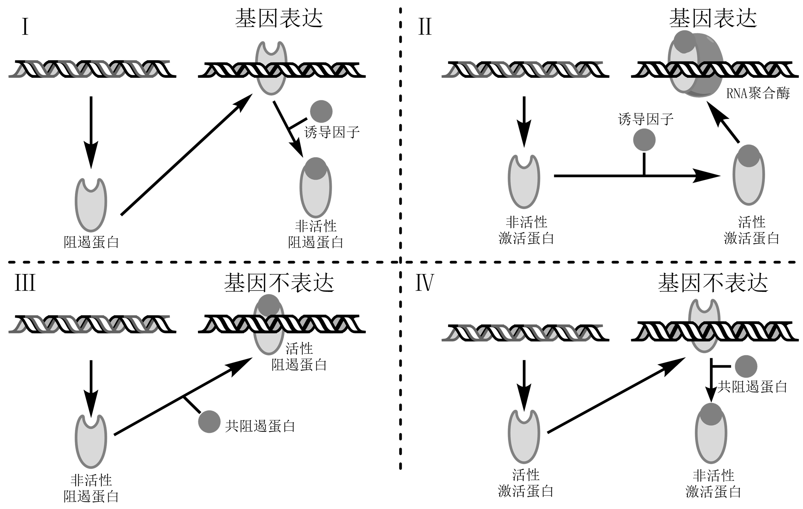
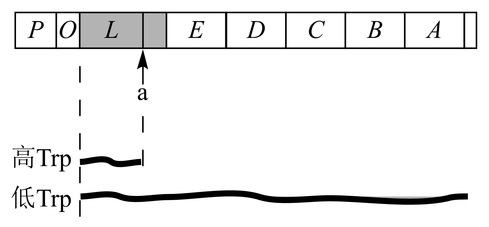

######################################
原核基因表达调控
######################################

自然选择倾向保留高效率的生命过程；不论真核、原核均具复杂、准确调节基因表达、蛋白质合成的机制。

* 组成型合成蛋白：代谢过程中必需的酶、蛋白质，其合成速率不受环境变化、代谢状态影响；DNA聚合酶、RNA聚合酶等。
* 适应型（调节型）合成蛋白：合成速率明显受环境影响而改变；β-半乳糖苷酶。

细菌中多数基本调节机制以on-off活性建立；off实际为基因表达量特别低，难以检测。

总论
======================================

基因表达：生物遗传信息以基因储存于胞内DNA/RNA中，随发育进程，有序的经转录、翻译转为蛋白质，发挥各生化功能。

基因表达调控：

    * 对基因表达过程的调节；
    * 转录水平调控，
    * 转录后水平调控（mRNA加工成熟水平、翻译水平）；
    * 原核主要受营养状况、环境因素，高等真核主要是激素水平、发育阶段。

分类与特点
--------------------------------------

原核生物基因表达调控主要发生于转录水平上，分：负转录调控、正转录调控。

    * 负转录调控中，调节基因的产物为阻遏蛋白，阻止结构基因转录；分负控诱导 :numref:`分子-图-细菌转录调控体系` Ⅰ（阻遏蛋白不与诱导物结合时结构基因不转录）、负控阻遏 :numref:`分子-图-细菌转录调控体系` Ⅲ（阻遏蛋白与诱导物结合时结构基因不转录）。
    * 正转录调控中，调节基因的产物为激活蛋白；分正控诱导 :numref:`分子-图-细菌转录调控体系` Ⅱ（诱导物存在使激活蛋白处于活性状态）、正控阻遏 :numref:`分子-图-细菌转录调控体系` Ⅳ（效应物存在使激活蛋白处于非活性状态）。

[The regulation of bacterial transcription initiation](https://doi.org/10.1038/nrmicro787)

.. list-table:: 负转录调控类型
   :align: center
   :header-rows: 1
   :name: 分子-表-负转录调控类型

   * - 调节物与DNA结合
     - 正调节
     - 负调节
   * - 是
     - 开启
     - 关闭
   * - 否
     - 关闭
     - 开启

   细菌转录调控体系

原核调节经特殊代谢物调节基因活性分可诱导调节、可阻遏调节。

    * 可诱导调节：指基因在特殊代谢物/化合物作用下，由关闭状态转为活性状态，即经诱导物使基因活化；可诱导基因、诱导酶，酶的诱导合成。如乳糖操纵子。
    * 可阻遏调节：此类基因处开启状态，经由特殊代谢物/化合物（阻遏物）积累而关闭，阻遏基因表达；可阻遏基因（某代谢途径终产物合成酶基因可被产物阻遏）、可阻遏酶，可阻遏想象。如色氨酸操纵子。

* 可诱导操纵子常为编码糖、氨基酸分解代谢蛋白的基因，此类糖、氨基酸常含量低；生理条件改变（Glc缺乏）而需利用时启动这些基因。
* 可阻遏基因则常为合成各代谢过程必需物质的基因，在正常生理条件下处重要地位；仅供应充足时可能关闭。

弱化子、降解物抑制及应急反应
--------------------------------------

* 弱化子：

    * 操纵子被阻遏，RNA合成终止时，起终止转录信号作用的核苷酸片段，由对应氨酰-tRNA浓度为信号；
    * 因核糖体于转录产物的不同位置而使RNA二级结构不同，调节转录的方式。
    * 如：E.coli的Trp、Phe、Thr、Ile、Val操纵子及沙门氏菌的His、Leu、嘧啶合成操纵子。

* 降解物抑制作用：

    * 通过提高转录强度调节基因表达；
    * 如在Glc充足时，细菌需能充足无需启动稀有糖类供能，Glc充足抑制腺苷酸环化酶活性，减少cAMP合成，环腺苷酸受体蛋白（CRP）/分解代谢物激活蛋白（CAP）缺失配体而不形成复合物。

* 应急反应：

    * 特殊生理条件下（氨基酸饥饿），细菌几乎全面停止生化反应；
    * 由空载tRNA激活焦磷酸转移酶合成的大量ppGpp/pppGpp诱导关闭基因。

lac操纵子与负控诱导系统
======================================

E.coli中乳糖操纵子含结构基因：

    * lacZ、lacY、lacA及启动子、控制子、阻遏子等，
    * 转录时RNA聚合酶与启动区结合，经操纵区依次转录lacZ、lacY、lacA，即每条mRNA上均带这3个基因；
    * 3个结构基因分别编码β-半乳糖苷酶（水解乳糖及其它β-半乳糖苷）、β-半乳糖苷透过酶（使外界β-半乳糖苷透过胞壁、质膜进入胞内）、β-半乳糖苷乙酰基转移酶，前两酶为当仅以lac为能源时的必需酶。

安慰性诱导物：高效诱导物，但不作为酶底物；如IPTG、TMG、ONPG等。经分析，酶的合成为加入诱导物后新合成，非经前体转化。

模型及影响因子
--------------------------------------

Lac操纵子模型：

    * lacZ、lacY、lacA基因产物由同一条多顺反子mRNA编码；
    * 此mRNA启动区（P）位于阻遏基因（lacI）与操纵区（O）间，不能单独起始基因高效表达；
    * 操纵区为DNA上小段系列，阻遏物结合位点；
    * 阻遏物与操纵区结合时抑制lac mRNA转录起始；
    * 诱导物与阻遏物结合后，改变阻遏物构象使其不与操纵区结合，激活lac mRNA合成；
    * 此仅解释lac体系负控诱导系统，但lac操纵子亦存在正调控。

.. figure:: images/lacOperatorRegulate.png
   :name: 分子-图-lac操纵子调控模型
   :align: center
   :figwidth: 75%

   lac操纵子调控模型

#. Lac操纵子本地水平表达
    * Lac操纵子中，诱导物为异构乳糖（由β-半乳糖苷酶催化）。
    * 本底水平的组成型合成：非诱导状态下有少量lac mRNA合成；因阻遏物结合非绝对紧密，当启动子阻碍解除后RNA聚合酶开始转录。
#. E.coli对乳糖反应
    * 加入lac后，激活lac mRNA大量合成，分解lac；
    * 当lac耗尽时，因阻遏物持续合成，无更多诱导物而使得lac mRNA合成受抑；
    * 已经合成的酶随分裂被不断稀释。
    * 对经lac激活的E.coli子代加入lac可立即被降解，因仍有一定浓度酶的存在。
#. 阻遏无lacI基因产物
    * lac操纵子阻遏物mRNA在弱启动子控制下组成型合成，阻遏蛋白LacI的N端为HTHDNA结合结构域，中间具可与诱导物结合结构域。
    * 无诱导物时，形成聚合体结合与lac操纵区一段DNA系列上，抑制转录；
    * 当胞内lac水平升高，与其结合后构象改变而特异性与lac操纵区DNA结合，随机与任意DNA区域结合，暴露lac操纵子起始区激活转录。
    * 当lacI基因由弱启动子突变为强启动子，使得胞内无充足诱导物克服阻遏状态，整个操纵子不可诱导。
#. Glc对lac操纵子影响
    * Glc充裕时，间接抑制lac操纵子；
    * 通过代谢物抑制lac mRNA合成，称代谢物阻遏效应。
#. cAMP与代谢激活蛋白
    * Glc充裕时，cAMP浓度低；
    * Glc不足时，cAMP浓度高。
    * CRP、cAMP是lac mRNA合成的必要成分（正调控因子）；
    * 亦参与gal、ara操纵子调节；
    * 由cAMP-CRP调节，与启动子区上游结合，弯曲双螺旋利于形成稳定开放型启动子-RNA聚合酶结构。

调控区及其它
--------------------------------------

#. P、O区
    * P区（启动子区）：常从lacI基因结束至转录起始点下游5~10bp。
    * O区（阻遏物结合区）：-7~+28，具序列对称性；阻遏物结合后影响RNA聚合酶与启动子区结合形成转录起始复合物的效率。
#. lacA基因与功能
    * lac基因编码β-半乳糖苷乙酰基转移酶；
    * lac不被乙酰化，但此酶将乙酰基转至半乳糖分子，可抑制β-半乳糖苷酶的有害性衍生物在胞内积累。
#. lac基因产物数量
    * 在完全被诱导的细胞中，β-半乳糖苷酶、β-半乳糖苷透过酶、β-半乳糖苷乙酰基转移酶的拷贝数比例：1:0.5:0.2；可能由翻译水平的调节所致。
    * lac mRNA翻译时与核糖体脱离终止肽链形成；
    * 在lac mRNA内部lacA比lacZ更易受内切酶作用而降解。
#. 基因工程应用
    * 在某些突变体上，因突变缺失使得处于上下游的两个不同操纵子形成融合基因。如载体构建常用的蓝白斑筛选技术。

trp操纵子与负控阻遏系统
======================================

* Trp体系参与生物合成，不受葡萄糖、cAMP-CRP调控；
* Trp合成主要分5步，共7个基因参与合成过程；
* Trp操纵子组成序列：P区、O区、L区（前导区）、弱化子区（a）、间隔区、结构基因（E、D、C、B、A）。

   E.coliTrp操纵子

* 阻遏系统：trpR基因（编码阻遏物）离trp操纵子很远，突变常引起组成型合成，产物称辅阻遏蛋白。
* 辅阻遏蛋白与Trp结合成活性阻遏物后与操纵区结合关闭trp mRNA转录，培养基中无Trp时则不发挥作用。

弱化子、前导肽
--------------------------------------

#. 弱化子
    * trp操纵子中，酶浓度依据氨基酸浓度变化而调节，依靠转录至首个结构基因前过早终止实现。转录终止发生于特定区域，且终止可被调节，该区域称弱化子。
    * 弱化子对RNA聚合酶的影响依赖前导肽翻译时核糖体所处位置。
#. 前导肽
    * 衰减作用需Trp-tRNA参与，即前导序列被翻译；序列上具相邻2给Trp密码子。在His、Phe操纵子中前导序列亦具相邻对应氨基酸密码子。
    * trp前导区碱基序列中，4个片段：1、2、3、4，可进行两种不同方式的碱基配对，1-2、3-4或2-3；3-4配对区恰好位于终止密码子识别区，即此时有利于转录继续。
#. 转录弱化作用
    * 转录弱化作用：mRNA转录终止是经前导肽基因翻译调节。
    * 前导肽基因中含两相邻Trp密码子，当环境Trp浓度低时Trp-tRNA就少使得翻译此位点时速度慢，当4区转录完成后核糖体才行至1区或停于Trp密码子处，此时前导区结构为2-3配对，不能形成3-4配对的终止结构，因而可继续转录完全部结构基因。
    * 当环境Trp浓度高时，核糖体顺利通过两Trp密码子，在4区转录前到达2区，使得3-4配对称茎-环终止结构，停止转录、结构基因关闭。
    * 弱化作用信号为Trp-tRNA量，阻遏作用信号为Trp量。
    * 阻遏作用反应较慢，但在大量外源Trp时可阻止非必需先导mRNA合成；弱化作用则能快速抗终止以增加内源Trp浓度。

其它调控机制
--------------------------------------

枯草杆菌中，Trp激活TRAP调节蛋白与前导RNA结合，形成RNA终止子结构终止转录。无负载tRNATrp浓度升高，AT蛋白与TRAP结合抑制转录终止复合物形成，激活trp操纵子。

其它操纵子
======================================

gal操纵子
--------------------------------------

含编码3个酶的结构基因（异构酶galE、UDP转移酶galT、半乳糖激酶galK）；调节基因galR与galE、T、K及操纵区O距离较远，作用与lacI-lacO类似；诱导物为gal。

此外，操纵子含2个启动子、2个O区。2个启动子分别具有RNA结合位点S1、S2；

    * 环境无Glc时S1才可顺利起始转录，需Gal、CRP、较高浓度cAMP。
    * S2起始的转录则完全依赖Glc，高水平cAMP-CRP可抑制。

双启动子生理功能：Gal即作为碳源、亦是UDP-Gal的前体用以合成胞壁。

    * 不依赖cAMP-CRP的启动子（S2）维持本底水平，依赖cAMP-CRP的启动子（S1）调节高水平合成；
    * 即仅在S2被完全抑制时调控才是有效的。

ara操纵子
--------------------------------------

含3个结构基因（araB、araA、araD），序列上游为复合启动子区、2个操纵区及调节基因（araC）。

    * AraC蛋白具正、负调节因子功能；结构基因转录依赖cAMP-CRP。
    * 高Glc低Ara时，AraC蛋白与操纵区O2及araI诱导因子结合区结合，形成DNA回转结构，结构基因不表达。
    * 无Glc有Ara时，AraC蛋白与Ara结合，构象改变为激活蛋白，AraC蛋白同源二聚体分别与araO1、araI结合，DNA回转结构破坏；
    * RNA聚合酶在cAMP-CRP介导下起始结构基因转录。

阻遏蛋白LexA与SOS应答
--------------------------------------

* SOS系统众多基因分散，但均受LexA阻遏蛋白抑制；正常状态下表达水平低。
* DNA严重受损时，复制中断，单链DNA缺口数增加，RecA与缺口处单链DNA结合激活为蛋白酶，切割LexA蛋白，去除阻遏。
* 修复完成后，RecA蛋白转为非酶活性，LexA蛋白积累恢复阻遏；RecA蛋白逐渐恢复至本底水平。

二组分调控系统
--------------------------------------

外部信号经信号传导至胞内后，可由二组分调节系统参与调节。二组分系统中含膜上受体激酶及胞内应答调节蛋白。

多启动子调控操纵子
--------------------------------------

#. rRNA操纵子
    * E.coli中具2个启动子P1、P2；
    * 对数生长期时以P1为主，为强启动子；
    * 紧急状态等条件下以P2为主。
#. 核糖体蛋白SI操纵子
    * 核糖体蛋白SI操纵子（rpsA）也受应急反应调节；
    * rpsA具4个启动子，P1、P2是强启动子，P3、P4是弱启动子（应急情况下启动）。
#. DnaQ蛋白操纵子
    * DnaQ蛋白为DNA聚合酶全酶亚基之一，用于校正DNA复制中可能出现的错误；
    * 具2个启动子，RNA聚合酶活性（与增值相关）低时转录由弱启动子P2控制，活性高时由强启动子P1控制。

转录及转录后调控
======================================

转录水平
--------------------------------------

转录过程调节是基因表达调节最有效方式。

#. σ因子调节作用
    * 不同σ因子可独立作用，但常构成网络调控模式；活性受蛋白水解酶调控，可被同源抗σ因子失活。
#. 组蛋白类似蛋白调节作用
    * 组蛋白类似蛋白，一类非特异性DNA结合蛋白，维持DNA高级结构；
    * 与部分基因调控区具较高亲和性，结合后抑制转录。
#. 转录调控因子作用
    * 转录调控因子，可与基因启动子区结合，激活或抑制基因转录的DNA结合蛋白；
    * 多为序列特异性；
    * 某些可调控大量基因表达，某些则仅数个基因；
    * 部分还对不同基因（或同一基因）具不同作用；
    * 部分则需共同作用（启动子区具多个转录调控因子结合位点）。
#. 抗终止因子调节作用
    * 抗终止因子，一类可在特定位点阻止转录终止的蛋白质；RNA聚合酶与其结合越过终止子。

mRNA自身元件及稳定性
--------------------------------------

#. 起始密码子
    * 原核中，翻译主要靠核糖体30S亚基识别mRNA起始密码子AUG；但亦存在其它密码子：GUG、UUG、AUU，与fMet-tRNA配对能力弱使翻译效率降低。
#. 5’非翻译区（5’UTR）
    * SD序列与核糖体配对，促使核糖体结合到mRNA上。mRNA二级结构是翻译起始调控重要因素，mRNA5’端需一定空间以利于核糖体结合。
#. 核糖开关
    * 核糖开关，一段具复杂结构的RNA序列，常位于5’非翻译区，可感受胞内各信号而改变表达状态。真核中，核糖开关通过控制mRNA剪切调控表达。
#. mRNA稳定性影响
    * 胞内系列核酸酶用于清除无用mRNA，mRNA降解受其二级结构影响。E.coli中的CsrAB系统，CsrA可结合于受控mRNA上，加快降解过程。

其它因素
--------------------------------------

#. 调节蛋白的调控作用
    * 细菌中某些mRNA结合蛋白可激活靶基因翻译；
    * mRNA特异性抑制蛋白则与核糖体竞争性结合抑制翻译起始。
#. 反义RNA调节作用
    * RNA调节是原核生物基因表达转录后调节重要机制之一；
    * 对环境压力改变而产生非编码小RNA分子，与mRNA中特定序列配对，改变mRNA分子构象，开启、关闭翻译或降解目标mRNA。
#. 稀有密码子影响
    * 稀有密码子在高效表达的结构蛋白、σ因子中极少使用，但在较低表达的蛋白中具较高频率；
    * 高频率使用稀有密码子，翻译时易受阻而影响蛋白质合成总量。
#. 重叠基因影响
    * 重叠基因使得基因间翻译偶联，上一个基因的终止密码子与下一个基因的起始密码子共用一个核苷酸，使得核糖体在终止上一个基因的翻译后即处于下一个基因的起始环境中，有利于保证两个基因产物数量相等。
#. 翻译阻遏
    * 噬菌体感染细菌后，RNA进入细胞指导合成相关酶，同时阻碍了复制；
    * 为克服矛盾，RNA复制酶起翻译阻遏物作用，与起始区结合抑制蛋白合成。
#. 魔斑核苷酸水平影响
    * 氨基酸缺乏时，无负载的tRNA增多，仍可与核糖体A位点结合（产生严紧控制信号：蛋白质合成停止但RNA合成速率不降），但因无法延伸使得大量GTP用于合成ppGpp、pppGpp（层析谱上的斑点，魔斑）。

######################################
真核基因表达调控
######################################

总论
======================================

基因组：一个细胞（病毒）所携带的全部遗传信息（整套基因），包括每一条染色体及所有亚细胞器DNA信息。

基因：产生一条肽链（功能RNA）所需DNA片段，含编码区（编码片段即外显子、切割序列即内含子）、上下游区域。

基因表达：基因经转录、翻译，产生具特异生物学功能的蛋白质分子/RNA分子的过程；受内源、外源信号调控即基因表达调控。

断裂结构
--------------------------------------

#. 外显子、内含子
    * 外显子：编码序列。
    * 内含子：非编码序列。

* 断裂基因：
    * 一个结构基因中，编码某蛋白质不同区域的各外显子非连续排列，被长度不等的内含子隔离，形成镶嵌排列的断裂方式；
    * 真核基因多为断裂基因。
    * 原核生物不具有切除基因内含子、产生功能型mRNA、蛋白质的能力，仅真核生物具有。
    * 断裂基因的结构形式为蛋白质编码区重组提供了可能，DNA序列可充分重复、组合，利于真核基因进化。

#. 连接区
    * 外显子-内含子连接区（边界序列）：
        * 具高度保守性、特异性；
        * RNA剪接信号序列；
        * 内含子两端无广泛同源性，不形成发夹结构；
        * 保守序列存在于几乎所有高等真核中，但线粒体、酵母tRNA基因中无。
    * GT-AG法则：
        * 5’ GT……AG 3’；
        * 5’端称左剪接位点（供体位点），3’端称右剪接位点（受体位点）。

#. 可变调控
    * 选择性剪接：同一基因的转录产物由于不同剪接方式形成不同mRNA的过程。
    * 初级转录产物经不同剪接方式产生不同mRNA；转录时选择不同启动子，或转录产物选择不同多（A）位点而具不同二级结构影响剪接。

基因家族
--------------------------------------

原核中，相关基因常形成操纵子，转录出多顺反mRNA，由一个启动子控制。真核中，为单顺反子结构，形成基因家族。

基因家族：真核中相关基因按功能组合成，紧密排列成基因簇，或分散于染色体不同部位甚至不同染色体上，具不同表达调控模式。

#. 简单多基因家族
    * 简单多基因家族中基因常以串联形式前后相连。
    * 如rRNA的形成，前rRNA转录产物含18S、28S、5.8SrRNA，多处被甲基化，经特异性RNA酶降解后形成成熟rRNA（snoRNAs参与）。
#. 复杂多基因家族
    * 复杂多基因家族常由多个相关基因家族构成，基因家族间含间隔序列，为独立转录单位。
    * 如海胆组蛋白基因家族，5个基因成串联单位于整个基因组；单位内每个基因分别转录为单顺反RNA，均无内含子，且同一DNA链上转录方向一致；转录、翻译速度受调节，合成比例与核小体构成一致。
#. 发育调控的复杂多基因家族
    * 血红蛋白在个体发育不同阶段亚基组成具差异性 :numref:`生化-表-人体内正常功能血红蛋白` 。
    * 在α、β-珠蛋白基因簇中，基因的排列顺序即为发育阶段表达顺序。原始、低等生物中仅有单个珠蛋白基因，低等哺乳类等则有α、β基因及其多个亚型；珠蛋白基因家族由一个原始基因经序列重复、突变、转为演变成。

表达方式及特点
--------------------------------------

#. 表达方式
    * 分组成性表达、选择性表达。
    * 管家基因：在个体所有细胞中持续表达的基因；其表达模式为组成性基因表达；特点：细胞结构、代谢过程必需基因（rRNA、肌动蛋白基因等），常保持较高表达量（可作RT-PCR对照）。
    * 可诱导基因（特定信号刺激激活相应基因）、可阻遏基因（基因被环境信号抑制）；表达调控多为对基因转录、翻译速率的调节。
#. 时空特异性
    * 时间特异性（阶段特异性）：按功能需要，特定基因表达严格按特定时间次序发生（血红蛋白亚基构成）。
    * 空间特异性（细胞/组织特异性）：个体生长时，某基因产物按不同组织空间顺序出现，呈分布差异。
    * 表达调控可维持细胞增殖、分化，维持个体生长、发育，利于个体适应外界环境。

表达调控规律
--------------------------------------

对多数真核细胞而言，基因表达调控最显著特征是在特定时间、特定细胞中激活特定基因。

    * 瞬时调控（可逆性调控）：相当于原核细胞对环境条件变化所做出的反应（底物、激素水平变化或细胞周期不同阶段酶活性调节）。
    * 发育调控（不可逆调控）：真核基因调控精髓，决定细胞生长、分化、发育的全部过程。

依基因调控的发生次序分：

    * 转录水平调控（遗传水平的DNA调控、表观遗传水平的染色质调控）、
    * 转录后水平调控（RNA加工成熟过程调控、翻译水平调控、蛋白质加工水平调控）。

   真核基因表达调控步骤

基因调控研究：诱发转录信号、调控发生水平、调控机制。

转录水平调控
======================================

真核细胞在基因转录、翻译、DNA空间结构较原核存在一定差异：

    * 真核细胞一条成熟mRNA仅翻译一种多肽链，原核则常为多基因操纵子。
    * 真核DNA与组蛋白、非组蛋白结合，仅少部分裸漏。
    * 真核DNA多数不转录，存在重复序列及内含子。
    * 真核可有序依生长发育阶段需要进行DNA重排、增加基因拷贝。
    * 真核中转录调控区较大且远离核心启动子（通过改变5’上游DNA构型影响与RNA聚合酶的结合能力）。
    * 真核中RNA于核合成后需穿过核膜至基质后才可发挥作用。
    * 真核中许多基因需经复杂的成熟、剪接过程才可翻译为蛋白质。

一般结构特征
--------------------------------------

完整真核基因含：编码区、5’及3’端特异性序列（CAAT区、TATA区、加帽位点、信号肽序列、内含子、加尾信号）。

转录调节基本要素：

    * 顺式作用元件（启动子及基因调节序列：增强子、沉默子）、
    * 反式作用因子（能够结合于顺式作用元件上调控基因表达的蛋白质、RNA）、
    * RNA聚合酶。

启动子、调节序列、调节蛋白经DNA-蛋白质互作、蛋白质-蛋白质互作影响RNA聚合酶（Ⅱ）活性。

#. 启动子9.4.1
    * 真核中含核心启动子、上游启动子，决定RNApolⅡ转录起始位点、频率。
    * 核心启动子：正常起始转录所必需、最少的DNA序列（TATA区），单独作用时仅产生基础水平。
    * 上游启动子（UPE）：CAAT区、GC区等，经TFⅡD复合物调节转录起始频率、提高转录效率。

#. 转录模板
    * 转录起始位点至RNApolⅡ转录终止处的DNA序列。

#. RNApolⅡ
    * 一类直接、间接与启动子核心序列TATA区特异结合，启动转录的调节蛋白，经转录因子介导形成转录起始复合物。
    * 最大亚基羧基末端含7氨基酸残基组成的多磷酸化位点重复序列，羧基末端结构域（CTD）。

#. 转录因子
    * RNApolⅡ转录基因时常需20种以上TF结合形成转录起始物。
    * 一步结合假说（酶先与大量TF结合成复合体后经TBP介导结合于DNA），
    * 分步结合假说（TATA区先结合TBP等后形成复合物）。

增强子影响
--------------------------------------

增强子9.4.2：使与之连锁的基因转录频率明显增加的DNA序列。

特性：

    * 增强效应明显（转录频率增加10~200倍，甚至上千倍）；
    * 增强效应与位置、取向无关；多为重复序列（适与某些蛋白结合）；
    * 具严密组织、细胞特异性（需与特定蛋白质互作发挥功能）；
    * 无基因专一性；
    * 受外部信号调控。
    * 可能作用基质：

        * 影响模板附近DNA双螺旋结构；
        * 固定模板于胞内特定位置；
        * 作反式作用因子或酶结合入口。

反式作用因子
--------------------------------------

顺式作用元件：真核启动子、增强子等由若干DNA序列元件组成与特定功能基因连锁，组成转录调控区、影响表达。

图 11 2反式作用因子

* 反式作用因子可直接、间接识别、结合各类顺式作用元件核心序列参与调控靶基因转录效率的蛋白质，可分三类图 11 2；
* 转录因子通过DNA-蛋白质互作调节转录活性，决定不同基因的时空特异性表达。

共调节因子无DNA结合活性，经蛋白质-蛋白质互作影响转录因子构象而调节活性。

#. DNA识别、结合域
    * 常见DNA结合域：碱性氨基酸结合域、酸性激活域、Q富含域、P富含域等；通常配体调节受体多具DNA结合域、转录激活域，甾醇类受体常为转录因子（N末端为保守DNA结合域，C末端具激素结合域）
    * 螺旋-转折-螺旋结构（HTH）：蛋白分子种至少含2个α螺旋，中间由短侧链氨基酸残基形成转折，近羧基端α螺旋氨基酸残基替换可影响蛋白与大沟的结合。同源域：编码60个保守氨基酸序列的DNA段，同源转换基因与生物有机体生长、发育、分化密切相关。
    * 锌指结构：锌指结构家族蛋白可分：锌指、锌钮、锌簇结构，特有Cys、His残基间氨基酸残基数基本恒定，锌参与时具转录调节活性；重复锌指结构以锌为中心，α螺旋、反向平行β片层基部，Cys、His结合DNA，具高特异性。锌指核酸酶：利用不同锌指结构识别特异DNA序列特点，具核酸酶功能。
    * 碱性亮氨酸拉链（bZIP）：肝、小肠上皮、脂肪细胞及某些脑细胞中存在一类C/EBP家族蛋白质，可与CCAAT区、病毒增强子结合；羧基末端α螺旋，Lys于同一侧形成拉链型二聚体与DNA结合。
    * 碱性螺旋-环-螺旋（bHLH）：羧基端形成2双性α螺旋（由非螺旋结构区隔）、氨基端为碱性区，DNA结合特性与亮氨酸拉链类蛋白类似；仅形成同源/异源二聚体才具DNA结合能力，二聚体中不含碱性区时则明显缺乏DNA亲和力。
#. 转录活化结构域
    * 真核中，反式作用因子功能主要受蛋白质-蛋白质互作调节，不一定直接与DNA结合，转录活化结构域为其结构基础。分：带负电荷的螺旋结构（糖皮质激素）、富含Q的结构、富含P的结构。
    * 利用顺式作用元件、反式作用因子间互作发明调控基因表达的技术，TALEN。

染色质修饰及表观遗传调控
======================================

表观遗传调控：真核生物中，发生于转录前，在染色质水平上的结构调整；含：DNA修饰（甲基化）、组蛋白修饰（乙酰化、甲基化）。

表观修饰遗传：母细胞分裂时，母细胞染色质特定的表观修饰会于子细胞中出现。

DNA水平表达调控
--------------------------------------

高度重复基因形成常与个体分化时DNA变化相关；由基因本身或拷贝数永久性变化，如基因丢失、扩增、重排、移位等消除、变换基因改变活性，是真核生物发育调控的一种形式；此调控改变基因组，与转录、翻译水平调控不同。

#. “开放”型活性染色质结构影响
    * 染色质常于特定区域解旋形成自由DNA（核小体结构消除/改变、DNA局部结构变化、右旋型变为左旋型等），可导致结构基因暴露、促进转录因子与启动子DNA结合、诱发转录。
    * 超敏感位点：染色质结构规律性变化结果，使DNA易与RNA聚合酶、转录因子结合启动基因表达，亦易与核酸酶降解。
    * 灯刷染色体：仅两栖类卵细胞减数分裂时才被观察到；两对姐妹染色单体连于着丝粒上，染色体上具突起结构（转录中）。

#. 基因扩增
    * 基因扩增：指基因拷贝数专一性增加，使细胞在短期产生大量基因产物以满足需要，是基因活性调控的一种方式（非洲爪蟾卵母细胞rRNA基因于减Ⅰ双线期扩增4k倍）。

#. 基因重排与变换
    * 基因重排：将基因从远离启动子处移至近处而启动转录；免疫球蛋白结构基因、T-细胞受体基因表达。
    * 基因转换：酵母细胞经“交配型转换”改变性别的过程。

DNA甲基化与基因活性
--------------------------------------

DNA甲基化可关闭某些基因活性，去甲基化则诱导基因重新活化、表达；可引起染色质结构、DNA构象、DNA稳定性、DNA与蛋白质互作方式改变而控制基因表达。DNA甲基化与组蛋白修饰密切相关，可诱导组蛋白去乙酰化。

#. DNA甲基化

    * 染色体水平，着丝粒附近DNA甲基化水平最高；基因水平，高甲基化水平区涵盖多数转座子、假基因、小RNA编码区；
    * 甲基化对长度较短基因具较强转录调控能力，对长基因调控能力较弱；
    * 主要形式：5-mC、N6-mA、7-mG；CpG岛：高等生物CpG二核苷酸序列中C常甲基化，极易自发脱氧成T，常成串出现。
    * 真核胞内具两种甲基化酶活性：

        * 日常型甲基转移酶（模板链指导下使半甲基化DNA上对应C甲基化；特异性强、对半甲基化DNA具较高亲和力），
        * 从头合成型甲基转移酶（催化未甲基化CpG成mCpG，不需母链指导、速度慢；导致特异基因受甲基化调控）。

#. 甲基化抑制转录机制

    * DNA甲基化导致DNA构象变化，影响蛋白质-DNA互作，抑制转录因子与启动区结合效率；提高位点突变频率。
    * 启动子区DNA甲基化密度与基因转录受抑程度相关，稀少的甲基化可使弱启动子失去转录活性；甲基化对转录抑制强度与MeCP1结合DNA能力正相关。

#. 甲基化与X染色体失活

    * X染色体失活：发育过程中独特调节机制，确保雌性哺乳类细胞与雄性具相同的X染色体剂量；Xist基因表 11 1。
    * X染色体失活中心：X染色体上一个核心区域使得整条染色体失活。

表 11 1Xist基因与X染色体失活
Xist基因	X染色体	其它位点
甲基化，不转录	活性	去甲基化，活性
去甲基化，转录	失活	甲基化，失活

组蛋白乙酰化影响
--------------------------------------

组蛋白5.1.2是核小体基本成分，乙酰化涉及众多生理生化过程。

#. 乙酰化及去乙酰化

    * 核心组蛋白朝外的N端部分（尾巴）可被组蛋白乙酰转移酶（HAT；一类与转录相关；一类与核小体组装、染色质结构相关）、组蛋白去乙酰转移酶修饰（HDAC）。

#. 对基因表达的影响

    * 组蛋白N端尾巴Lys乙酰化中和了其正电荷，降低与DNA的亲和，导致核小体构象向利于转录调节蛋白、染色质结合态变化，提高有转录活性。

组蛋白甲基化的表达调控
--------------------------------------

#. 甲基化功能

    * 各种组蛋白甲基化修饰于染色体上分布、功能不同，H3K9me3常与异染色质相关、H3K27me3常与抑制基因表达习惯、H3K4me3常视为转录活化区标记。
    * 异染色质区分非组成型、组成型异染色质化；

        * 非组成型异染色质化：多发于不同生长发育期一些需被沉默的基因区域；雌性X染色体失活。
        * 组成型异染色质化：常发生于染色质中心粒、端粒区。

    * 组蛋白的各种修饰作用不是相互孤立，而是常参与同一基因的表达调控。

#. 组蛋白甲基转移酶、去甲基化酶

    * 组蛋白中Lys（单、双、三甲基化）、Arg（单、对称、不对称甲基化）可被甲基化，组蛋白甲基转移酶分组蛋白赖氨酸甲基转移酶（HKMT）、蛋白精氨酸甲基转移酶（PRMT；分Ⅰ型：单、非对称，Ⅱ型：单、对称），均由SAM作甲基供体。
    * 同一去甲基化酶与不同复合物结合具转录激活或转录抑制的功能。

基因沉默
======================================

基因沉默（RNA沉默）：真核生物中由双链RNA诱导的识别、清除胞内非正常RNA机制；分转录水平基因沉默、转录后基因沉默。

RNA干扰（RNAi）：由双链RNA（dsRNA）诱发的同源mRNA高效特异性降解技术。

干扰小RNA
--------------------------------------

共抑制现象：导入靶基因的正义链、反义链都可能引起内源靶基因表达下降；在线虫、果蝇中称RNAi。双链RNA对内源基因表达的干扰效率远高于单链RNA，即基因沉默主要作用为dsRNA。

干扰小RNA（siRNA）：RNAi过程中，引入外源dsRNA的正义、反义链均经ATP供能切割为21~23nt片段后介导沉默。

#. siRNA合成

    * siRNA可由病毒RNA、环境及实验等外源RNA引起，或是基因组重复片段、转座子等产生；为长21nt双链小RNA（19nt配对；引导链：介导mRNA降解；乘客链：形成功能复合物前降解）。
    * 形成步骤：经Dicer切割称双链小片段，组装复合物，形成活性沉默复合物（RISC）。

#. 沉默机理与意义

    * 机理：

        * siRNA介导的基因沉默主要为：转录后水平的mRNA降解、染色体水平的形成染色质。
        * siRNA介导mRNA降解需核酸酶、Mg2+；RDRP可使siRNA产生次级放大效应。
        * 在染色质串联重复序列、反向重复序列较多区域（异染色质区、转座子区）产生配对siRNA，介导组蛋白甲基化。

    * RNAi的意义：

        * 在转录水平、转录后水平参与基因表达调控；
        * 维持基因组稳定；
        * 保护基因组防外源核酸入侵。

miRNA
--------------------------------------

微RNA（miRNA、microRNA）是一类重要的行式基因功能但不编码的基因，初级转录物pri-miRNA5’端具帽子结构、3’端具多腺苷酸结构。

miRNA功能：与siRNA类似装载称RISC后降解mRNA；抑制mRNA翻译，降低靶基因蛋白水平而不影响mRNA水平。

其它水平调控
======================================

蛋白磷酸化的转录调控
--------------------------------------

蛋白质磷酸化、去磷酸化是体内普遍的信息传导调节方式；

    * 受体分子活化细胞主要途径：酪氨酸激酶途径、G蛋白偶联受体介导途径。
    * 细胞应答的阶段：外界信息感知（胞膜至核内信息传递），染色质水平基因活性调控，特定基因表达。

* PKA与cAMP：膜上受体与外源配基结合，引起受体构象变化，与GTP结合蛋白结合，激活膜相关腺苷酸环化酶，胞内cAMP增多，活化PKA，催化亚基入核，底物被磷酸化（作为转录激活因子诱发转录）。

* PKC与PIP2、IP3-DAG：膜上受体与外源配基结合，引起受体构象变化，与GTP结合蛋白结合，水解PIP2为IP3、DAG，IP3引起基质Ca\ :sup:`2+`\升高，DAG与Ca\ :sup:`2+`\激活PKC。

蛋白乙酰化对转录活性影响
--------------------------------------

肿瘤抑制因子p53蛋白，参与多种信号通路（周期调控、DNA损伤修复、血管生成抑制、细胞凋亡等），由N端酸性区、C端碱性区、中间疏水区构成；其调节结构域被乙酰化后，暴露其DNA结合区而促进靶基因转录。

激素与热激蛋白影响
--------------------------------------

许多固醇激素及一般代谢性激素的调控均经起始基因转录实现；经修饰的受体与激素复合物经核膜入核，与染色质特定区域结合，导致基因转录起始或关闭；此过程激素、受体、顺式作用元件缺一不可。

激素受体对相应激素具高度特异性的识别、亲和力，形成复合物后诱导相应效应；受体流动假说、中介物假说、邻位互调假说。

应答元件：可与某类专一蛋白因子结合，控制基因特异表达的DNA上游序列。热激蛋白：生物于最适温度范围以上时受热诱导合成的一类蛋白质；由热激因子与基因上游序列结合诱发。热激蛋白参与靶蛋白活性、功能调节，但不参与靶蛋白组成，故称分子伴侣。

RNA加工成熟
--------------------------------------

#. rRNA、tRNA成熟

    * rRNA：初级转录产物45S前体加工降解为不同分子量的成熟rRNA；修饰主要为甲基化（真核：核糖甲基化；原核：碱基甲基化）。
    * tRNA：初级转录产物进入胞质后先核苷修饰生成4.5S前体tRNA，后剪接为成熟4StRNA

#. mRNA成熟

    hnRNA经剪接加工为成熟mRNA（5’端加帽、3’端加polA尾、RNA剪接、核苷酸甲基化修饰）。hnRNA为mRNA前体依据：真核胞内代谢活跃，不稳定，占总RNA量低，3’端具polA结构，dAR抑制聚A合成则mRNA与hnRNA均受抑。

#. 转录后加工多样性

    * 简单转录单位：

        * 无内含子、3’端无polA尾、具保守回文序列为转录终止信号，组蛋白（DNA复制相关；复制无关、组织特异性组蛋白：两者由单拷贝基因编码与其它组蛋白基因无关具polA尾）；
        * 无内含子、不需剪接、需加polA尾；
        * 具内含子、需转录后加工剪接、需加polA尾。

    * 复杂转录单位：

        * 利用多个5’端转录起始位点或剪接位点产生不同蛋白质；
        * 利用多个加polA位点和不同剪接方式产生不同蛋白质；
        * 无剪接，但具多个转录起始位点或多个加polA位点的基因。

翻译水平调控
--------------------------------------

翻译涉及组分：核糖体、mRNA、起始复合物相关因子、tRNA。

扫描模式：小亚基及起始因子从mRNA5’端向3’端滑行至发现AUG起始密码子后结合大亚基成起始复合物。

mRNA帽子结构、二级结构、rRNA互补性、起始密码子邻近序列等构成蛋白合成的信号系统，与其它蛋白因子、核糖体见互作而调控合成。

