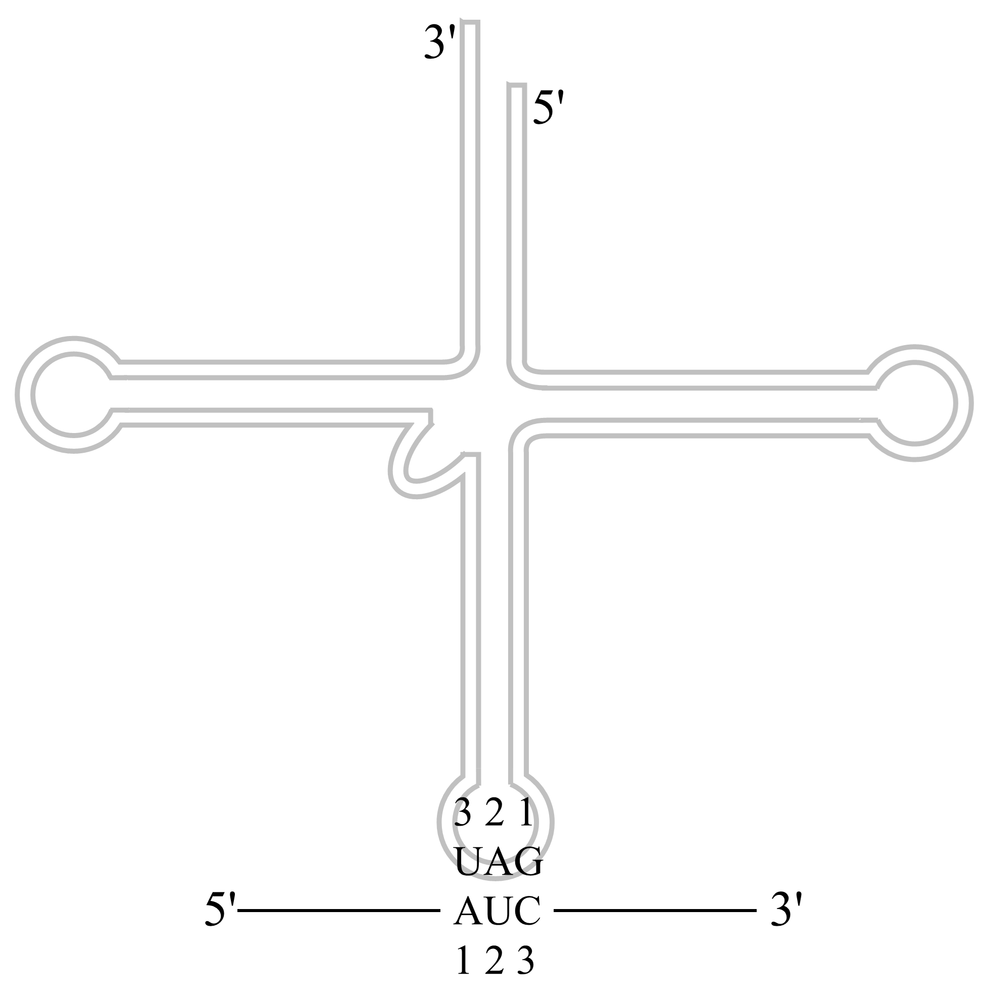

######################################
遗传信息传递
######################################

基因为唯一能自主复制保持的单位，其生物学功能以蛋白质形式表达。基因表达含转录（拷贝出一条与DNA链序列匹配的RNA单链；表达的核心步骤）及翻译（以新生mRNA为模板，经密码子翻译为氨基酸序列、合成多肽链的过程；表达的最终目的）。

编码链（有义链）：与mRNA序列相同的DNA链。模板链（反义链）：依碱基互补配对原则指导mRNA合成的DNA链。除少数RNA病毒，RNA分子信息均源自DNA。

RNA结构、分类、功能
======================================

RNA结构：含核糖，常为单链线性分子，高级结构复杂；RNA链自身折叠成局部双螺旋，形成多种茎-环结构（发夹、凸、环），除常见碱基配对还有G-U碱基对，双链RNA小沟宽且浅无序列特征性、大沟狭且深难与蛋白结合；RNA可折叠成复杂三级结构。

RNA种类繁多，在组成、大小、结构、功能、胞内定位分布都有所不同。主要RNA：mRNA（编码特定蛋白序列）、tRNA（特异解读mRNA信息、转运氨基酸）、rRNA（直接参与核糖体蛋白质合成）。

.. list-table:: RNA分布
   :align: center
   :header-rows: 1
   :name: 分子-表-RNA分布

   * - 胞内总RNA
     -
     -
   * - 编码RNA（2%）
     - hnRNA
     - mRNA
   * - 非编码RNA
     - 前rRNA
     - rRNA
   * -
     - 前tRNA
     - tRNA
   * -
     - snRNA
     -
   * -
     - snoRNA
     -
   * -
     - scRNA
     -
   * -
     - tmRNA等
     -

仅真核：  ；仅细菌：

RNA：

    * 既是信息分子，亦是功能分子；
    * 贮藏、转移遗传信息，为DNA至蛋白质间的核心作用；
    * 功能：胞内蛋白合成主要参与者，部分RNA作为核酶于胞内催化重要反应（初始转录产物剪接加工），参与基因表达调控，某些病毒中为遗传物质。

转录基本过程
======================================

不论原核、真核，RNA链合成均：

    * 以5’→3’反向合成，
    * 以DNA反义链（模板链）为模板，
    * 由RNA聚合酶催化，以NTPs为原料，依碱基配对原则核苷酸间形成磷酸二酯键，无引物参与，
    * 合成序列与DNA编码链（有义链）一致。

模板识别：

    * RNA聚合酶与启动子DNA双链互作结合。
    * 启动子为转录起始必需DNA序列片段，为表达调控的上有顺式作用元件之一。
    * 真核生物RNA聚合酶需经转录调控因子介导形成特定顺序的转录前起始复合物，才能有效起始转录。

转录起始：

    * RNA链上首个核苷酸键的产生；
    * RNA聚合酶结合于启动子后，附近DNA双链解旋、解链形成转录泡促进碱基配对；
    * 3个阶段：

        * RNA聚合酶全酶对启动子识别，可逆结合形成封闭复合物；
        * 封闭复合物转为开放复合物，酶结合DNA小片段解链（强启动子不可逆）；
        * 开放复合物与首两NTP结合形成磷酸二酯键后转为三元复合物。

    * 三元复合物进入途径：流产式起始、转为延伸复合物。
    * 真核细胞转录起始需多种转录因子（TF）参与。

转录延伸：

    * RNA聚合酶催化RNA链至9~10nt时σ因子从RNA聚合酶全酶脱落，聚合酶离开启动子，核心酶沿模板移动延伸RNA链。
    * DNA转录循环假说；延伸复合物在遇到终止信号前较稳定可长时间结合模板不解离。

转录终止：

    * 延伸至终止位点时RNA聚合酶不形成新磷酸二酯键，转录泡瓦解，DNA恢复双链。
    * 不依赖ρ因子：

        * 终止子：终止转录信号，上游常含丰富GC二重对称区，易形成发夹结构，前具多A序列；
        * 新生RNA因发夹结构导致RNA聚合酶暂停；

    * 依赖ρ因子：

        * “穷追”模型：RNA合成起始后，ρ因子附于新链5’端特异位点，经ATP供能向3’端转录泡移动，RNA聚合酶于终止子处暂停时，ρ因子到达3’端取代RNA聚合酶，转录复合物解体；

    * 抗终止：因某些生理需要，转录过程中遇到终止信号仍需继续转录，破坏终止位点RNA茎-环结构、依赖蛋白质因子的转录抗终止。

RNA聚合酶
======================================

RNA聚合酶：以双链DNA为模板、Mg\ :sup:`2+`\/Mn\ :sup:`2+`\为辅助因子催化RNA链合成起始、延伸、终止，不需引物。

原核生物中，一种RNA聚合酶几乎负责所有mRNA、rRNA、tRNA的合成，多数原核生物RNA聚合酶组成相同。E.coli中RNA聚合酶由2α亚基、1β亚基、1β’亚基、1ω亚基构成核心酶，与1σ亚基构成全酶。σ因子负责模板链选择及转录起始，是酶的别构效应物（极大提高RNA聚合酶与启动子区DNA序列亲和力，降低非专一位点亲和力）。

真核生物中，共3类RNA聚合酶，为多亚基酶。除核中RNA聚合酶外，线粒体、叶绿体中存有不同RNA聚合酶，均不受α-鹅膏蕈碱抑制。线粒体RNA聚合酶：仅1条肽链，已知最小之一，与T7噬菌体RNA聚合酶同源。叶绿体RNA聚合酶：结构上与细菌RNA聚合酶相似，部分亚基由叶绿体基因组编码。

.. list-table:: 真核细胞RNA聚合酶比较
   :align: center
   :header-rows: 1
   :name: 分子-表-真核细胞RNA聚合酶比较

   * - 酶
     - 胞内定位
     - 产物
     - α-鹅膏蕈碱敏感性
   * - RNA聚合酶Ⅰ
     - 核仁
     - rRNA
     - 不敏感
   * - RNA聚合酶Ⅱ
     - 核质
     - hnRNA
     - 敏感
   * - RNA聚合酶Ⅲ
     - 核质
     - tRNA、snRNA
     - 具物种特异性

* RNA聚合酶Ⅱ在较高离子强度（尤其Mn\ :sup:`2+`\）具较高活性。
* RNA聚合酶Ⅲ在宽离子（优先Mn\ :sup:`2+`\）强度范围内均具活性。
* RNA聚合酶Ⅲ对α-鹅膏蕈碱，在昆虫中无抑制作用、动物中则抑制转录。

启动子与转录起始
======================================

RNA聚合酶与启动子互作含：启动子区识别、酶与启动子结合、σ因子的结合与解离（E.coli中）。

启动子
--------------------------------------

启动子：一段于结构基因5’端上游DNA序列，可活化RNA聚合酶（使其与模板DNA准确结合并具转录起始特异性）。

   RNA转录单位

* 转录单位：一段自启动子始至终止子终的DNA序列；细菌中一个转录单位可为一个基因或多个基因。

    * 转录起点：新生RNA链首个核苷酸对应的DNA链碱基位置，常为嘌呤。
    * 上游序列：起点前（5’端）序列；起点前首碱基位置为：-1，上游依次为-2、-3...。

        * -10区（Pribnow区，TATA）：一个由5核苷酸构成的序列，为RNA聚合酶紧密结合点，于上游10bp处。
        * -35区（TTGACA）。E.coli中，-10区、-35区为RNA聚合酶与启动子的结合位点，可与σ因子相互识别且具高亲和力。
        * 真核生物中具有类型序列，TATA区、CAAT区。

    * 下游序列：3’末端序列；起点碱基位置为+1，后续为+2、+3...。

* RNA聚合酶经氢键互补识别启动子区碱基；
* DNA分子上的氢键供体、受体具特定方位，与酶中具特定空间构象的受体、供体相互结合；
* 保守区碱基取代不影响DNA上氢键方位、特性时仍保留启动子功能，若局部DNA构象、电荷密度改变影响这些基团相对方位则影响启动子功能。

* 原核生物-35区与-10区间距＜15bp或＞20bp均降低启动子活性。
* 下降突变：-10区变化引起结构基因转录水平极大降低。
* 上升突变：增加-10区共同序列同一性提高启动子效率。

增强子
--------------------------------------

增强子（强化子）：非启动子序列，可强化转录起始的序列。

特点：远距离效应；无方向性；顺式调节；无物种、基因特异性；具组织特异性；有相位性；可对外部信号反应。

真核启动子影响
--------------------------------------

* 上游启动子元件（UPE；上游激活序列，UAS）：TATA区上游保守序列。

    * 真核生物除含CAAT区外，多数基因还有GC区、增强子区。
    * TATA区主要使转录精确起始；
    * CAAT区、GC区主要控制转录起始频率。
    * 真核生物还存在大量特异性/组成型表达，可与不同基因启动子UPE结合的转录调控因子。

* 基因转录是RNA聚合酶、转录调控因子、启动子区各调控元件相互作用的结果。

转录抑制
--------------------------------------

* RNA转录抑制剂分：

    * DNA模板功能抑制剂（结合DNA改变模板功能；放线菌素D、烷化剂、嵌入染料EB等）、
    * RNA聚合酶抑制物（抑制RNA聚合酶活力；利福霉素、利迪链霉素、α-鹅膏蕈碱等）。

* 部分嘌呤、嘧啶类似物可作核苷酸拮抗物抑制核苷酸合成相关酶而抑制合成；或掺入核酸分子形成异常DNA、RNA影响功能导致突变。

.. list-table:: 常见转录抑制剂
   :align: center
   :header-rows: 1
   :name: 分子-表-常见转录抑制剂

   * - 抑制剂
     - 靶酶
     - 作用
   * - 利福霉素
     - 细菌全酶
     - 结合β亚基,抑制起始
   * - 利迪链霉素
     - 细菌核心酶
     - 结合β亚基,抑制起始
   * - 放线菌素D
     - 真核RNApolⅠ
     - 结合DNA,阻止延伸
   * - α-鹅膏蕈碱
     - 真核RNApolⅡ
     - 结合RNApolⅡ

真原核转录产物比较
======================================

原核、真核转录具一定相似性，但有一定差异：

    * 酶差异

        * 原核中仅一种RNA聚合酶；
        * 真核中多种，负责不同类型基因转录

    * 产物差异

        * 原核初级转录产物多为编码序列，与氨基酸序列呈线性关系；
        * 真核初级转录产物具内含子，成熟mRNA仅为其一小部分

    * 产物成熟过程不同

        * 原核初级转录产物常不需剪接加工；
        * 真核则需剪接修饰等成熟过程

    * 转录与翻译的联系差异

        * 原核中转录、翻译于胞内同一空间，可同步进行；
        * 真核则发生于不同时空。

.. list-table:: 原核、真核转录比较
   :align: center
   :header-rows: 1
   :name: 分子-表-原核真核转录比较

   * -
     - 原核
     - 真核
   * - 酶
     - 仅一种RNA聚合酶
     - 多种，负责不同类型基因转录
   * - 产物
     - 初级转录产物多为编码序列，与氨基酸序列呈线性关系
     - 初级转录产物具内含子，成熟mRNA仅为其一小部分
   * - 产物成熟
     - 初级转录产物常不需剪接加工
     - 需剪接修饰等成熟过程
   * - 转录与翻译的联系
     - 转录、翻译于胞内同一空间，可同步进行
     - 发生于不同时空

原核mRNA
--------------------------------------

* mRNA半衰期短；
* 以多顺反子形式存在；5’端无帽子结构、3’端无/仅短polA结构。

真核mRNA
--------------------------------------

* 几乎均为单顺反子；
* 5’端具帽子结构（使mRNA免遭核酸酶破坏）；
* 3’端具polA尾。（提高mRNA于基质中稳定性，增强mRNA可翻译能力）

基因：产生一条多肽链或功能RNA所必需的全部核苷酸序列。

真核RNA转录后加工
======================================

mRNA剪接及内含子
--------------------------------------

真核基因多为断裂基因，基因表达过程常伴随RNA剪接，从mRNA前体中切除内含子非编码区、拼接外显子编码区形成成熟mRNA。

RNA剪接（非tRNA）主要有：pre-mRNA剪接、Ⅰ类、Ⅱ类剪接内含子。

内含子边界存相似核苷酸，其在剪接过程进化上保守；内含子剪接异常可引起疾病（地中海贫血）。

DNA转录形成的初级转录产物hnRNA（核内不均一RNA）为mRNA前体，经5’端加帽、3’端加尾、剪接使得外显子连接成连续开放阅读框（ORF），经核孔进入胞质作蛋白合成模板。

.. list-table:: RNA加工与推测功能
   :align: center
   :header-rows: 1
   :name: 分子-表-RNA加工与推测功能

   * - 过程
     - 推测功能
   * - 加帽
     - mRNA向胞质转运、翻译起始
   * - 加尾
     - 转录终止、翻译起始、降解
   * - 剪接
     - 切除内含子
   * - 切割
     - 前体RNA释放成熟tRNA、rRNA分子

RNA序列决定剪接发生位点：mRNA前体内含子5’端边界序列GU、3’端边界序列AG（GU-AG法则）；除边界序列外，内含子部分序列也可参与剪接。

剪接的两步转酯反应：

    #. 第一步为外显子3’端核糖与内含子5’端磷酸间断键；
    #. 第二步为外显子5’端、3’端连接，内含子切除。

剪接多发生于剪接体：许多snRNA与snRNPs参与剪接，两者的复合物称核小核糖核蛋白（snRNP）；

    功能：

    * 识别5’端剪接位点、分支点；
    * 集结两位点；
    * 催化/协助催化剪接、连接。

* 可变剪接：

    * 个体发育、细胞分化时有选择性越过某些外显子、某个剪接点进行变位剪接，产生组织、发育阶段特异性mRNA；
    * 外显子遗漏、外显子延伸、内含子保留等。

* Ⅰ类自剪接内含子：剪接主要为转酯反应，释放线性内含子；原生生物、细菌。
* Ⅱ类自剪接内含子：转酯反应由内含子自身腺苷酸2’-OH作亲核基团，释放环状内含子；真核线粒体、叶绿体rRNA基因。
* Ⅲ类自剪接内含子与Ⅱ类类似，仅边界序列保守性、次级结构不同。

.. list-table:: RNA剪接类型
   :align: center
   :header-rows: 1
   :name: 分子-表-RNA剪接类型

   * - 类型
     - 丰度
     - 机制
     - 催化体
   * - pre-mRNA
     - 常见、多数真核基因
     - 两步转酯、分支点:A
     - 主要剪接体
   * - Ⅰ类
     - 罕见,某些真核胞核rRNA、胞器基因、少数原核基因
     - 两步转酯、分支点:G
     - 核酶
   * - Ⅱ类
     - 罕见,部分胞器及原核基因
     - 类似于pre-mRNA
     - 核酶

tRNA
--------------------------------------

真核tRNA基因具内含子，其内含子：长度、序列无共同性，位于反密码子下游，内含子与外显子间无保守序列。

tRNA分子具高度保守二级结构，真核tRNA前体内含子精确切除信号为其共同二级结构。过程：内含子剪接，3’端添加CCA序列，核苷酸修饰（tRNA稀有核苷酸较多）。

rRNA
--------------------------------------

多数真核rRNA基因无内含子，部分含内含子但不转录。

新生rRNA前体与蛋白结合成核糖体核蛋白前体颗粒，经snoRNA定位由酶切割成熟。

过程：切除5’端非编码序列（成41S） → 切割为32S（含28S、5.8S）、20S（含18S） → 进一步切割为28S、5.8S、18S。

RNA编辑修饰
======================================

RNA编辑：某些RNA，特别是mRNA前体的加工方式（插入、删除、取代），导致DNA所编码的遗传信息改变；机制：位点特异性脱氨基作用、引导RNA指导的尿嘧啶插入或删除。

哺乳动物载脂蛋白mRNA编辑，在肝、肠中合成的mRNA不同，肠（较短）中mRNA末位密码子突变为终止密码子但其余序列于肝中无异。

RNA编辑的生物学意义：校正作用、调控翻译、扩充遗传信息。

RNA再编码：RNA编码、读码方式的改变；mRNA在某些情况下不以固定方式翻译，改变原编码信息以不同方式翻译。

除RNA编辑外，特别是前体rRNA、tRNA具特异性化学修饰；甲基化、去氨基化、硫代、碱基同分异构、二价键饱和。

核酶：一类具催化功能的RNA，通过催化靶位点RNA链磷酸二酯键断裂，特异性剪切底物RNA分子阻断基因表达；剪切型核酶、剪接型核酶。

密码子、tRNA及核糖体
======================================

密码子
--------------------------------------

密码子（三联子密码）：mRNA上每3给核苷酸翻译成蛋白质多肽链上一个氨基酸，即此3给核苷酸。翻译从起始密码子AUG开始，沿mRNA5’→3’连续阅读，至终止密码子。

密码子的破译：均聚物、随机共聚物及特定序列共聚物为模板指导多肽合成；核糖体结合技术

密码子性质：

    * 连续性（密码子间无间断、重叠；起始密码子决定后续密码子位置）；
    * 简并性表 9 6（一种以上密码子编码同一氨基酸；同义密码子：编码同一氨基酸的密码子）；
    * 通用性（遗传密码在物种间均通用）及特殊性（少部分生物、线粒体中编码有所不同；支原体UAG-Trp）；
    * 摆动性表 9 7（tRNA反密码子与mRNA密码子识别时，密码子末碱基具一定自由度）。

.. list-table:: 密码子及其对应氨基酸
   :align: center
   :header-rows: 1
   :name: 分子-表-密码子及其对应氨基酸

   * - 5’端
     - 中
     - 间
     - 核苷
     - 酸
     - 3’端
   * -
     - U
     - C
     - A
     - G
     -
   * - U
     - Phe
     - Ser
     - Tyr
     - Cys
     - U
   * -
     - Phe
     - Ser
     - Tyr
     - Cys
     - C
   * -
     - Leu
     - Ser
     - **Stop**
     - **Stop**
     - A
   * -
     - Leu
     - Ser
     - **Stop**
     - Trp
     - G
   * - C
     - Leu
     - Pro
     - His
     - Arg
     - U
   * -
     - Leu
     - Pro
     - His
     - Arg
     - C
   * -
     - Leu
     - Pro
     - Gln
     - Arg
     - A
   * -
     - Leu
     - Pro
     - Gln
     - Arg
     - G
   * - A
     - Ile
     - Thr
     - Asn
     - Ser
     - U
   * -
     - Ile
     - Thr
     - Asn
     - Ser
     - C
   * -
     - Ile
     - Thr
     - Lys
     - Arg
     - A
   * -
     - Met
     - Thr
     - Lys
     - Arg
     - G
   * - G
     - Val
     - Ala
     - Asp
     - Gly
     - U
   * -
     - Val
     - Ala
     - Asp
     - Gly
     - C
   * -
     - Val
     - Ala
     - Glu
     - Gly
     - A
   * -
     - Val
     - Ala
     - Glu
     - Gly
     - G

* 终止密码子：

    * UAA（赭石密码，ochre）、UAG（琥珀密码，amber）、UGA（蛋白石密码，opal）不能与tRNA反密码子配对，但可由终止因子/释放因子识别而终止肽链合成；
    * 细菌中，UAA频率最高，UGA次之，UAG最低，或因UAG出错可能较大。

* 通常编码某一氨基酸密码子越多则该氨基酸于蛋白质中出现频率越高；Arg例外，因真核CG双联子频率较低。

.. list-table:: 反密码子与密码子间配对摆动
   :align: center
   :name: 分子-表-反密码子与密码子间配对摆动

   * - 反密码子
     - 首位为C或A
     - 仅识别1种密码子
   * - 反密码子
     - X-Y-C
     - X-Y-A
   * - 密码子
     - Y-X-G
     - Y-X-U
   * - 反密码子
     - 首位为U或G
     - 可识别2种密码子
   * - 反密码子
     - X-Y-U
     - X-Y-G
   * - 密码子
     - Y-X-A/G
     - Y-X-C/U
   * - 反密码子
     - 首位为I
     - 可识别3种密码子
   * - 反密码子
     - X-Y-I
     -
   * - 密码子
     - Y-X-A/U/C
     -

密码子：5’→3’；反密码子：3’→5’

tRNA反密码子是经反向配对与mRNA密码子相互作用。

   tRNA与mRNA配对

tRNA
--------------------------------------

tRNA的共同特征：存在经特殊修饰碱基、3’端均以CCA-OH结束（氨基酸结合位点）。

tRNA二级结构呈三叶草形 :numref:`分子-图-tRNA二级结构` ：

    * 受体臂（结合氨基酸，CCA序列）、TψC臂、反密码子臂、D臂（存在17:1、20:1、20:2可变位点）；
    * tRNA最大变化于多余臂，一类仅3~5nt，一类则更多核苷酸。

   tRNA二级结构

tRNA稀有碱基含量丰富，多分布于非配对区；特别在反密码子3’端且多为嘌呤核苷酸，维持反密码子环稳定、密码子与反密码子间配对。

tRNA三级结构呈L形由氢键维持，与氨酰-tRNA核酶对其识别有关。tRNA的性质由反密码子决定而非所携带的氨基酸。翻译时，起识别作用的是tRNA而非氨基酸。

* tRNA分：

    * 起始tRNA：一类特异识别mRNA起始密码子的tRNA；原核携带fMet，真核携带Met；
    * 延伸tRNA；
    * 同工tRNA：代表相同氨基酸的tRNA；
    * 校正tRNA：无义突变、错义突变后经反密码子区改变而转运正常的氨基酸；某一校正基因的效率即取决于反密码子与密码子的亲和力，也取决于其在胞中的浓度即竞争中的参数。

* 无义突变：某个非终止密码子突变为终止密码子使得肽链合成提前终止，合成无功能、无意义的肽链。
* 错义突变：结构基因中某个核苷酸变化使得一种氨基酸的密码变为另一种氨基酸的密码。

氨酰-tRNA合成：由氨酰-tRNA合酶催化，此酶对氨基酸、tRNA具高度专一性。反应：氨基酸 + tRNA + ATP → 氨酰-tRNA + AMP + Pi。

核糖体
--------------------------------------

核糖体含两个亚基（大亚基、小亚基）及rRNA；大小以沉降速率衡量；

    * 原核中为70S：50S+30S，
    * 真核为80S：60S+40S。
    * 小亚基负责mRNA序列特异性识别；
    * 大亚基负责携带氨基酸、肽键形成、氨酰/肽酰-tRNA结合等。

核糖体上具多个活性中心（核糖体蛋白，RP），分离后不具催化活性，即核糖体为多酶集合体；核糖体蛋白突变能调节p53活性影响疾病、肿瘤发生。

rRNA：

    * 5SrRNA：具两高度保守区域，分别识别tRNA、50S亚基，
    * 16SrRNA：与mRNA、50S亚基、P位及A位tRNA直接作用，
    * 23SrRNA：存在与tRNAMet互补片段，
    * 5.8SrRNA：真核大亚基特有，含修饰碱基；含原核5SrRNA部分保守序列识别tRNA，
    * 18SrRNA，
    * 28SrRNA。

核糖体上具3个tRNA结合位点：

    * A位点：新氨酰-tRNA结合位点，
    * P位点：肽酰-tRNA结合位点，
    * E位点：tRNA释放位点。
    * tRNA的氨酰末端于大亚基，其反密码子于小亚基处，使得每一tRNA结合位点横跨两亚基于交界处。

翻译基本过程
======================================

蛋白质是基因表达终产物，涉及

    * 翻译起始：核糖体与mRNA结合后与氨酰-tRNA形成起始复合物、
    * 肽链延伸：核糖体沿mRNA5’→3’移动，肽链N端→C端合成；速度最快、
    * 肽链终止及释放等过程：核糖体从mRNA解离。

核糖体是蛋白质合成的场所，mRNA是蛋白质合成的模板，tRNA为模板与氨基酸间接合体。

合成各阶段还需各种蛋白质、酶及其它生物大分子，亦是需能反应。

真核胞内合成的mRNA只有经运输至胞质才能翻译合成蛋白质。

翻译：指将mRNA链上核苷酸从一特定起始点开始，以每3个核苷酸代表1氨基酸的原则合成多肽类的过程。

氨基酸活化
--------------------------------------

氨基酸需经氨酰-tRNA合成酶作用生成活化氨基酸：氨酰-tRNA。至少存在20种以上具氨基酸专一性的氨酰-tRNA合成酶，同一氨酰-tRNA合成酶可把相同氨基酸加至两个或多个带不同反密码子的tRNA上。tRNA与相应氨基酸结合是蛋白质合成的关键步骤，携带准确氨基酸的tRNA是多肽合成准确性的保证。

* 细菌起始氨基酸为甲酰甲硫氨酸：fMet-tRNAfMet。
* 真核生物起始氨基酸为甲硫氨酸：Met-tRNAiMet；
* 普通的Met-tRNAMet仅用于肽链延伸。

翻译
--------------------------------------

#. 起始

    * 原核：小亚基+mRNA+fMet-tRNAfMet+大亚基。mRNA上具富嘌呤区（SD序列），与30S亚基rRNA识别互补。除fMet-tRNAfMet与P位点结合外其余tRNA均需经A位点到达P位点。

    * 真核：小亚基+Met-tRNAMet+mRNA+大亚基。帽子结构促进起始反应，稳定mRNA与40S亚基结合。

#. 延伸

    * 延伸每增加一个氨基酸经一个周期，含：氨酰-tRNA与核糖体结合、肽键生成、移位。
    * 氨酰-tRNA在延伸因子、GTP作用形成复合物结合于核糖体A位点。
    * 肽基转移酶催化下A位点的氨酰-tRNA上氨基酸转移至P位点与前一氨酰-tRNA上氨基酸生成肽键，前一tRNA脱离P位点。
    * 核糖体前移一个密码子，由另一GTP供能；肽酰-tRNA进入P位点，前一tRNA进入E位点。
    * 原核、真核每增加一氨基酸分别需EF-Tu/Ts/G、EF-1/2及消耗2GTP。

#. 终止

    * 终止密码子进入A位点时，无对应氨酰-tRNA，由释放因子（RF，GTP酶活性）识别结合，水解P位点肽链与tRNA间二酯键。

        * Ⅰ类释放因子：识别终止密码子，释放肽链。
        * Ⅱ类释放因子：肽链释放后刺激Ⅰ类释放因子解离。

    * 核糖体循环：蛋白质翻译为循环过程，涉及大小亚基及mRNA、tRNA结合解离。多核糖体：结合多个核糖体的mRNA。

前体加工、折叠
--------------------------------------

* N端fMet或Met切除（原核、真核N端Met常于肽链合成完前切除）；
* 二硫键形成；
* 特定氨基酸修饰（磷酸化、糖基化、甲基化、乙酰化、泛素化、羟基化）；
* 切除非功能片段。

新生肽链正确折叠成动力学、热力学稳定的三维构象而表现生物学活性、功能。

分子伴侣：可在胞内辅助新生肽链正确折叠的蛋白质，一类无序列相关性但具共同功能的保守蛋白质，在胞内协助其它多肽正确折叠、组装、运转、降解，分子伴侣本身不参与最终产物形成；含热休克蛋白（应激反应性蛋白），伴侣素。

蛋白合成抑制剂
--------------------------------------

.. list-table:: 常见蛋白合成抑制剂
   :align: center
   :header-rows: 1
   :name: 分子-表-常见蛋白合成抑制剂

   * - 抑制剂
     - 细胞
     - 位点
     - 效果
   * - 氯霉素
     - 原核
     - 50S亚基肽酰转移酶中心
     - 阻断肽酰转移反应
   * - 四环素
     - 原核
     - 30S亚基A位点
     - 抑制氨酰-tRNA结合A位点
   * - 潮霉素
     - 原,真
     - 30S亚基A位点附近
     - 阻挠A位点tRNA移位至P位点
   * - 嘌呤霉素
     - 原,真
     - 大亚基肽酰转移酶中心
     - 链终止子
   * - 红霉素
     - 原核
     - 50S亚基多肽出口
     - 阻遏翻译
   * - 青霉素
     - 原核
     - 肽葡聚糖转肽酶
     - 抑制细菌胞壁合成
   * - 链霉素
     - 原,真
     - 30S亚基
     - 干扰氨酰-tRNA与核糖体结合,mRNA错读
   * - 卡那霉素
     - 原核
     - 30S亚基
     - 干扰氨酰-tRNA与核糖体结合
   * - 白喉毒素
     - 真核
     - 修饰EF-Tu
     - 抑制EF-Tu
   * - 放线菌酮
     - 真核
     - 60S亚基肽酰转移酶中心
     - 抑制肽基转移酶活性
   * - 蓖麻毒素
     - 原,真
     - 60S亚基肽酰转移酶中心
     - 阻扰翻译因子GTP酶活性

蛋白转运、修饰及降解
======================================

翻译转运同步机制：蛋白质合成和转运同时发生。翻译后转运机制：蛋白质从核糖体释放后才发生转运。

.. list-table:: 主要蛋白质转运机制
   :align: center
   :header-rows: 1
   :name: 分子-表-主要蛋白质转运机制

   * - 性质
     - 机制
     - 类型
   * - 分泌
     - 结合核糖体合成，翻译转运同步机制
     - 免疫球蛋白、酶等
   * - 胞器发育
     - 游离核糖体合成，翻译后转运机制
     - 各胞器蛋白质
   * - 膜形成
     - 翻译转运同步机制、翻译后转运机制
     - 各膜中蛋白质

翻译转运同步机制
--------------------------------------

信号肽假说：

    * 蛋白质跨膜转运信号由mRNA编码；
    * 起始密码子后一段编码疏水性氨基酸序列（信号肽）的RNA区域；
    * 信号序列经结合核糖体合成后与膜上特定受体互作形成通道，使得多肽延长时穿膜。

信号肽特点：

    * 13~36残基；常带10~15疏水氨基酸；
    * N端常有1个/多个正电氨基酸；
    * C端近酶切位点常具极性氨基酸，酶切位点附近氨基酸侧链很短。
    * 完整信号肽是转运的必要条件，仅信号肽不足以保证转运发生，信号肽切除非转运必需，非所有蛋白质都具可降解信号肽。
    * 信号识别颗粒（SRP）、停靠蛋白（DP，SRP受体）介导蛋白质跨膜转运。

翻译后转运机制
--------------------------------------

#. 线粒体蛋白质跨膜转运

    * 线粒体蛋白质合成后转运：

        * 常以前体形式存在，由成熟蛋白、N端前导肽组成，过膜时前导肽水解释放成熟蛋白；
        * 跨线粒体内膜转运耗能；
        * 跨膜时与分子伴侣结合。

#. 叶绿体蛋白质跨膜转运

    * 叶绿体定位信号肽常具两部分：是否进入叶绿体基质、是否进入类囊体。
    * 活性水解酶位于叶绿体基质内（翻译后转运指标之一）；叶绿体膜可特异结合叶绿体蛋白前体；叶绿体蛋白前体可降解序列具种类差异。

#. 前导肽作用及性质

    * 具前导肽的线粒体蛋白前体可跨膜转运至线粒体。
    * 前导肽特性：

        * 正点碱性氨基酸（Arg）含量较丰富（牵引蛋白质过膜）；
        * 缺少负电酸性氨基酸；
        * 羟基氨基酸（Ser）含量较高；
        * 具形成两亲α-螺旋结构能力。

核定位蛋白转运机制
--------------------------------------

核孔是真核细胞细胞核与核外双向转运的分子通道。核膜上核孔复合体（NPC）是核内外物质交换的主要通道。

相对分子量较大的出入核蛋白质需带特殊序列：核定位信号（NLS）、出核信号（NES），才可被核转运蛋白识别。

入核信号与导肽区别：含水核孔通道鉴别；入核信号为蛋白质永久性部分不被切除，可反复利用，利于分裂后核蛋白重新入核。

核糖体蛋白均先于胞质中合成，运至核内于核仁中装配为大小亚基后转运至胞质发挥功能。

泛素化与类泛素修饰
--------------------------------------

E.coli中蛋白质降解经依赖ATP蛋白酶（Lon）实现，2ATP/肽键。

真核生物蛋白质降解主要依赖泛素（一类低相对分子量蛋白质，序列高度保守）。

* 泛素化：

    * 泛素分子在泛素激活酶、结合酶、连接酶等作用下对靶蛋白进行特异性修饰的过程（泛素C端Gly经酰胺键与底物蛋白Lysε氨基结合；一个位点可结合单个或多个泛素分子）。
    * 部分泛素化修饰可参与多种生物功能调控，蛋白质定位、代谢、调节等及细胞周期、凋亡、分化、转移、基因表达、转录调节、信号传递、损伤修复等等。

* SUMO化修饰：

    * 与泛素化修饰类似，小泛素化修饰，修饰物为泛素类蛋白家族成员；
    * 阻碍泛素化对底物蛋白的共价修饰，提高底物蛋白稳定性。

* NEDD修饰：

    * NEDD8一类泛素蛋白修饰分子，参与蛋白质翻译后修饰；
    * 修饰不引起蛋白质降解，而调节蛋白质功能。

* Lys残基还可发生乙酰化、甲基化等，在不同生理条件下，蛋白质同一Lys残基上发生不同修饰可能用以满足不同生理需求。

一级结构对蛋白稳定性影响
--------------------------------------

.. list-table:: N端残基与蛋白质半衰期关系
   :align: center
   :header-rows: 1
   :name: 分子-表-N端残基与蛋白质半衰期关系

   * -
     - N端残基
     - 半衰期
   * - 稳定型残基
     -
     -
   * -
     - Met、Gly、Ala、Ser、Thr、Val
     - ＞20h
   * - 不稳定型残基
     -
     -
   * -
     - Ile、Gln
     - ~30min
   * -
     - Tyr、Glu
     - ~10min
   * -
     - Pro
     - ~7min
   * -
     - Leu、Phe、Asn、Lys
     - ~3min
   * -
     - Arg
     - ~2min

